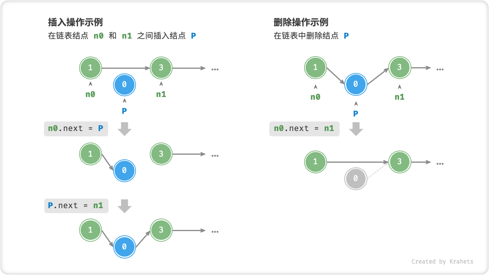

# 链表

!!! note "引言"

    内存空间是所有程序的公共资源，排除已占用的内存，空闲内存往往是散落在内存各处的。我们知道，存储数组需要内存空间连续，当我们需要申请一个很大的数组时，系统不一定存在这么大的连续内存空间。而链表则更加灵活，不需要内存是连续的，只要剩余内存空间大小够用即可。

「链表 Linked List」是一种线性数据结构，其中每个元素都是单独的对象，各个元素（一般称为结点）之间通过指针连接。由于结点中记录了连接关系，因此链表的存储方式相比于数组更加灵活，系统不必保证内存地址的连续性。

链表的「结点 Node」包含两项数据，一是结点「值 Value」，二是指向下一结点的「指针 Pointer」（或称「引用 Reference」）。


<p style="text-align:center"> Fig. 链表定义与存储方式 </p>

=== "Java"

    ```java title=""
    /* 链表结点类 */
    class ListNode {
        int val;        // 结点值
        ListNode next;  // 指向下一结点的指针（引用）
        ListNode(int x) { val = x; }  // 构造函数
    }
    ```

=== "C++"

    ```cpp title=""
    
    ```

=== "Python"

    ```python title=""
    """ 链表结点类 """ 
    class ListNode:
        def __init__(self, x):
            self.val = x      # 结点值
            self.next = None  # 指向下一结点的指针（引用）
    ```

**尾结点指向什么？** 我们一般将链表的最后一个结点称为「尾结点」，其指向的是「空」，在 Java / C++ / Python 中分别记为 `null` / `nullptr` / `None` 。在不引起歧义下，本书都使用 `null` 来表示空。

**链表初始化方法。** 建立链表分为两步，第一步是初始化各个结点对象，第二步是构建引用指向关系。完成后，即可以从链表的首个结点（即头结点）出发，访问其余所有的结点。

!!! tip

    我们通常将头结点当作链表的代称，例如头结点 `head` 和链表 `head` 实际上是同义的。

=== "Java"

    ```java title=""
    /* 初始化链表 1 -> 3 -> 2 -> 5 -> 4 */
    // 初始化各个结点 
    ListNode n0 = new ListNode(1);
    ListNode n1 = new ListNode(3);
    ListNode n2 = new ListNode(2);
    ListNode n3 = new ListNode(5);
    ListNode n4 = new ListNode(4);
    // 构建引用指向
    n0.next = n1;
    n1.next = n2;
    n2.next = n3;
    n3.next = n4;
    ```

=== "C++"

    ```cpp title=""
    
    ```

=== "Python"

    ```python title=""
    
    ```

## 链表优点

**在链表中，插入与删除结点的操作效率高。** 例如，如果想在链表中间的两个结点 `A` , `B` 之间插入一个新结点 `P` ，我们只需要改变两个结点指针即可，时间复杂度为 $O(1)$ ，相比数组的插入操作高效很多。在链表中删除某个结点也很方便，只需要改变一个结点指针即可。



<p style="text-align:center"> Fig. 在链表中插入与删除结点 </p>

=== "Java"

    ```java title=""
    /* 在链表的结点 n0 之后插入结点 P */
    void insert(ListNode n0, ListNode P) {
        ListNode n1 = n0.next;
        n0.next = P;
        P.next = n1;
    }
    
    /* 删除链表的结点 n0 之后的首个结点 */
    void remove(ListNode n0) {
        if (n0.next == null)
            return;
        // n0 -> P -> n1
        ListNode P = n0.next;
        ListNode n1 = P.next;
        n0.next = n1;
    }
    ```

=== "C++"

    ```cpp title=""
    
    ```

=== "Python"

    ```python title=""
    
    ```

## 链表缺点

**链表访问结点效率低。** 上节提到，数组可以在 $O(1)$ 时间下访问任意元素，但链表无法直接访问任意结点。这是因为计算机需要从头结点出发，一个一个地向后遍历到目标结点。例如，倘若想要访问链表索引为 `index` （即第 `index + 1` 个）的结点，那么需要 `index` 次访问操作。

=== "Java"

    ```java title=""
    /* 访问链表中索引为 index 的结点 */
    ListNode access(ListNode head, int index) {
        for (int i = 0; i < index; i++) {
            head = head.next;
            if (head == null)
                return null;
        }
        return head;
    }
    ```

=== "C++"

    ```cpp title=""
    
    ```

=== "Python"

    ```python title=""
    
    ```

**链表的内存占用多。** 链表以结点为单位，每个结点除了保存值外，还需额外保存指针（引用）。这意味着同样数据量下，链表比数组需要占用更多内存空间。

## 链表常用操作

**遍历链表查找。** 遍历链表，查找链表内值为 `target` 的结点，输出结点在链表中的索引。

=== "Java"

    ```java title=""
    /* 在链表中查找值为 target 的首个结点 */
    int find(ListNode head, int target) {
        int index = 0;
        while (head != null) {
            if (head.val == target)
                return index;
            head = head.next;
            index++;
        }
        return -1;
    }
    ```

=== "C++"

    ```cpp title=""
    
    ```

=== "Python"

    ```python title=""
    
    ```

## 常见链表类型

**单向链表。** 即上述介绍的普通链表。单向链表的结点有「值」和指向下一结点的「指针（引用）」两项数据。我们将首个结点称为头结点，尾结点指向 `null` 。

**环形链表。** 如果我们令单向链表的尾结点指向头结点（即首尾相接），则得到一个环形链表。在环形链表中，我们可以将任意结点看作是头结点。

**双向链表。** 单向链表仅记录了一个方向的指针（引用），在双向链表的结点定义中，同时有指向下一结点（后继结点）和上一结点（前驱结点）的「指针（引用）」。双向链表相对于单向链表更加灵活，即可以朝两个方向遍历链表，但也需要占用更多的内存空间。

=== "Java"

    ```java title=""
    /* 双向链表结点类 */
    class ListNode {
        int val;        // 结点值
        ListNode next;  // 指向后继结点的指针（引用）
        ListNode prev;  // 指向前驱结点的指针（引用）
        ListNode(int x) { val = x; }  // 构造函数
    }
    ```

=== "C++"

    ```cpp title=""
    
    ```

=== "Python"

    ```python title=""
    
    ```


<p style="text-align:center"> Fig. 常见链表类型 </p>
