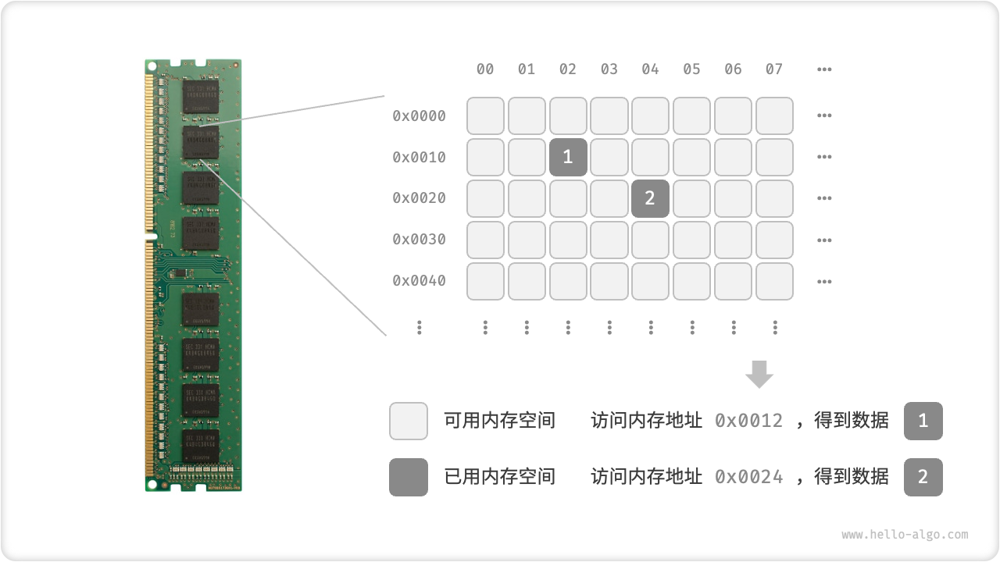

# 数据与内存

## 基本数据类型

谈到计算机中的数据，我们能够想到文本、图片、视频、语音、3D 模型等等，这些数据虽然组织形式不同，但是有一个共同点，即都是由各种基本数据类型构成的。

**「基本数据类型」是 CPU 可以直接进行运算的类型，在算法中直接被使用。**

- 「整数」根据不同的长度分为 byte, short, int, long ，根据算法需求选用，即在满足取值范围的情况下尽量减小内存空间占用。
- 「浮点数」代表小数，根据长度分为 float, double ，同样根据算法的实际需求选用。
- 「字符」在计算机中是以字符集的形式保存的，char 的值实际上是数字，代表字符集中的编号，计算机通过字符集查表来完成编号到字符的转换。
- 「布尔」代表逻辑中的 ”是“ 与 ”否“ ，其占用空间需要具体根据编程语言确定，通常为 1 byte 或 1 bit 。

!!! note "字节与比特"

    1 字节 (byte) = 8 比特 (bit) ， 1 比特即最基本的 1 个二进制位

<p align="center"> Table. Java 的基本数据类型 </p>

<div class="center-table" markdown>

| 类别   | 符号        | 占用空间          | 取值范围                                       | 默认值         |
| ------ | ----------- | ----------------- | ---------------------------------------------- | -------------- |
| 整数   | byte        | 1 byte            | $-2^7$ ~ $2^7 - 1$ ( $-128$ ~ $127$ )          | $0$            |
|        | short       | 2 bytes           | $-2^{15}$ ~ $2^{15} - 1$                       | $0$            |
|        | **int**     | 4 bytes           | $-2^{31}$ ~ $2^{31} - 1$                       | $0$            |
|        | long        | 8 bytes           | $-2^{63}$ ~ $2^{63} - 1$                       | $0$            |
| 浮点数 | **float**   | 4 bytes           | $-3.4 \times 10^{38}$ ~ $3.4 \times 10^{38}$   | $0.0$ f        |
|        | double      | 8 bytes           | $-1.7 \times 10^{308}$ ~ $1.7 \times 10^{308}$ | $0.0$          |
| 字符   | **char**    | 2 bytes           | $0$ ~ $2^{16} - 1$                             | $0$            |
| 布尔   | **boolean(bool)** | 1 byte / 1 bit  | $\text{true}$ 或 $\text{false}$                | $\text{false}$ |

</div>

!!! tip

    以上表格中，加粗项在「算法题」中最为常用。此表格无需硬背，大致理解即可，需要时可以通过查表来回忆。

**「基本数据类型」与「数据结构」之间的联系与区别**

我们知道，数据结构是在计算机中 **组织与存储数据的方式** ，它的主语是“结构”，而不是“数据”。比如，我们想要表示“一排数字”，自然应该使用「数组」这个数据结构。数组的存储方式使之可以表示数字的相邻关系、先后关系等一系列我们需要的信息，但至于其中存储的是整数 int ，还是小数 float ，或是字符 char ，**则与所谓的数据的结构无关了**。

=== "Java"

    ```java title=""
    /* 使用多种「基本数据类型」来初始化「数组」 */
    int[] numbers = new int[5];
    float[] decimals = new float[5];
    char[] characters = new char[5];
    boolean[] booleans = new boolean[5];
    ```

=== "C++"

    ```cpp title=""
    /* 使用多种「基本数据类型」来初始化「数组」 */
    int numbers[5];
    float decimals[5];
    char characters[5];
    bool booleans[5];
    ```

=== "Python"

    ```python title=""
    
    ```

=== "Go"

    ```go title=""

    ```

=== "JavaScript"

    ```js title=""

    ```

=== "TypeScript"

    ```typescript title=""

    ```

=== "C"

    ```c title=""

    ```

=== "C#"

    ```csharp title=""

    ```

## 计算机内存

在计算机中，内存和硬盘是两种主要的存储硬件设备。「硬盘」主要用于长期存储数据，容量较大（通常可达到 TB 级别）、速度较慢。「内存」用于运行程序时暂存数据，速度更快，但容量较小（通常为 GB 级别）。

**算法运行中，相关数据都被存储在内存中。** 下图展示了一个计算机内存条，其中每个黑色方块都包含一块内存空间。我们可以将内存想象成一个巨大的 Excel 表格，其中每个单元格都可以存储 1 byte 的数据，在算法运行时，所有数据都被存储在这些单元格中。

**系统通过「内存地址 Memory Location」来访问目标内存位置的数据。** 计算机根据特定规则给表格中每个单元格编号，保证每块内存空间都有独立的内存地址。自此，程序便通过这些地址，访问内存中的数据。



<p align="center"> Fig. 内存条、内存空间、内存地址 </p>

**内存资源是设计数据结构与算法的重要考虑因素。** 内存是所有程序的公共资源，当内存被某程序占用时，不能被其它程序同时使用。我们需要根据剩余内存资源的情况来设计算法。例如，若剩余内存空间有限，则要求算法占用的峰值内存不能超过系统剩余内存；若运行的程序很多、缺少大块连续的内存空间，则要求选取的数据结构必须能够存储在离散的内存空间内。
