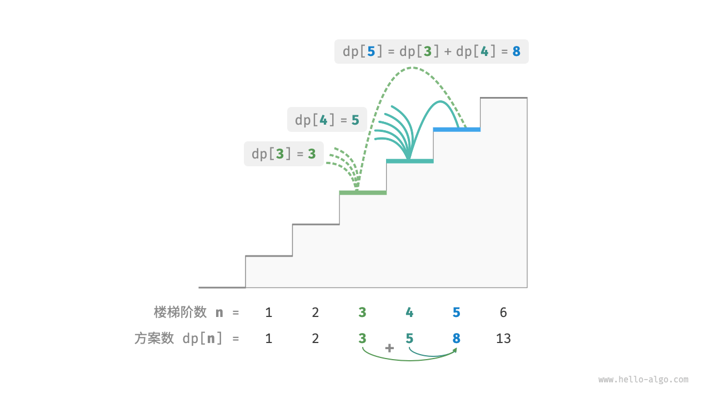
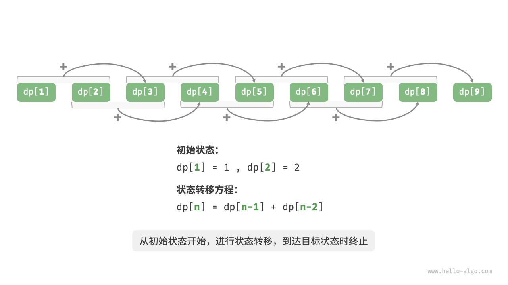

# 初探动态规划

「动态规划 dynamic programming」是一个重要的算法范式，它将一个问题分解为一系列更小的子问题，并通过存储子问题的解来避免重复计算，从而大幅提升时间效率。

在本节中，我们从一个经典例题入手，先给出它的暴力回溯解法，观察其中包含的重叠子问题，再逐步导出更高效的动态规划解法。

!!! question "爬楼梯"

    给定一个共有 $n$ 阶的楼梯，你每步可以上 $1$ 阶或者 $2$ 阶，请问有多少种方案可以爬到楼顶。

如下图所示，对于一个 $3$ 阶楼梯，共有 $3$ 种方案可以爬到楼顶。


本题的目标是求解方案数量，**我们可以考虑通过回溯来穷举所有可能性**。具体来说，将爬楼梯想象为一个多轮选择的过程：从地面出发，每轮选择上 $1$ 阶或 $2$ 阶，每当到达楼梯顶部时就将方案数量加 $1$ ，当越过楼梯顶部时就将其剪枝。

=== "Java"

    ```java title="climbing_stairs_backtrack.java"
    [class]{climbing_stairs_backtrack}-[func]{backtrack}

    [class]{climbing_stairs_backtrack}-[func]{climbingStairsBacktrack}
    ```

=== "C++"

    ```cpp title="climbing_stairs_backtrack.cpp"
    [class]{}-[func]{backtrack}

    [class]{}-[func]{climbingStairsBacktrack}
    ```

=== "Python"

    ```python title="climbing_stairs_backtrack.py"
    [class]{}-[func]{backtrack}

    [class]{}-[func]{climbing_stairs_backtrack}
    ```

=== "Go"

    ```go title="climbing_stairs_backtrack.go"
    [class]{}-[func]{backtrack}

    [class]{}-[func]{climbingStairsBacktrack}
    ```

=== "JS"

    ```javascript title="climbing_stairs_backtrack.js"
    [class]{}-[func]{backtrack}

    [class]{}-[func]{climbingStairsBacktrack}
    ```

=== "TS"

    ```typescript title="climbing_stairs_backtrack.ts"
    [class]{}-[func]{backtrack}

    [class]{}-[func]{climbingStairsBacktrack}
    ```

=== "C"

    ```c title="climbing_stairs_backtrack.c"
    [class]{}-[func]{backtrack}

    [class]{}-[func]{climbingStairsBacktrack}
    ```

=== "C#"

    ```csharp title="climbing_stairs_backtrack.cs"
    [class]{climbing_stairs_backtrack}-[func]{backtrack}

    [class]{climbing_stairs_backtrack}-[func]{climbingStairsBacktrack}
    ```

=== "Swift"

    ```swift title="climbing_stairs_backtrack.swift"
    [class]{}-[func]{backtrack}

    [class]{}-[func]{climbingStairsBacktrack}
    ```

=== "Zig"

    ```zig title="climbing_stairs_backtrack.zig"
    [class]{}-[func]{backtrack}

    [class]{}-[func]{climbingStairsBacktrack}
    ```

=== "Dart"

    ```dart title="climbing_stairs_backtrack.dart"
    [class]{}-[func]{backtrack}

    [class]{}-[func]{climbingStairsBacktrack}
    ```

=== "Rust"

    ```rust title="climbing_stairs_backtrack.rs"
    [class]{}-[func]{backtrack}

    [class]{}-[func]{climbing_stairs_backtrack}
    ```

## 方法一：暴力搜索

回溯算法通常并不显式地对问题进行拆解，而是将问题看作一系列决策步骤，通过试探和剪枝，搜索所有可能的解。

我们可以尝试从问题分解的角度分析这道题。设爬到第 $i$ 阶共有 $dp[i]$ 种方案，那么 $dp[i]$ 就是原问题，其子问题包括:

$$
dp[i-1] , dp[i-2] , \dots , dp[2] , dp[1]
$$

由于每轮只能上 $1$ 阶或 $2$ 阶，因此当我们站在第 $i$ 阶楼梯上时，上一轮只可能站在第 $i - 1$ 阶或第 $i - 2$ 阶上。换句话说，我们只能从第 $i -1$ 阶或第 $i - 2$ 阶前往第 $i$ 阶。

由此便可得出一个重要推论：**爬到第 $i - 1$ 阶的方案数加上爬到第 $i - 2$ 阶的方案数就等于爬到第 $i$ 阶的方案数**。公式如下：

$$
dp[i] = dp[i-1] + dp[i-2]
$$

这意味着在爬楼梯问题中，各个子问题之间存在递推关系，**原问题的解可以由子问题的解构建得来**。下图展示了该递推关系。



我们可以根据递推公式得到暴力搜索解法：

- 以 $dp[n]$ 为起始点，**递归地将一个较大问题拆解为两个较小问题的和**，直至到达最小子问题 $dp[1]$ 和 $dp[2]$ 时返回。
- 最小子问题的解 $dp[1] = 1$ , $dp[2] = 2$ 是已知的，代表爬到第 $1$ , $2$ 阶分别有 $1$ , $2$ 种方案。

观察以下代码，它和标准回溯代码都属于深度优先搜索，但更加简洁。

=== "Java"

    ```java title="climbing_stairs_dfs.java"
    [class]{climbing_stairs_dfs}-[func]{dfs}

    [class]{climbing_stairs_dfs}-[func]{climbingStairsDFS}
    ```

=== "C++"

    ```cpp title="climbing_stairs_dfs.cpp"
    [class]{}-[func]{dfs}

    [class]{}-[func]{climbingStairsDFS}
    ```

=== "Python"

    ```python title="climbing_stairs_dfs.py"
    [class]{}-[func]{dfs}

    [class]{}-[func]{climbing_stairs_dfs}
    ```

=== "Go"

    ```go title="climbing_stairs_dfs.go"
    [class]{}-[func]{dfs}

    [class]{}-[func]{climbingStairsDFS}
    ```

=== "JS"

    ```javascript title="climbing_stairs_dfs.js"
    [class]{}-[func]{dfs}

    [class]{}-[func]{climbingStairsDFS}
    ```

=== "TS"

    ```typescript title="climbing_stairs_dfs.ts"
    [class]{}-[func]{dfs}

    [class]{}-[func]{climbingStairsDFS}
    ```

=== "C"

    ```c title="climbing_stairs_dfs.c"
    [class]{}-[func]{dfs}

    [class]{}-[func]{climbingStairsDFS}
    ```

=== "C#"

    ```csharp title="climbing_stairs_dfs.cs"
    [class]{climbing_stairs_dfs}-[func]{dfs}

    [class]{climbing_stairs_dfs}-[func]{climbingStairsDFS}
    ```

=== "Swift"

    ```swift title="climbing_stairs_dfs.swift"
    [class]{}-[func]{dfs}

    [class]{}-[func]{climbingStairsDFS}
    ```

=== "Zig"

    ```zig title="climbing_stairs_dfs.zig"
    [class]{}-[func]{dfs}

    [class]{}-[func]{climbingStairsDFS}
    ```

=== "Dart"

    ```dart title="climbing_stairs_dfs.dart"
    [class]{}-[func]{dfs}

    [class]{}-[func]{climbingStairsDFS}
    ```

=== "Rust"

    ```rust title="climbing_stairs_dfs.rs"
    [class]{}-[func]{dfs}

    [class]{}-[func]{climbing_stairs_dfs}
    ```

下图展示了暴力搜索形成的递归树。对于问题 $dp[n]$ ，其递归树的深度为 $n$ ，时间复杂度为 $O(2^n)$ 。指数阶属于爆炸式增长，如果我们输入一个比较大的 $n$ ，则会陷入漫长的等待之中。


观察上图，**指数阶的时间复杂度是由于“重叠子问题”导致的**。例如 $dp[9]$ 被分解为 $dp[8]$ 和 $dp[7]$ ，$dp[8]$ 被分解为 $dp[7]$ 和 $dp[6]$ ，两者都包含子问题 $dp[7]$ 。

以此类推，子问题中包含更小的重叠子问题，子子孙孙无穷尽也。绝大部分计算资源都浪费在这些重叠的问题上。

## 方法二：记忆化搜索

为了提升算法效率，**我们希望所有的重叠子问题都只被计算一次**。为此，我们声明一个数组 `mem` 来记录每个子问题的解，并在搜索过程中这样做：

1. 当首次计算 $dp[i]$ 时，我们将其记录至 `mem[i]` ，以便之后使用。
2. 当再次需要计算 $dp[i]$ 时，我们便可直接从 `mem[i]` 中获取结果，从而将重叠子问题剪枝。

=== "Java"

    ```java title="climbing_stairs_dfs_mem.java"
    [class]{climbing_stairs_dfs_mem}-[func]{dfs}

    [class]{climbing_stairs_dfs_mem}-[func]{climbingStairsDFSMem}
    ```

=== "C++"

    ```cpp title="climbing_stairs_dfs_mem.cpp"
    [class]{}-[func]{dfs}

    [class]{}-[func]{climbingStairsDFSMem}
    ```

=== "Python"

    ```python title="climbing_stairs_dfs_mem.py"
    [class]{}-[func]{dfs}

    [class]{}-[func]{climbing_stairs_dfs_mem}
    ```

=== "Go"

    ```go title="climbing_stairs_dfs_mem.go"
    [class]{}-[func]{dfsMem}

    [class]{}-[func]{climbingStairsDFSMem}
    ```

=== "JS"

    ```javascript title="climbing_stairs_dfs_mem.js"
    [class]{}-[func]{dfs}

    [class]{}-[func]{climbingStairsDFSMem}
    ```

=== "TS"

    ```typescript title="climbing_stairs_dfs_mem.ts"
    [class]{}-[func]{dfs}

    [class]{}-[func]{climbingStairsDFSMem}
    ```

=== "C"

    ```c title="climbing_stairs_dfs_mem.c"
    [class]{}-[func]{dfs}

    [class]{}-[func]{climbingStairsDFSMem}
    ```

=== "C#"

    ```csharp title="climbing_stairs_dfs_mem.cs"
    [class]{climbing_stairs_dfs_mem}-[func]{dfs}

    [class]{climbing_stairs_dfs_mem}-[func]{climbingStairsDFSMem}
    ```

=== "Swift"

    ```swift title="climbing_stairs_dfs_mem.swift"
    [class]{}-[func]{dfs}

    [class]{}-[func]{climbingStairsDFSMem}
    ```

=== "Zig"

    ```zig title="climbing_stairs_dfs_mem.zig"
    [class]{}-[func]{dfs}

    [class]{}-[func]{climbingStairsDFSMem}
    ```

=== "Dart"

    ```dart title="climbing_stairs_dfs_mem.dart"
    [class]{}-[func]{dfs}

    [class]{}-[func]{climbingStairsDFSMem}
    ```

=== "Rust"

    ```rust title="climbing_stairs_dfs_mem.rs"
    [class]{}-[func]{dfs}

    [class]{}-[func]{climbing_stairs_dfs_mem}
    ```

观察下图，**经过记忆化处理后，所有重叠子问题都只需被计算一次，时间复杂度被优化至 $O(n)$** ，这是一个巨大的飞跃。


## 方法三：动态规划

**记忆化搜索是一种“从顶至底”的方法**：我们从原问题（根节点）开始，递归地将较大子问题分解为较小子问题，直至解已知的最小子问题（叶节点）。之后，通过回溯将子问题的解逐层收集，构建出原问题的解。

与之相反，**动态规划是一种“从底至顶”的方法**：从最小子问题的解开始，迭代地构建更大子问题的解，直至得到原问题的解。

由于动态规划不包含回溯过程，因此只需使用循环迭代实现，无须使用递归。在以下代码中，我们初始化一个数组 `dp` 来存储子问题的解，它起到了记忆化搜索中数组 `mem` 相同的记录作用。

=== "Java"

    ```java title="climbing_stairs_dp.java"
    [class]{climbing_stairs_dp}-[func]{climbingStairsDP}
    ```

=== "C++"

    ```cpp title="climbing_stairs_dp.cpp"
    [class]{}-[func]{climbingStairsDP}
    ```

=== "Python"

    ```python title="climbing_stairs_dp.py"
    [class]{}-[func]{climbing_stairs_dp}
    ```

=== "Go"

    ```go title="climbing_stairs_dp.go"
    [class]{}-[func]{climbingStairsDP}
    ```

=== "JS"

    ```javascript title="climbing_stairs_dp.js"
    [class]{}-[func]{climbingStairsDP}
    ```

=== "TS"

    ```typescript title="climbing_stairs_dp.ts"
    [class]{}-[func]{climbingStairsDP}
    ```

=== "C"

    ```c title="climbing_stairs_dp.c"
    [class]{}-[func]{climbingStairsDP}
    ```

=== "C#"

    ```csharp title="climbing_stairs_dp.cs"
    [class]{climbing_stairs_dp}-[func]{climbingStairsDP}
    ```

=== "Swift"

    ```swift title="climbing_stairs_dp.swift"
    [class]{}-[func]{climbingStairsDP}
    ```

=== "Zig"

    ```zig title="climbing_stairs_dp.zig"
    [class]{}-[func]{climbingStairsDP}
    ```

=== "Dart"

    ```dart title="climbing_stairs_dp.dart"
    [class]{}-[func]{climbingStairsDP}
    ```

=== "Rust"

    ```rust title="climbing_stairs_dp.rs"
    [class]{}-[func]{climbing_stairs_dp}
    ```

下图模拟了以上代码的执行过程。



与回溯算法一样，动态规划也使用“状态”概念来表示问题求解的某个特定阶段，每个状态都对应一个子问题以及相应的局部最优解。例如，爬楼梯问题的状态定义为当前所在楼梯阶数 $i$ 。

总结以上，动态规划的常用术语包括：

- 将数组 `dp` 称为「$dp$ 表」，$dp[i]$ 表示状态 $i$ 对应子问题的解。
- 将最小子问题对应的状态（即第 $1$ , $2$ 阶楼梯）称为「初始状态」。
- 将递推公式 $dp[i] = dp[i-1] + dp[i-2]$ 称为「状态转移方程」。

## 状态压缩

细心的你可能发现，**由于 $dp[i]$ 只与 $dp[i-1]$ 和 $dp[i-2]$ 有关，因此我们无须使用一个数组 `dp` 来存储所有子问题的解**，而只需两个变量滚动前进即可。

=== "Java"

    ```java title="climbing_stairs_dp.java"
    [class]{climbing_stairs_dp}-[func]{climbingStairsDPComp}
    ```

=== "C++"

    ```cpp title="climbing_stairs_dp.cpp"
    [class]{}-[func]{climbingStairsDPComp}
    ```

=== "Python"

    ```python title="climbing_stairs_dp.py"
    [class]{}-[func]{climbing_stairs_dp_comp}
    ```

=== "Go"

    ```go title="climbing_stairs_dp.go"
    [class]{}-[func]{climbingStairsDPComp}
    ```

=== "JS"

    ```javascript title="climbing_stairs_dp.js"
    [class]{}-[func]{climbingStairsDPComp}
    ```

=== "TS"

    ```typescript title="climbing_stairs_dp.ts"
    [class]{}-[func]{climbingStairsDPComp}
    ```

=== "C"

    ```c title="climbing_stairs_dp.c"
    [class]{}-[func]{climbingStairsDPComp}
    ```

=== "C#"

    ```csharp title="climbing_stairs_dp.cs"
    [class]{climbing_stairs_dp}-[func]{climbingStairsDPComp}
    ```

=== "Swift"

    ```swift title="climbing_stairs_dp.swift"
    [class]{}-[func]{climbingStairsDPComp}
    ```

=== "Zig"

    ```zig title="climbing_stairs_dp.zig"
    [class]{}-[func]{climbingStairsDPComp}
    ```

=== "Dart"

    ```dart title="climbing_stairs_dp.dart"
    [class]{}-[func]{climbingStairsDPComp}
    ```

=== "Rust"

    ```rust title="climbing_stairs_dp.rs"
    [class]{}-[func]{climbing_stairs_dp_comp}
    ```

观察以上代码，由于省去了数组 `dp` 占用的空间，因此空间复杂度从 $O(n)$ 降低至 $O(1)$ 。

**这种空间优化技巧被称为「状态压缩」**。在常见的动态规划问题中，当前状态仅与前面有限个状态有关，这时我们可以应用状态压缩，只保留必要的状态，通过“降维”来节省内存空间。
