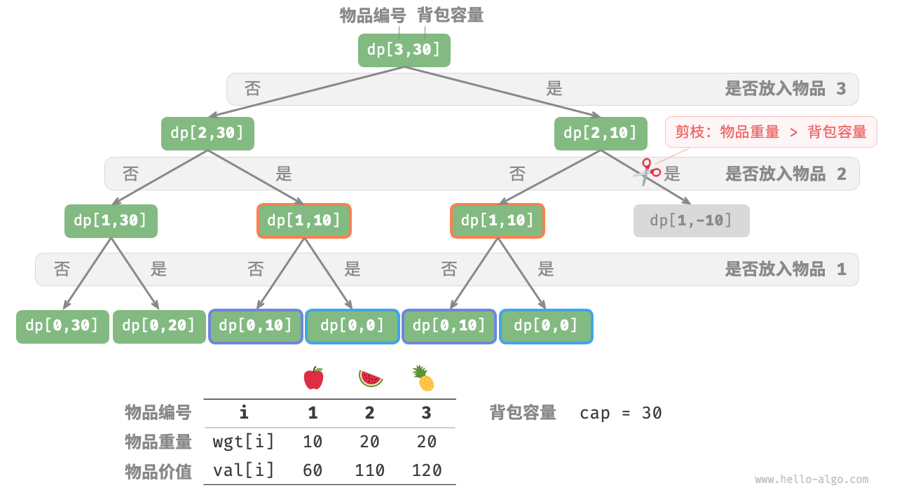
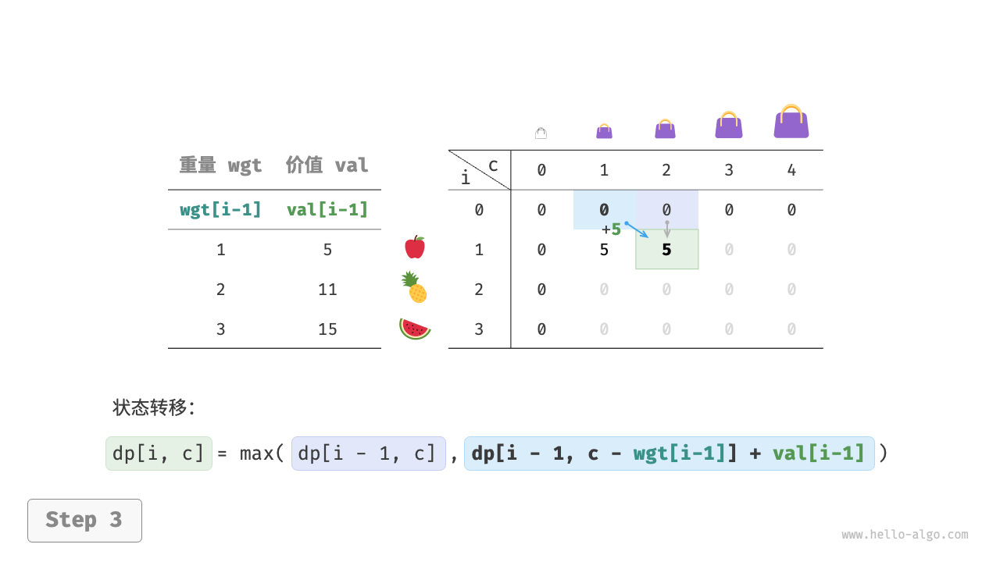
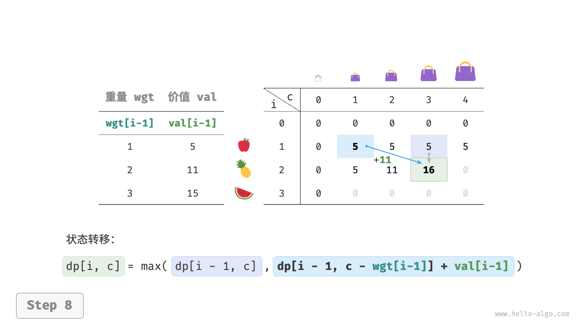
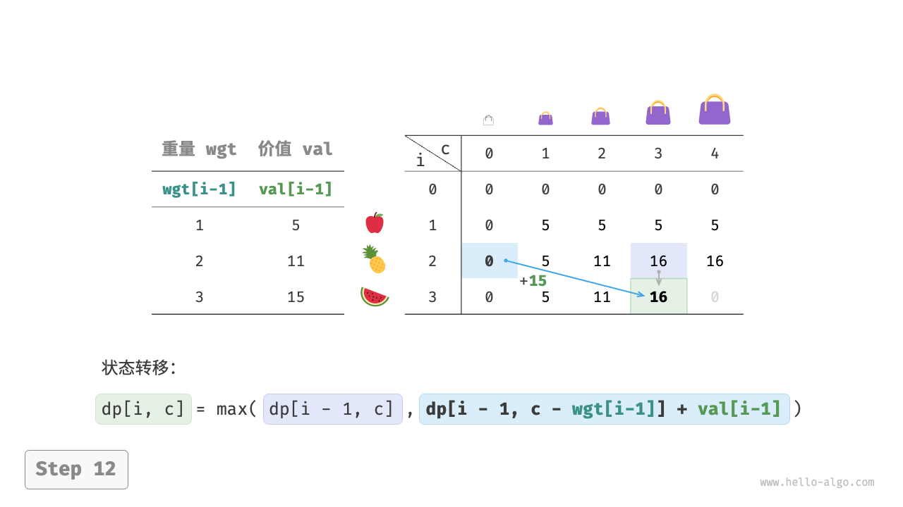
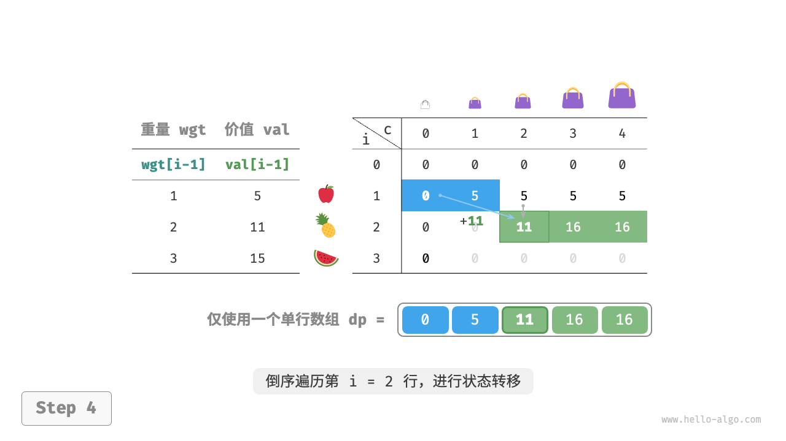
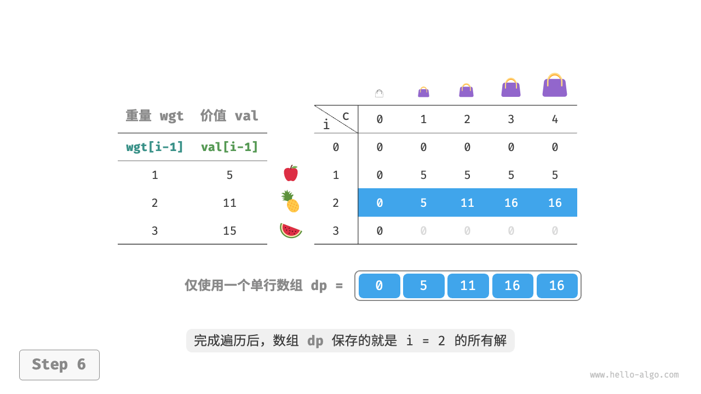

# 0-1 背包问题

背包问题是一个非常好的动态规划入门题目，是动态规划中最常见的问题形式。其具有很多变种，例如 0-1 背包问题、完全背包问题、多重背包问题等。

在本节中，我们先来学习基础的的 0-1 背包问题。

!!! question

    给定 $n$ 个物品，第 $i$ 个物品的重量为 $wgt[i-1]$ 、价值为 $val[i-1]$ ，现在有个容量为 $cap$ 的背包，请求解在不超过背包容量下背包中物品的最大价值。
    
    请注意，物品编号 $i$ 从 $1$ 开始计数，数组索引从 $0$ 开始计数，因此物品 $i$ 对应重量 $wgt[i-1]$ 和价值 $val[i-1]$ 。

下图给出了一个 0-1 背包的示例数据，背包内的最大价值为 $220$ 。


我们可以将 0-1 背包问题看作是一个由 $n$ 轮决策组成的过程，每个物体都有不放入和放入两种决策，因此该问题是满足决策树模型的。此外，该问题的目标是求解“在限定背包容量下的最大价值”，因此较大概率是个动态规划问题。我们接下来尝试求解它。

**第一步：思考每轮的决策，定义状态，从而得到 $dp$ 表**

在 0-1 背包问题中，不放入背包，背包容量不变；放入背包，背包容量减小。由此可得状态定义：当前物品编号 $i$ 和剩余背包容量 $c$ ，记为 $[i, c]$ 。

状态 $[i, c]$ 对应的子问题为：**前 $i$ 个物品在剩余容量为 $c$ 的背包中的最大价值**，记为 $dp[i, c]$ 。

至此，我们得到一个尺寸为 $n \times cap$ 的二维 $dp$ 矩阵。

**第二步：找出最优子结构，进而推导出状态转移方程**

当我们做出物品 $i$ 的决策后，剩余的是前 $i-1$ 个物品的决策。因此，状态转移分为两种情况：

- **不放入物品 $i$** ：背包容量不变，状态转移至 $[i-1, c]$ ；
- **放入物品 $i$** ：背包容量减小 $wgt[i-1]$ ，价值增加 $val[i-1]$ ，状态转移至 $[i-1, c-wgt[i-1]]$ ；

上述的状态转移向我们揭示了本题的最优子结构：**最大价值 $dp[i, c]$ 等于不放入物品 $i$ 和放入物品 $i$ 两种方案中的价值更大的那一个**。由此可推出状态转移方程：

$$
dp[i, c] = \max(dp[i-1, c], dp[i-1, c - wgt[i-1]] + val[i-1])
$$

需要注意的是，若当前物品重量 $wgt[i - 1]$ 超出剩余背包容量 $c$ ，则只能选择不放入背包。

**第三步：确定边界条件和状态转移顺序**

当无物品或无剩余背包容量时最大价值为 $0$ ，即所有 $dp[i, 0]$ 和 $dp[0, c]$ 都等于 $0$ 。

当前状态 $[i, c]$ 从上方的状态 $[i-1, c]$ 和左上方的状态 $[i-1, c-wgt[i-1]]$ 转移而来，因此通过两层循环正序遍历整个 $dp$ 表即可。

## 方法一：暴力搜索

搜索代码包含以下要素：

- **递归参数**：状态 $[i, c]$ ；**返回值**：子问题的解 $dp[i, c]$ 。
- **终止条件**：当物品编号越界 $i = 0$ 或背包剩余容量为 $0$ 时，终止递归并返回价值 $0$ 。
- **剪枝**：若当前物品重量超出背包剩余容量，则只能不放入背包。

=== "Java"

    ```java title="knapsack.java"
    [class]{knapsack}-[func]{knapsackDFS}
    ```

=== "C++"

    ```cpp title="knapsack.cpp"
    [class]{}-[func]{knapsackDFS}
    ```

=== "Python"

    ```python title="knapsack.py"
    [class]{}-[func]{knapsack_dfs}
    ```

=== "Go"

    ```go title="knapsack.go"
    [class]{}-[func]{knapsackDFS}
    ```

=== "JavaScript"

    ```javascript title="knapsack.js"
    [class]{}-[func]{knapsackDFS}
    ```

=== "TypeScript"

    ```typescript title="knapsack.ts"
    [class]{}-[func]{knapsackDFS}
    ```

=== "C"

    ```c title="knapsack.c"
    [class]{}-[func]{knapsackDFS}
    ```

=== "C#"

    ```csharp title="knapsack.cs"
    [class]{knapsack}-[func]{knapsackDFS}
    ```

=== "Swift"

    ```swift title="knapsack.swift"
    [class]{}-[func]{knapsackDFS}
    ```

=== "Zig"

    ```zig title="knapsack.zig"
    [class]{}-[func]{knapsackDFS}
    ```

=== "Dart"

    ```dart title="knapsack.dart"
    [class]{}-[func]{knapsackDFS}
    ```

如下图所示，由于每个物品都会产生不选和选两条搜索分支，因此最差时间复杂度为 $O(2^n)$ 。

观察递归树，容易发现其中存在一些「重叠子问题」，例如 $dp[1, 10]$ 等。而当物品较多、背包容量较大，尤其是当相同重量的物品较多时，重叠子问题的数量将会大幅增多。



## 方法二：记忆化搜索

为了防止重复求解重叠子问题，我们借助一个记忆列表 `mem` 来记录子问题的解，其中 `mem[i][c]` 对应解 $dp[i, c]$ 。

=== "Java"

    ```java title="knapsack.java"
    [class]{knapsack}-[func]{knapsackDFSMem}
    ```

=== "C++"

    ```cpp title="knapsack.cpp"
    [class]{}-[func]{knapsackDFSMem}
    ```

=== "Python"

    ```python title="knapsack.py"
    [class]{}-[func]{knapsack_dfs_mem}
    ```

=== "Go"

    ```go title="knapsack.go"
    [class]{}-[func]{knapsackDFSMem}
    ```

=== "JavaScript"

    ```javascript title="knapsack.js"
    [class]{}-[func]{knapsackDFSMem}
    ```

=== "TypeScript"

    ```typescript title="knapsack.ts"
    [class]{}-[func]{knapsackDFSMem}
    ```

=== "C"

    ```c title="knapsack.c"
    [class]{}-[func]{knapsackDFSMem}
    ```

=== "C#"

    ```csharp title="knapsack.cs"
    [class]{knapsack}-[func]{knapsackDFSMem}
    ```

=== "Swift"

    ```swift title="knapsack.swift"
    [class]{}-[func]{knapsackDFSMem}
    ```

=== "Zig"

    ```zig title="knapsack.zig"
    [class]{}-[func]{knapsackDFSMem}
    ```

=== "Dart"

    ```dart title="knapsack.dart"
    [class]{}-[func]{knapsackDFSMem}
    ```

引入记忆化之后，所有子问题都只被计算一次，**因此时间复杂度取决于子问题数量**，也就是 $O(n \times cap)$ 。


## 方法三：动态规划

动态规划解法本质上就是在状态转移中填充 `dp` 矩阵的过程，代码如下所示。

=== "Java"

    ```java title="knapsack.java"
    [class]{knapsack}-[func]{knapsackDP}
    ```

=== "C++"

    ```cpp title="knapsack.cpp"
    [class]{}-[func]{knapsackDP}
    ```

=== "Python"

    ```python title="knapsack.py"
    [class]{}-[func]{knapsack_dp}
    ```

=== "Go"

    ```go title="knapsack.go"
    [class]{}-[func]{knapsackDP}
    ```

=== "JavaScript"

    ```javascript title="knapsack.js"
    [class]{}-[func]{knapsackDP}
    ```

=== "TypeScript"

    ```typescript title="knapsack.ts"
    [class]{}-[func]{knapsackDP}
    ```

=== "C"

    ```c title="knapsack.c"
    [class]{}-[func]{knapsackDP}
    ```

=== "C#"

    ```csharp title="knapsack.cs"
    [class]{knapsack}-[func]{knapsackDP}
    ```

=== "Swift"

    ```swift title="knapsack.swift"
    [class]{}-[func]{knapsackDP}
    ```

=== "Zig"

    ```zig title="knapsack.zig"
    [class]{}-[func]{knapsackDP}
    ```

=== "Dart"

    ```dart title="knapsack.dart"
    [class]{}-[func]{knapsackDP}
    ```

如下图所示，时间复杂度由 `dp` 矩阵大小决定，为 $O(n \times cap)$ 。

=== "<1>"
    

=== "<2>"
    

=== "<3>"
    

=== "<4>"
    

=== "<5>"
    

=== "<6>"
    

=== "<7>"
    

=== "<8>"
    

=== "<9>"
    

=== "<10>"
    

=== "<11>"
    

=== "<12>"
    

=== "<13>"
    

=== "<14>"
    

**最后考虑状态压缩**。以上代码中的 `dp` 矩阵占用 $O(n \times cap)$ 空间。由于每个状态都只与其上一行的状态有关，因此我们可以使用两个数组滚动前进，将空间复杂度从 $O(n^2)$ 将低至 $O(n)$ 。代码省略，有兴趣的同学可以自行实现。

那么，我们是否可以仅用一个数组实现状态压缩呢？观察可知，每个状态都是由左上方或正上方的格子转移过来的。假设只有一个数组，当遍历到第 $i$ 行时，该数组存储的仍然是第 $i-1$ 行的状态，为了避免左边区域的格子在状态转移中被覆盖，我们应采取倒序遍历。

以下动画展示了在单个数组下从第 $i=1$ 行转换至第 $i=2$ 行的过程。建议你思考一下正序遍历和倒序遍历的区别。

=== "<1>"
    

=== "<2>"
    

=== "<3>"
    

=== "<4>"
    

=== "<5>"
    

=== "<6>"
    

如以下代码所示，我们仅需将 `dp` 矩阵的第一维 $i$ 直接删除，并且将内循环修改为倒序遍历即可。

=== "Java"

    ```java title="knapsack.java"
    [class]{knapsack}-[func]{knapsackDPComp}
    ```

=== "C++"

    ```cpp title="knapsack.cpp"
    [class]{}-[func]{knapsackDPComp}
    ```

=== "Python"

    ```python title="knapsack.py"
    [class]{}-[func]{knapsack_dp_comp}
    ```

=== "Go"

    ```go title="knapsack.go"
    [class]{}-[func]{knapsackDPComp}
    ```

=== "JavaScript"

    ```javascript title="knapsack.js"
    [class]{}-[func]{knapsackDPComp}
    ```

=== "TypeScript"

    ```typescript title="knapsack.ts"
    [class]{}-[func]{knapsackDPComp}
    ```

=== "C"

    ```c title="knapsack.c"
    [class]{}-[func]{knapsackDPComp}
    ```

=== "C#"

    ```csharp title="knapsack.cs"
    [class]{knapsack}-[func]{knapsackDPComp}
    ```

=== "Swift"

    ```swift title="knapsack.swift"
    [class]{}-[func]{knapsackDPComp}
    ```

=== "Zig"

    ```zig title="knapsack.zig"
    [class]{}-[func]{knapsackDPComp}
    ```

=== "Dart"

    ```dart title="knapsack.dart"
    [class]{}-[func]{knapsackDPComp}
    ```
