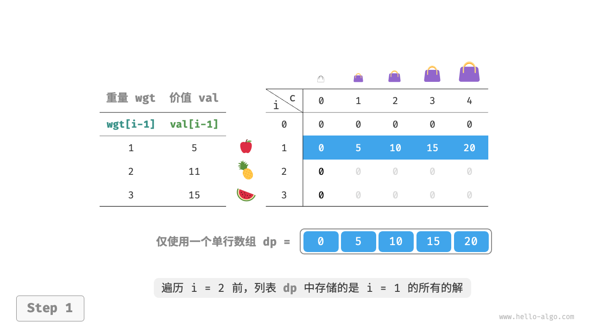
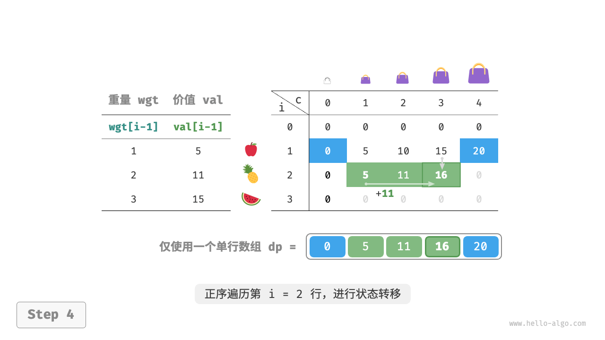
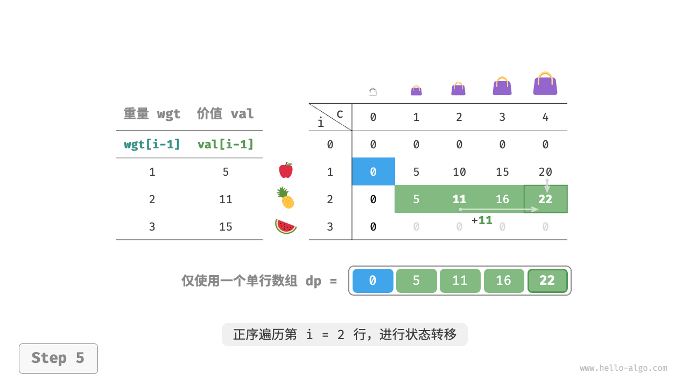
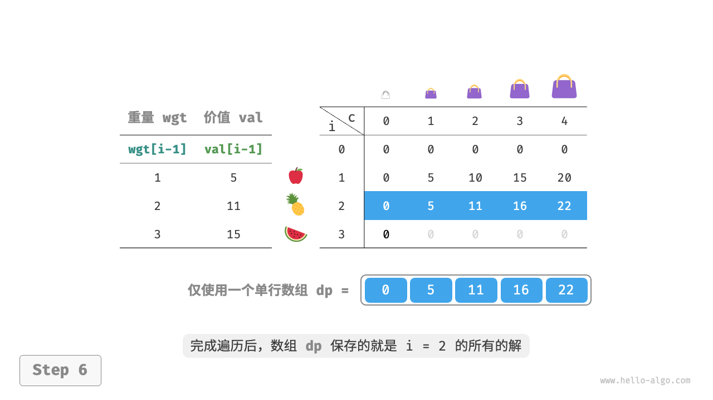
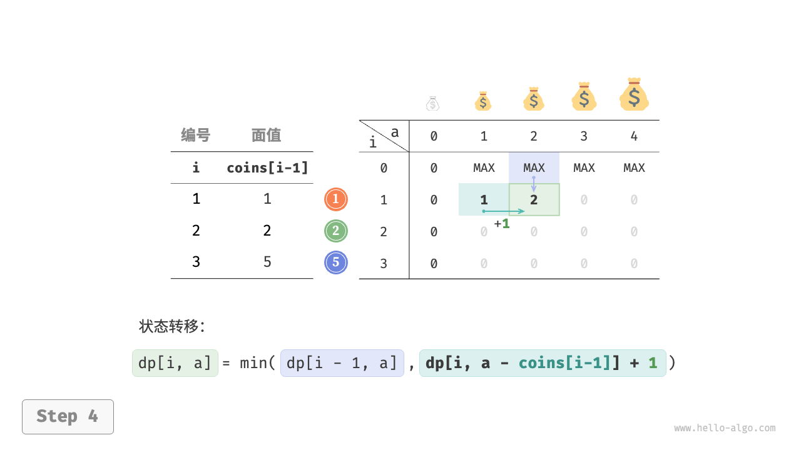
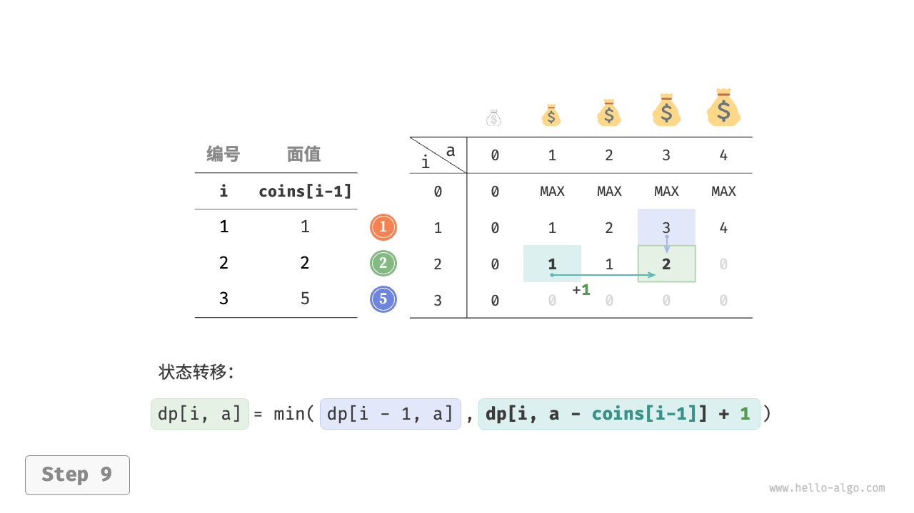
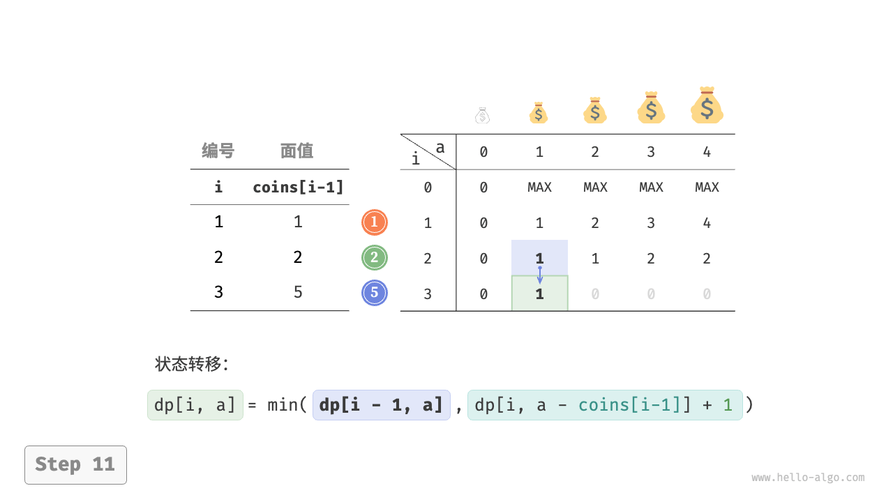
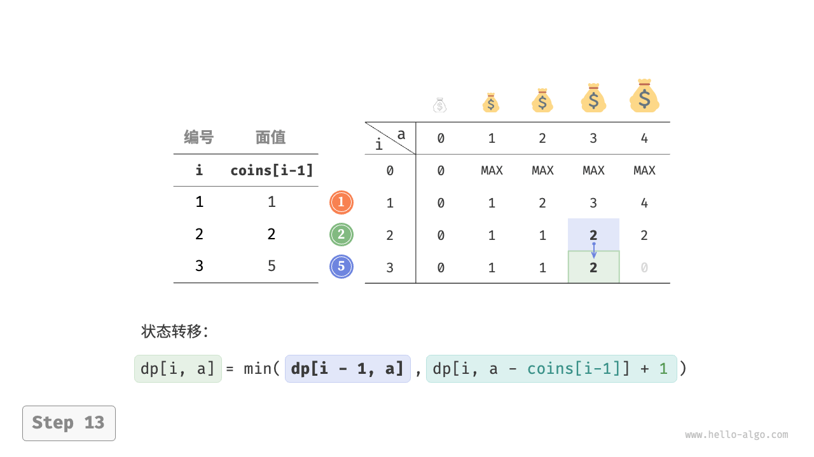
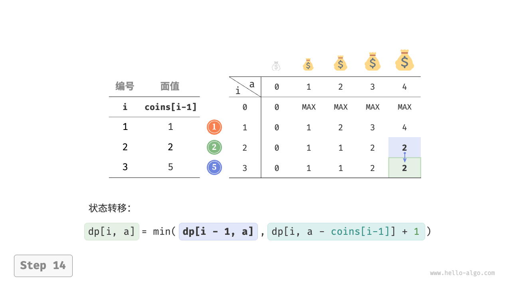
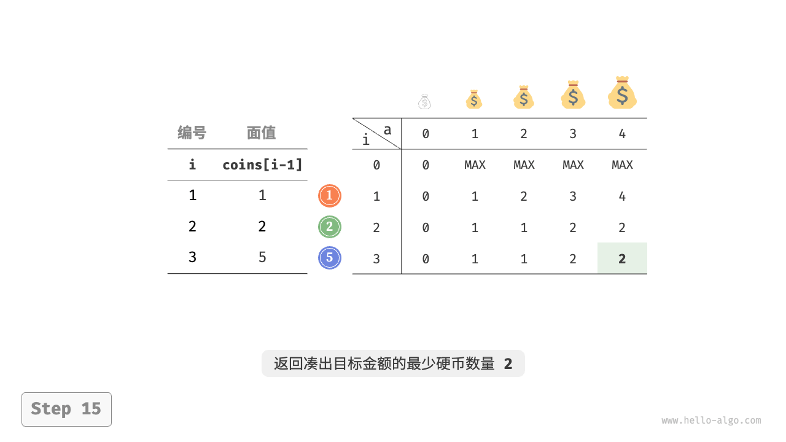

# 完全背包问题

在本节中，我们先求解另一个常见的背包问题：完全背包，再了解它的一种特例：零钱兑换。

## 完全背包

!!! question

    给定 $n$ 个物品，第 $i$ 个物品的重量为 $wgt[i-1]$ 、价值为 $val[i-1]$ ，和一个容量为 $cap$ 的背包。**每个物品可以重复选取**，问在不超过背包容量下能放入物品的最大价值。


### 动态规划思路

完全背包和 0-1 背包问题非常相似，**区别仅在于不限制物品的选择次数**。

- 在 0-1 背包中，每个物品只有一个，因此将物品 $i$ 放入背包后，只能从前 $i-1$ 个物品中选择。
- 在完全背包中，每个物品有无数个，因此将物品 $i$ 放入背包后，**仍可以从前 $i$ 个物品中选择**。

这就导致了状态转移的变化，对于状态 $[i, c]$ 有：

- **不放入物品 $i$** ：与 0-1 背包相同，转移至 $[i-1, c]$ 。
- **放入物品 $i$** ：与 0-1 背包不同，转移至 $[i, c-wgt[i-1]]$ 。

从而状态转移方程变为：

$$
dp[i, c] = \max(dp[i-1, c], dp[i, c - wgt[i-1]] + val[i-1])
$$

### 代码实现

对比两道题目的代码，状态转移中有一处从 $i-1$ 变为 $i$ ，其余完全一致。

=== "Java"

    ```java title="unbounded_knapsack.java"
    [class]{unbounded_knapsack}-[func]{unboundedKnapsackDP}
    ```

=== "C++"

    ```cpp title="unbounded_knapsack.cpp"
    [class]{}-[func]{unboundedKnapsackDP}
    ```

=== "Python"

    ```python title="unbounded_knapsack.py"
    [class]{}-[func]{unbounded_knapsack_dp}
    ```

=== "Go"

    ```go title="unbounded_knapsack.go"
    [class]{}-[func]{unboundedKnapsackDP}
    ```

=== "JS"

    ```javascript title="unbounded_knapsack.js"
    [class]{}-[func]{unboundedKnapsackDP}
    ```

=== "TS"

    ```typescript title="unbounded_knapsack.ts"
    [class]{}-[func]{unboundedKnapsackDP}
    ```

=== "C"

    ```c title="unbounded_knapsack.c"
    [class]{}-[func]{unboundedKnapsackDP}
    ```

=== "C#"

    ```csharp title="unbounded_knapsack.cs"
    [class]{unbounded_knapsack}-[func]{unboundedKnapsackDP}
    ```

=== "Swift"

    ```swift title="unbounded_knapsack.swift"
    [class]{}-[func]{unboundedKnapsackDP}
    ```

=== "Zig"

    ```zig title="unbounded_knapsack.zig"
    [class]{}-[func]{unboundedKnapsackDP}
    ```

=== "Dart"

    ```dart title="unbounded_knapsack.dart"
    [class]{}-[func]{unboundedKnapsackDP}
    ```

=== "Rust"

    ```rust title="unbounded_knapsack.rs"
    [class]{}-[func]{unbounded_knapsack_dp}
    ```

### 状态压缩

由于当前状态是从左边和上边的状态转移而来，**因此状态压缩后应该对 $dp$ 表中的每一行采取正序遍历**。

这个遍历顺序与 0-1 背包正好相反。请借助下图来理解两者的区别。

=== "<1>"
    

=== "<2>"
    

=== "<3>"
    

=== "<4>"
    

=== "<5>"
    

=== "<6>"
    

代码实现比较简单，仅需将数组 `dp` 的第一维删除。

=== "Java"

    ```java title="unbounded_knapsack.java"
    [class]{unbounded_knapsack}-[func]{unboundedKnapsackDPComp}
    ```

=== "C++"

    ```cpp title="unbounded_knapsack.cpp"
    [class]{}-[func]{unboundedKnapsackDPComp}
    ```

=== "Python"

    ```python title="unbounded_knapsack.py"
    [class]{}-[func]{unbounded_knapsack_dp_comp}
    ```

=== "Go"

    ```go title="unbounded_knapsack.go"
    [class]{}-[func]{unboundedKnapsackDPComp}
    ```

=== "JS"

    ```javascript title="unbounded_knapsack.js"
    [class]{}-[func]{unboundedKnapsackDPComp}
    ```

=== "TS"

    ```typescript title="unbounded_knapsack.ts"
    [class]{}-[func]{unboundedKnapsackDPComp}
    ```

=== "C"

    ```c title="unbounded_knapsack.c"
    [class]{}-[func]{unboundedKnapsackDPComp}
    ```

=== "C#"

    ```csharp title="unbounded_knapsack.cs"
    [class]{unbounded_knapsack}-[func]{unboundedKnapsackDPComp}
    ```

=== "Swift"

    ```swift title="unbounded_knapsack.swift"
    [class]{}-[func]{unboundedKnapsackDPComp}
    ```

=== "Zig"

    ```zig title="unbounded_knapsack.zig"
    [class]{}-[func]{unboundedKnapsackDPComp}
    ```

=== "Dart"

    ```dart title="unbounded_knapsack.dart"
    [class]{}-[func]{unboundedKnapsackDPComp}
    ```

=== "Rust"

    ```rust title="unbounded_knapsack.rs"
    [class]{}-[func]{unbounded_knapsack_dp_comp}
    ```

## 零钱兑换问题

背包问题是一大类动态规划问题的代表，其拥有很多的变种，例如零钱兑换问题。

!!! question

    给定 $n$ 种硬币，第 $i$ 种硬币的面值为 $coins[i - 1]$ ，目标金额为 $amt$ ，**每种硬币可以重复选取**，问能够凑出目标金额的最少硬币个数。如果无法凑出目标金额则返回 $-1$ 。


### 动态规划思路

**零钱兑换可以看作是完全背包的一种特殊情况**，两者具有以下联系与不同点：

- 两道题可以相互转换，“物品”对应于“硬币”、“物品重量”对应于“硬币面值”、“背包容量”对应于“目标金额”。
- 优化目标相反，背包问题是要最大化物品价值，零钱兑换问题是要最小化硬币数量。
- 背包问题是求“不超过”背包容量下的解，零钱兑换是求“恰好”凑到目标金额的解。

**第一步：思考每轮的决策，定义状态，从而得到 $dp$ 表**

状态 $[i, a]$ 对应的子问题为：**前 $i$ 种硬币能够凑出金额 $a$ 的最少硬币个数**，记为 $dp[i, a]$ 。

二维 $dp$ 表的尺寸为 $(n+1) \times (amt+1)$ 。

**第二步：找出最优子结构，进而推导出状态转移方程**

与完全背包的状态转移方程基本相同，不同点在于：

- 本题要求最小值，因此需将运算符 $\max()$ 更改为 $\min()$ 。
- 优化主体是硬币数量而非商品价值，因此在选中硬币时执行 $+1$ 即可。

$$
dp[i, a] = \min(dp[i-1, a], dp[i, a - coins[i-1]] + 1)
$$

**第三步：确定边界条件和状态转移顺序**

当目标金额为 $0$ 时，凑出它的最少硬币个数为 $0$ ，即首列所有 $dp[i, 0]$ 都等于 $0$ 。

当无硬币时，**无法凑出任意 $> 0$ 的目标金额**，即是无效解。为使状态转移方程中的 $\min()$ 函数能够识别并过滤无效解，我们考虑使用 $+ \infty$ 来表示它们，即令首行所有 $dp[0, a]$ 都等于 $+ \infty$ 。

### 代码实现

大多数编程语言并未提供 $+ \infty$ 变量，只能使用整型 `int` 的最大值来代替。而这又会导致大数越界：状态转移方程中的 $+ 1$ 操作可能发生溢出。

为此，我们采用数字 $amt + 1$ 来表示无效解，因为凑出 $amt$ 的硬币个数最多为 $amt$ 个。

最后返回前，判断 $dp[n, amt]$ 是否等于 $amt + 1$ ，若是则返回 $-1$ ，代表无法凑出目标金额。

=== "Java"

    ```java title="coin_change.java"
    [class]{coin_change}-[func]{coinChangeDP}
    ```

=== "C++"

    ```cpp title="coin_change.cpp"
    [class]{}-[func]{coinChangeDP}
    ```

=== "Python"

    ```python title="coin_change.py"
    [class]{}-[func]{coin_change_dp}
    ```

=== "Go"

    ```go title="coin_change.go"
    [class]{}-[func]{coinChangeDP}
    ```

=== "JS"

    ```javascript title="coin_change.js"
    [class]{}-[func]{coinChangeDP}
    ```

=== "TS"

    ```typescript title="coin_change.ts"
    [class]{}-[func]{coinChangeDP}
    ```

=== "C"

    ```c title="coin_change.c"
    [class]{}-[func]{coinChangeDP}
    ```

=== "C#"

    ```csharp title="coin_change.cs"
    [class]{coin_change}-[func]{coinChangeDP}
    ```

=== "Swift"

    ```swift title="coin_change.swift"
    [class]{}-[func]{coinChangeDP}
    ```

=== "Zig"

    ```zig title="coin_change.zig"
    [class]{}-[func]{coinChangeDP}
    ```

=== "Dart"

    ```dart title="coin_change.dart"
    [class]{}-[func]{coinChangeDP}
    ```

=== "Rust"

    ```rust title="coin_change.rs"
    [class]{}-[func]{coin_change_dp}
    ```

下图展示了零钱兑换的动态规划过程，和完全背包非常相似。

=== "<1>"
    

=== "<2>"
    

=== "<3>"
    

=== "<4>"
    

=== "<5>"
    

=== "<6>"
    

=== "<7>"
    

=== "<8>"
    

=== "<9>"
    

=== "<10>"
    

=== "<11>"
    

=== "<12>"
    

=== "<13>"
    

=== "<14>"
    

=== "<15>"
    

### 状态压缩

零钱兑换的状态压缩的处理方式和完全背包一致。

=== "Java"

    ```java title="coin_change.java"
    [class]{coin_change}-[func]{coinChangeDPComp}
    ```

=== "C++"

    ```cpp title="coin_change.cpp"
    [class]{}-[func]{coinChangeDPComp}
    ```

=== "Python"

    ```python title="coin_change.py"
    [class]{}-[func]{coin_change_dp_comp}
    ```

=== "Go"

    ```go title="coin_change.go"
    [class]{}-[func]{coinChangeDPComp}
    ```

=== "JS"

    ```javascript title="coin_change.js"
    [class]{}-[func]{coinChangeDPComp}
    ```

=== "TS"

    ```typescript title="coin_change.ts"
    [class]{}-[func]{coinChangeDPComp}
    ```

=== "C"

    ```c title="coin_change.c"
    [class]{}-[func]{coinChangeDPComp}
    ```

=== "C#"

    ```csharp title="coin_change.cs"
    [class]{coin_change}-[func]{coinChangeDPComp}
    ```

=== "Swift"

    ```swift title="coin_change.swift"
    [class]{}-[func]{coinChangeDPComp}
    ```

=== "Zig"

    ```zig title="coin_change.zig"
    [class]{}-[func]{coinChangeDPComp}
    ```

=== "Dart"

    ```dart title="coin_change.dart"
    [class]{}-[func]{coinChangeDPComp}
    ```

=== "Rust"

    ```rust title="coin_change.rs"
    [class]{}-[func]{coin_change_dp_comp}
    ```

## 零钱兑换问题 II

!!! question

    给定 $n$ 种硬币，第 $i$ 种硬币的面值为 $coins[i - 1]$ ，目标金额为 $amt$ ，每种硬币可以重复选取，**问在凑出目标金额的硬币组合数量**。


### 动态规划思路

相比于上一题，本题目标是组合数量，因此子问题变为：**前 $i$ 种硬币能够凑出金额 $a$ 的组合数量**。而 $dp$ 表仍然是尺寸为 $(n+1) \times (amt + 1)$ 的二维矩阵。

当前状态的组合数量等于不选当前硬币与选当前硬币这两种决策的组合数量之和。状态转移方程为：

$$
dp[i, a] = dp[i-1, a] + dp[i, a - coins[i-1]]
$$

当目标金额为 $0$ 时，无须选择任何硬币即可凑出目标金额，因此应将首列所有 $dp[i, 0]$ 都初始化为 $1$ 。当无硬币时，无法凑出任何 $>0$ 的目标金额，因此首行所有 $dp[0, a]$ 都等于 $0$ 。

### 代码实现

=== "Java"

    ```java title="coin_change_ii.java"
    [class]{coin_change_ii}-[func]{coinChangeIIDP}
    ```

=== "C++"

    ```cpp title="coin_change_ii.cpp"
    [class]{}-[func]{coinChangeIIDP}
    ```

=== "Python"

    ```python title="coin_change_ii.py"
    [class]{}-[func]{coin_change_ii_dp}
    ```

=== "Go"

    ```go title="coin_change_ii.go"
    [class]{}-[func]{coinChangeIIDP}
    ```

=== "JS"

    ```javascript title="coin_change_ii.js"
    [class]{}-[func]{coinChangeIIDP}
    ```

=== "TS"

    ```typescript title="coin_change_ii.ts"
    [class]{}-[func]{coinChangeIIDP}
    ```

=== "C"

    ```c title="coin_change_ii.c"
    [class]{}-[func]{coinChangeIIDP}
    ```

=== "C#"

    ```csharp title="coin_change_ii.cs"
    [class]{coin_change_ii}-[func]{coinChangeIIDP}
    ```

=== "Swift"

    ```swift title="coin_change_ii.swift"
    [class]{}-[func]{coinChangeIIDP}
    ```

=== "Zig"

    ```zig title="coin_change_ii.zig"
    [class]{}-[func]{coinChangeIIDP}
    ```

=== "Dart"

    ```dart title="coin_change_ii.dart"
    [class]{}-[func]{coinChangeIIDP}
    ```

=== "Rust"

    ```rust title="coin_change_ii.rs"
    [class]{}-[func]{coin_change_ii_dp}
    ```

### 状态压缩

状态压缩处理方式相同，删除硬币维度即可。

=== "Java"

    ```java title="coin_change_ii.java"
    [class]{coin_change_ii}-[func]{coinChangeIIDPComp}
    ```

=== "C++"

    ```cpp title="coin_change_ii.cpp"
    [class]{}-[func]{coinChangeIIDPComp}
    ```

=== "Python"

    ```python title="coin_change_ii.py"
    [class]{}-[func]{coin_change_ii_dp_comp}
    ```

=== "Go"

    ```go title="coin_change_ii.go"
    [class]{}-[func]{coinChangeIIDPComp}
    ```

=== "JS"

    ```javascript title="coin_change_ii.js"
    [class]{}-[func]{coinChangeIIDPComp}
    ```

=== "TS"

    ```typescript title="coin_change_ii.ts"
    [class]{}-[func]{coinChangeIIDPComp}
    ```

=== "C"

    ```c title="coin_change_ii.c"
    [class]{}-[func]{coinChangeIIDPComp}
    ```

=== "C#"

    ```csharp title="coin_change_ii.cs"
    [class]{coin_change_ii}-[func]{coinChangeIIDPComp}
    ```

=== "Swift"

    ```swift title="coin_change_ii.swift"
    [class]{}-[func]{coinChangeIIDPComp}
    ```

=== "Zig"

    ```zig title="coin_change_ii.zig"
    [class]{}-[func]{coinChangeIIDPComp}
    ```

=== "Dart"

    ```dart title="coin_change_ii.dart"
    [class]{}-[func]{coinChangeIIDPComp}
    ```

=== "Rust"

    ```rust title="coin_change_ii.rs"
    [class]{}-[func]{coin_change_ii_dp_comp}
    ```
