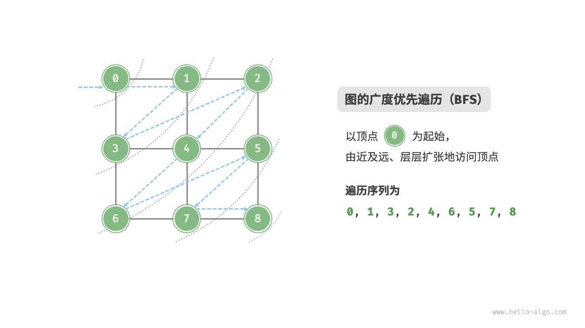
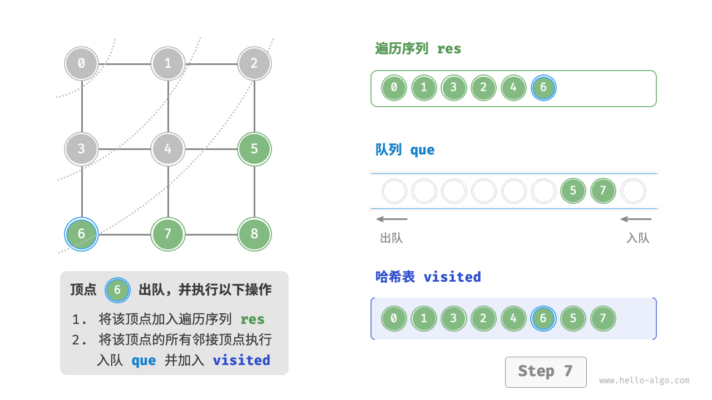
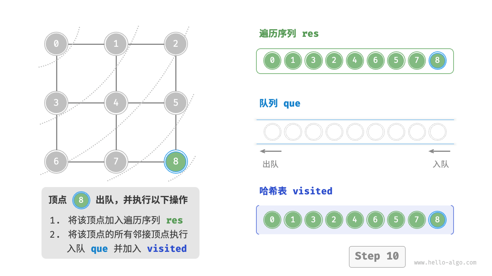
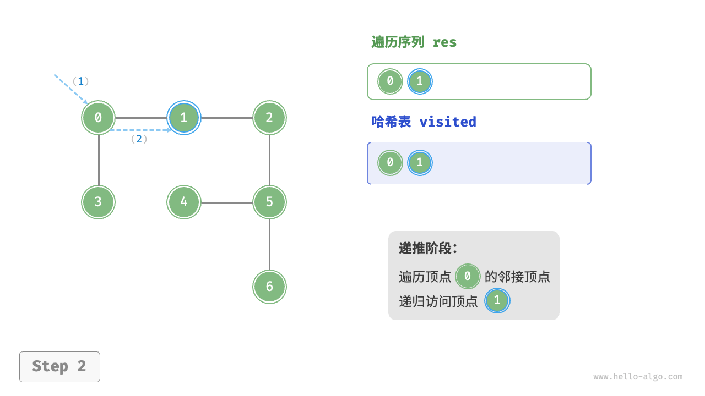
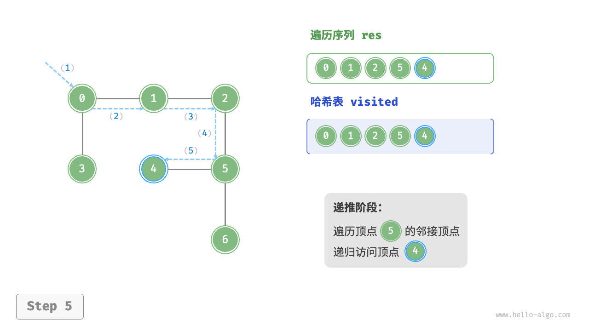
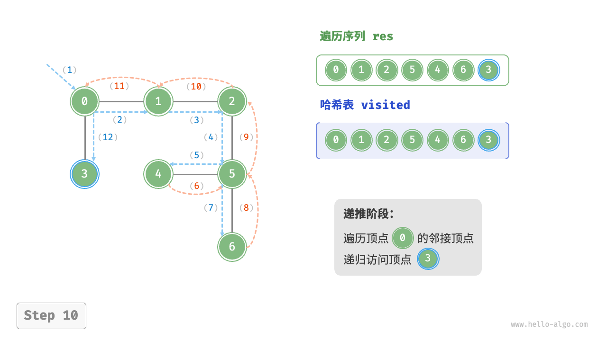

# 图的遍历

!!! note "图与树的关系"

    树代表的是“一对多”的关系，而图则自由度更高，可以代表任意“多对多”关系。本质上，**可以把树看作是图的一类特例**。那么显然，树遍历操作也是图遍历操作的一个特例，两者的方法是非常类似的，建议你在学习本章节的过程中将两者融会贯通。

「图」与「树」都是非线性数据结构，都需要使用「搜索算法」来实现遍历操作。

类似地，图的遍历方式也分为两种，即「广度优先遍历 Breadth-First Traversal」和「深度优先遍历 Depth-First Travsersal」，也称「广度优先搜索 Breadth-First Search」和「深度优先搜索 Depth-First Search」，简称为 BFS 和 DFS 。

## 广度优先遍历

**广度优先遍历优是一种由近及远的遍历方式，从距离最近的顶点开始访问，并一层层向外扩张**。具体地，从某个顶点出发，先遍历该顶点的所有邻接顶点，随后遍历下个顶点的所有邻接顶点，以此类推……



### 算法实现

BFS 常借助「队列」来实现。队列具有“先入先出”的性质，这与 BFS “由近及远”的思想是异曲同工的。

1. 将遍历起始顶点 `startVet` 加入队列，并开启循环；
2. 在循环的每轮迭代中，弹出队首顶点弹出并记录访问，并将该顶点的所有邻接顶点加入到队列尾部；
3. 循环 `2.` ，直到所有顶点访问完成后结束；

为了防止重复遍历顶点，我们需要借助一个哈希表 `visited` 来记录哪些结点已被访问。

=== "Java"

    ```java title="graph_bfs.java"
    [class]{graph_bfs}-[func]{graphBFS}
    ```

=== "C++"

    ```cpp title="graph_bfs.cpp"

    ```

=== "Python"

    ```python title="graph_bfs.py"

    ```

=== "Go"

    ```go title="graph_bfs.go"

    ```

=== "JavaScript"

    ```javascript title="graph_bfs.js"

    ```

=== "TypeScript"

    ```typescript title="graph_bfs.ts"

    ```

=== "C"

    ```c title="graph_bfs.c"

    ```

=== "C#"

    ```csharp title="graph_bfs.cs"

    ```

=== "Swift"

    ```swift title="graph_bfs.swift"
    [class]{}-[func]{graphBFS}
    ```

=== "Zig"

    ```zig title="graph_bfs.zig"

    ```

代码相对抽象，建议对照以下动画图示来加深理解。

=== "<1>"
    

=== "<2>"
    

=== "<3>"
    

=== "<4>"
    

=== "<5>"
    

=== "<6>"
    

=== "<7>"
    

=== "<8>"
    

=== "<9>"
    

=== "<10>"
    

=== "<11>"
    

!!! question "广度优先遍历的序列是否唯一？"

    不唯一。广度优先遍历只要求“由近及远”，而相同距离的多个顶点的遍历顺序允许任意被打乱。以上图为例，顶点 $1$ , $3$ 的访问顺序可以交换、顶点 $2$ , $4$ , $6$ 的访问顺序也可以任意交换、以此类推……

### 复杂度分析

**时间复杂度：** 所有顶点都会入队、出队一次，使用 $O(|V|)$ 时间；在遍历邻接顶点的过程中，由于是无向图，因此所有边都会被访问 $2$ 次，使用 $O(2|E|)$ 时间；总体使用 $O(|V| + |E|)$ 时间。

**空间复杂度：** 列表 `res` ，哈希表 `visited` ，队列 `que` 中的顶点数量最多为 $|V|$ ，使用 $O(|V|)$ 空间。

## 深度优先遍历

**深度优先遍历是一种优先走到底、无路可走再回头的遍历方式**。具体地，从某个顶点出发，不断地访问当前结点的某个邻接顶点，直到走到尽头时回溯，再继续走到底 + 回溯，以此类推……直至所有顶点遍历完成时结束。


### 算法实现

这种“走到头 + 回溯”的算法形式一般基于递归来实现。与 BFS 类似，在 DFS 中我们也需要借助一个哈希表 `visited` 来记录已被访问的顶点，以避免重复访问顶点。

=== "Java"

    ```java title="graph_dfs.java"
    [class]{graph_dfs}-[func]{dfs}

    [class]{graph_dfs}-[func]{graphDFS}
    ```

=== "C++"

    ```cpp title="graph_dfs.cpp"

    ```

=== "Python"

    ```python title="graph_dfs.py"

    ```

=== "Go"

    ```go title="graph_dfs.go"

    ```

=== "JavaScript"

    ```javascript title="graph_dfs.js"

    ```

=== "TypeScript"

    ```typescript title="graph_dfs.ts"

    ```

=== "C"

    ```c title="graph_dfs.c"

    ```

=== "C#"

    ```csharp title="graph_dfs.cs"

    ```

=== "Swift"

    ```swift title="graph_dfs.swift"
    [class]{}-[func]{dfs}

    [class]{}-[func]{graphDFS}
    ```

=== "Zig"

    ```zig title="graph_dfs.zig"

    ```

深度优先遍历的算法流程如下图所示，其中

- **直虚线代表向下递推**，代表开启了一个新的递归方法来访问新顶点；
- **曲虚线代表向上回溯**，代表此递归方法已经返回，回溯到了开启此递归方法的位置；

为了加深理解，请你将图示与代码结合起来，在脑中（或者用笔画下来）模拟整个 DFS 过程，包括每个递归方法何时开启、何时返回。

=== "<1>"
    

=== "<2>"
    

=== "<3>"
    

=== "<4>"
    

=== "<5>"
    

=== "<6>"
    

=== "<7>"
    

=== "<8>"
    

=== "<9>"
    

=== "<10>"
    

=== "<11>"
    

!!! question "深度优先遍历的序列是否唯一？"

    与广度优先遍历类似，深度优先遍历序列的顺序也不是唯一的。给定某顶点，先往哪个方向探索都行，都是深度优先遍历。
    
    以树的遍历为例，“根 $\rightarrow$ 左 $\rightarrow$ 右”、“左 $\rightarrow$ 根 $\rightarrow$ 右”、“左 $\rightarrow$ 右 $\rightarrow$ 根”分别对应前序、中序、后序遍历，体现三种不同的遍历优先级，而三者都属于深度优先遍历。

### 复杂度分析

**时间复杂度：** 所有顶点都被访问一次；所有边都被访问了 $2$ 次，使用 $O(2|E|)$ 时间；总体使用 $O(|V| + |E|)$ 时间。

**空间复杂度：** 列表 `res` ，哈希表 `visited` 顶点数量最多为 $|V|$ ，递归深度最大为 $|V|$ ，因此使用 $O(|V|)$ 空间。
