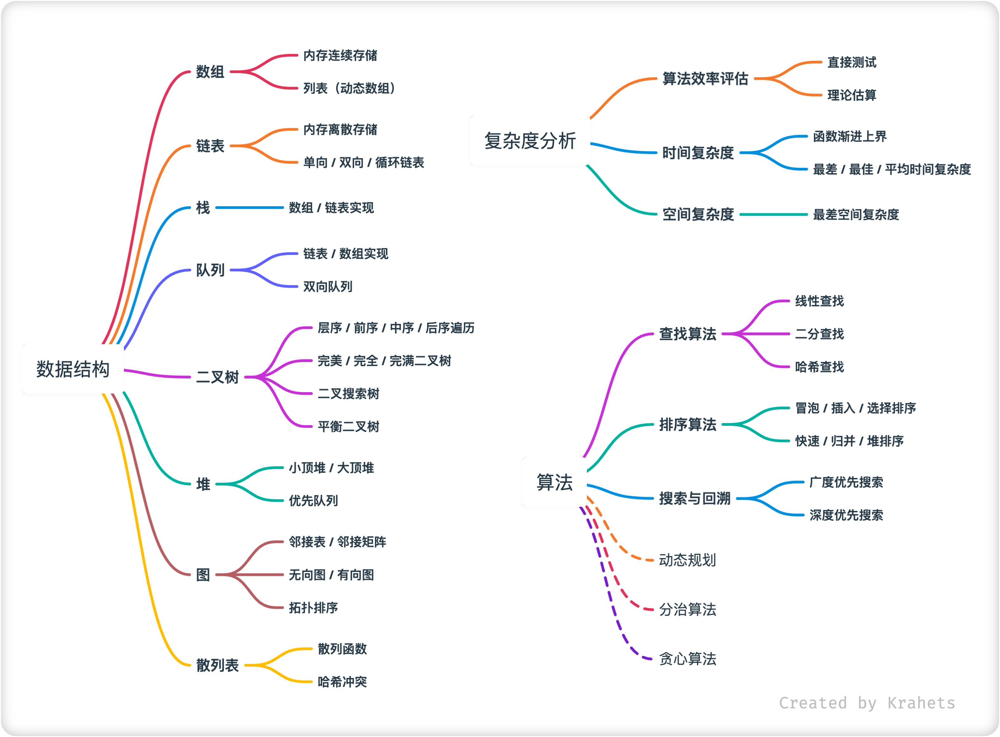

# 关于本书

在 2018 年 10 月发生了一件事，成为了我职业生涯的重要转折点。当时的我在交大读研，对互联网求职一无所知，但仍然硬着头皮申请了 Microsoft 的软件工程师实习。在二面中，面试官让我在白板上写出 “快速排序” 代码，我摇了摇头，畏畏缩缩地写了一个 “冒泡排序” ，并且还写错了。从面试官的表情上，我看到了一个大大的 Game Over 。

从那次失利开始，找工作的压力就倒逼我开始刷算法题。我采用 “扫雷游戏” 式的学习方法，两眼一抹黑刷题，扫到不会的 “雷” 就通过查资料把它解决掉，配合周期性的总结，逐渐形成了数据结构与算法的知识图景。幸运地，我在 2020 年秋招斩获了多家大厂的 Offer 。

之后，分享题解成为了我的爱好。经常刷题的同学可能遇见过一个顶着路飞笑脸头像，名为「Krahets」的力扣 ID ，那便是我。截至目前，我已在力扣（LeetCode）上分享了近 100 道题目解析，累积了 1700 万阅读量，回复了数千条读者的评论和问题，并编写了 LeetBook《图解算法数据结构》，已免费售出 21 万多本。

回想自己当初在 “扫雷式” 刷题中被炸的满头包的痛苦，我意识到有一本 “刷题前必看” 的读物可以使算法小白少走许多弯路，而这正与我的擅长点契合。强烈的写作意愿席卷而来，那就来吧：

<h4 style="text-align:center"> Hello，算法！ </h4>

## 读者对象

- 数据结构与算法零基础的同学，但需具备 Java, C++, Python 任一语言的编程基础
- 具有一定算法刷题基础，想要系统地学习或复习数据结构与算法的同学
- 本书以代码实践为导向，尤其适合在职或即将成为工程师（程序员）的同学

!!! quote ""

    
 追风赶月莫停留，平芜尽处是春山 

    
 一起加油！ 

## 内容结构

本书主要内容分为复杂度分析、数据结构、算法三个部分。

 Fig. 知识点思维导图 

### 复杂度分析

首先介绍数据结构与算法的评价维度，以及算法效率评估方法，引出了计算复杂度概念。

接下来，介绍了函数渐进上界的含义，并分别介绍了时间复杂度和空间复杂度的定义、推算方法、常见类型等，以及最差、最佳、平均时间复杂度的区别。

### 数据结构

首先介绍了物理结构和逻辑结构两种数据结构的分类方法，随后介绍了各个数据结构，包括数组、链表、栈、队列、树、堆、图、散列表等，内容包括：

- 基本定义：数据结构的设计来源、存在意义；
- 主要特点：在各项数据操作中的优势、劣势；
- 常用操作：例如访问、更新、插入、删除、遍历、搜索等；
- 常见类型：在算法题或工程实际中，经常碰到的数据结构类型；
- 典型应用：此数据结构经常搭配哪些算法使用；
- 实现方法：对于重要的数据结构，将给出完整的实现示例；

### 算法

介绍了常见的算法类型，包括查找算法、排序算法、搜索与回溯算法、动态规划、分治算法等，主要关心以下内容：

- 基本定义：算法的设计思想；
- 主要特点：使用前置要求、优势和劣势；
- 算法效率：最差和平均时间复杂度、空间复杂度；
- 应用场景：结合例题讲述算法应用；

## 配套代码

完整可运行的代码在 GitHub 仓库  ，你可以使用 Git 将仓库 Clone 至本地，也可以下载仓库压缩包使用。

编程环境部署和代码使用方法请见下章 “编程环境安装” 和 “算法学习建议” 。

## 风格约定

- 文章中的重要名词会用「」符号标注，例如「数组 Array」。这类名词应该被牢记，英文翻译也建议记住，以便后续查阅资料时使用。
- 重点内容、总起句、总结句会被 **加粗** ，此类文字值得更多关注。
- 专有名词和有特指含义的词句会使用 “ ” 标注，以避免歧义。 
- 标题后标注 * 符号的是选读章节，如果你的时间有限，可以先跳过这些章节。

## 本书特点

**以实践为主。** 我们知道，学习英语期间光啃书本是远远不够的，需要多听、多说、多写，在实践中培养语感、积累经验。编程语言也是一门语言，因此学习方法也应是类似的，需要多看优秀代码、多敲键盘、多思考代码逻辑。

本书的理论部分占少量篇幅，主要分为两类：一是基础且必要的概念知识，以培养读者对于算法的感性认识；二是重要的分类、对比或总结，这是为了帮助你站在更高视角俯瞰各个知识点，形成连点成面的效果。

实践部分主要由示例和代码组成。代码配有简要注释，复杂示例会尽可能地使用视觉化的形式呈现。我强烈建议读者对照着代码自己敲一遍，如果时间有限，也至少逐行读、复制并运行一遍，配合着讲解将代码吃透。

!!! quote

    “Talk is cheap. Show me the code.” ― Linus Torvalds
    
    “少吹牛，看代码”

**视觉化学习。** 信息时代以来，视觉化的脚步从未停止。媒体形式经历了文字短信、图文 Email 、动图、短（长）视频、交互式 Web 、3D 游戏等演变过程，信息的视觉化程度越来越高、愈加符合人类感官、信息传播效率大大提升。科技界也在向视觉化迈进，iPhone 就是一个典型例子，其相对于传统手机是高度视觉化的，包含精心设计的字体、主题配色、交互动画等。

近两年，短视频成为最受欢迎的信息媒介，可以在短时间内将高密度的信息 “灌” 给我们，有着极其舒适的观看体验。阅读则不然，读者与书本之间天然存在一种 “疏离感”，我们看书会累、会走神、会停下来想其他事、会划下喜欢的句子、会思考某一片段的含义，这种疏离感给了读者与书本之间对话的可能，拓宽了想象空间。

本书作为一本入门教材，希望可以保有书本的 “慢节奏” ，但也会避免与读者产生过多 “疏离感” ，而是努力将知识完整清晰地推送到你聪明的小脑袋瓜中。我将采用视觉化的方式（例如配图、动画），尽我可能清晰易懂地讲解复杂概念和抽象示例。

!!! quote

    “A picture is worth a thousand words.”
    
    “一图胜千言”

**内容精简化。** 大多数的经典教科书，会把每个主题都讲的很透彻。虽然透彻性正是其获得读者青睐的原因，但对于想要快速入门的初学者来说，这些教材的实用性不足。本书会避免引入非必要的概念、名词、定义等，也避免展开不必要的理论分析，毕竟这不是一本真正意义上的教材，主要任务是尽快地带领读者入门。

引入一些生活案例或趣味内容，非常适合作为知识点的引子或者解释的补充，但当融入过多额外元素时，内容会稍显冗长，也许反而使读者容易迷失、抓不住重点，这也是本书需要避免的。

敲代码如同写字，“美” 是统一的追求。本书力求美观的代码，保证规范的变量命名、统一的空格与换行、对齐的缩进、整齐的注释等。

## 致谢

（TODO）
