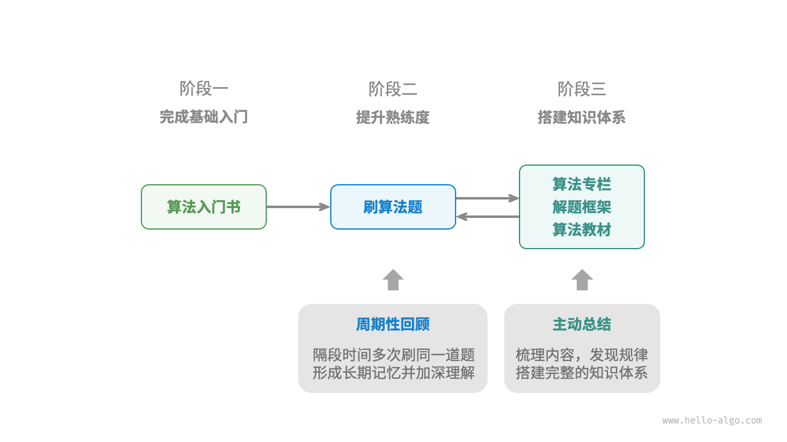

# 如何使用本书

## 图文搭配学

视频和图片相比于文字的信息密度和结构化程度更高，更容易让人理解。在本书中，重点和难点知识会主要以动画、图解的形式呈现，而文字的作用则是作为动画和图的解释与补充。

在阅读本书的过程中，若发现某段内容提供了动画或图解，**建议你以图为主线**，将文字内容（一般在图的上方）对齐到图中内容，综合来理解。


## 代码实践学

!!! tip "前置工作"

    如果没有本地编程环境，可以参照下节 [编程环境安装](https://www.hello-algo.com/chapter_preface/installation/) 。

### 下载代码仓

如果已经安装 [Git](https://git-scm.com/downloads) ，可以通过命令行来克隆代码仓。

```shell
git clone https://github.com/krahets/hello-algo.git
```

当然，你也可以点击“Download ZIP”直接下载代码压缩包，解压即可。


### 运行源代码

本书提供配套 Java, C++, Python 代码仓（后续可能拓展支持语言）。书中的代码栏上若标有 `*.java` , `*.cpp` , `*.py` ，则可在仓库 codes 文件夹中找到对应的 **代码源文件**。


这些源文件中包含详细注释，配有测试样例，可以直接运行，帮助你省去不必要的调试时间，可以将精力集中在学习内容上。


!!! tip "代码学习建议"

    若学习时间紧张，**请至少将所有代码通读并运行一遍**。若时间允许，**强烈建议对照着代码自己敲一遍**，逐渐锻炼肌肉记忆。相比于读代码，写代码的过程往往能带来新的收获。

## 提问讨论学

阅读本书时，请不要“惯着”那些弄不明白的知识点。如果有任何疑惑，**可以在评论区留下你的问题**，小伙伴们和我都会给予解答（您一般 3 天内会得到回复）。

同时，也希望你可以多花时间逛逛评论区。一方面，可以看看大家遇到了什么问题，反过来查漏补缺，这往往可以引起更加深度的思考。另一方面，也希望你可以慷慨地解答小伙伴们的问题、分享自己的见解，大家一起加油与进步！


## 算法学习“三步走”

**第一阶段，算法入门，也正是本书的定位**。熟悉各种数据结构的特点、用法，学习各种算法的工作原理、用途、效率等。

**第二阶段，刷算法题**。可以先从热门题单开刷，推荐 [剑指 Offer](https://leetcode.cn/problem-list/xb9nqhhg/)、[LeetCode 热题 HOT 100](https://leetcode.cn/problem-list/2cktkvj/) ，先积累至少 100 道题量，熟悉大多数的算法问题。刚开始刷题时，“遗忘”是最大的困扰点，但这是很正常的，请不要担心。学习中有一种概念叫“周期性回顾”，同一道题隔段时间做一次，当做了三遍以上，往往就能牢记于心了。

**第三阶段，搭建知识体系**。在学习方面，可以阅读算法专栏文章、解题框架、算法教材，不断地丰富知识体系。在刷题方面，可以开始采用进阶刷题方案，例如按专题分类、一题多解、一解多题等，刷题方案在社区中可以找到一些讲解，在此不做赘述。


