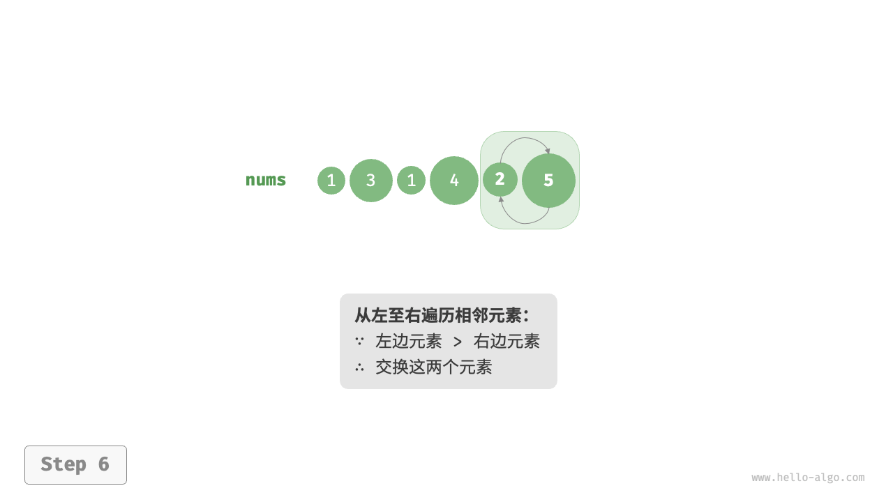
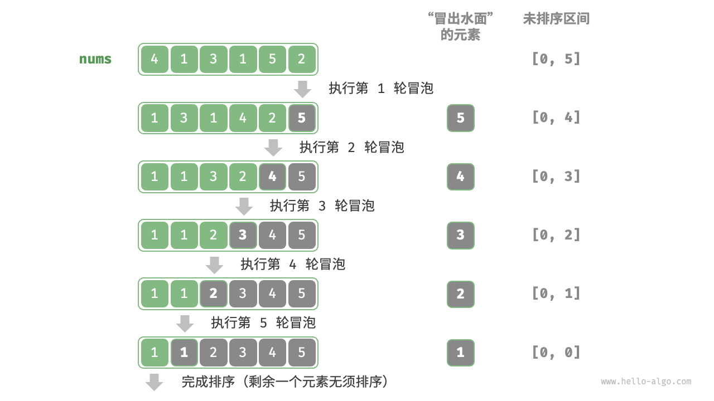

# 冒泡排序

「冒泡排序 bubble sort」通过连续地比较与交换相邻元素实现排序。这个过程就像气泡从底部升到顶部一样，因此得名冒泡排序。

我们可以利用元素交换操作模拟上述过程：从数组最左端开始向右遍历，依次比较相邻元素大小，如果“左元素 > 右元素”就交换它俩。遍历完成后，最大的元素会被移动到数组的最右端。

=== "<1>"
    

=== "<2>"
    

=== "<3>"
    

=== "<4>"
    

=== "<5>"
    

=== "<6>"
    

=== "<7>"
    

## 算法流程

设数组的长度为 $n$ ，冒泡排序的步骤为：

1. 首先，对 $n$ 个元素执行“冒泡”，**将数组的最大元素交换至正确位置**，
2. 接下来，对剩余 $n - 1$ 个元素执行“冒泡”，**将第二大元素交换至正确位置**。
3. 以此类推，经过 $n - 1$ 轮“冒泡”后，**前 $n - 1$ 大的元素都被交换至正确位置**。
4. 仅剩的一个元素必定是最小元素，无须排序，因此数组排序完成。



=== "Java"

    ```java title="bubble_sort.java"
    [class]{bubble_sort}-[func]{bubbleSort}
    ```

=== "C++"

    ```cpp title="bubble_sort.cpp"
    [class]{}-[func]{bubbleSort}
    ```

=== "Python"

    ```python title="bubble_sort.py"
    [class]{}-[func]{bubble_sort}
    ```

=== "Go"

    ```go title="bubble_sort.go"
    [class]{}-[func]{bubbleSort}
    ```

=== "JS"

    ```javascript title="bubble_sort.js"
    [class]{}-[func]{bubbleSort}
    ```

=== "TS"

    ```typescript title="bubble_sort.ts"
    [class]{}-[func]{bubbleSort}
    ```

=== "C"

    ```c title="bubble_sort.c"
    [class]{}-[func]{bubbleSort}
    ```

=== "C#"

    ```csharp title="bubble_sort.cs"
    [class]{bubble_sort}-[func]{bubbleSort}
    ```

=== "Swift"

    ```swift title="bubble_sort.swift"
    [class]{}-[func]{bubbleSort}
    ```

=== "Zig"

    ```zig title="bubble_sort.zig"
    [class]{}-[func]{bubbleSort}
    ```

=== "Dart"

    ```dart title="bubble_sort.dart"
    [class]{}-[func]{bubbleSort}
    ```

=== "Rust"

    ```rust title="bubble_sort.rs"
    [class]{}-[func]{bubble_sort}
    ```

## 效率优化

我们发现，如果某轮“冒泡”中没有执行任何交换操作，说明数组已经完成排序，可直接返回结果。因此，可以增加一个标志位 `flag` 来监测这种情况，一旦出现就立即返回。

经过优化，冒泡排序的最差和平均时间复杂度仍为 $O(n^2)$ ；但当输入数组完全有序时，可达到最佳时间复杂度 $O(n)$ 。

=== "Java"

    ```java title="bubble_sort.java"
    [class]{bubble_sort}-[func]{bubbleSortWithFlag}
    ```

=== "C++"

    ```cpp title="bubble_sort.cpp"
    [class]{}-[func]{bubbleSortWithFlag}
    ```

=== "Python"

    ```python title="bubble_sort.py"
    [class]{}-[func]{bubble_sort_with_flag}
    ```

=== "Go"

    ```go title="bubble_sort.go"
    [class]{}-[func]{bubbleSortWithFlag}
    ```

=== "JS"

    ```javascript title="bubble_sort.js"
    [class]{}-[func]{bubbleSortWithFlag}
    ```

=== "TS"

    ```typescript title="bubble_sort.ts"
    [class]{}-[func]{bubbleSortWithFlag}
    ```

=== "C"

    ```c title="bubble_sort.c"
    [class]{}-[func]{bubbleSortWithFlag}
    ```

=== "C#"

    ```csharp title="bubble_sort.cs"
    [class]{bubble_sort}-[func]{bubbleSortWithFlag}
    ```

=== "Swift"

    ```swift title="bubble_sort.swift"
    [class]{}-[func]{bubbleSortWithFlag}
    ```

=== "Zig"

    ```zig title="bubble_sort.zig"
    [class]{}-[func]{bubbleSortWithFlag}
    ```

=== "Dart"

    ```dart title="bubble_sort.dart"
    [class]{}-[func]{bubbleSortWithFlag}
    ```

=== "Rust"

    ```rust title="bubble_sort.rs"
    [class]{}-[func]{bubble_sort_with_flag}
    ```

## 算法特性

- **时间复杂度为 $O(n^2)$ 、自适应排序** ：各轮“冒泡”遍历的数组长度依次为 $n - 1$ , $n - 2$ , $\dots$ , $2$ , $1$ ，总和为 $(n - 1) n / 2$ 。在引入 `flag` 优化后，最佳时间复杂度可达到 $O(n)$ 。
- **空间复杂度为 $O(1)$ 、原地排序**：指针 $i$ , $j$ 使用常数大小的额外空间。
- **稳定排序**：由于在“冒泡”中遇到相等元素不交换。
