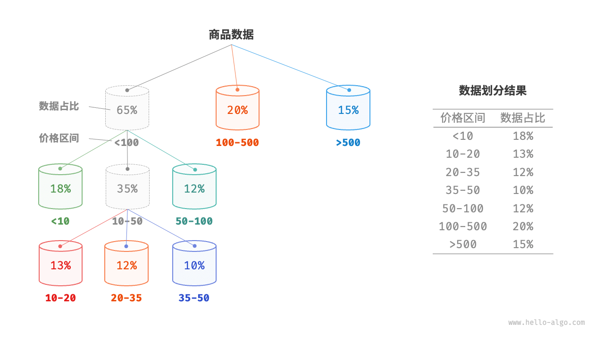
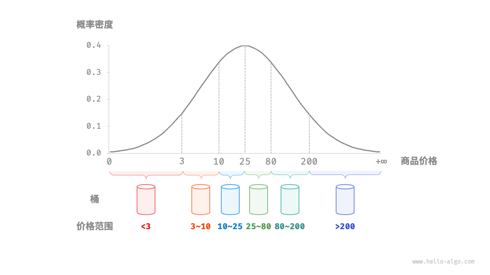

# 桶排序

「桶排序 Bucket Sort」是分治思想的典型体现，其通过设置一些桶，将数据平均分配到各个桶中，并在每个桶内部分别执行排序，最终根据桶之间天然的大小顺序将各个桶内元素合并，从而得到排序结果。

## 算法流程

输入一个长度为 $n$ 的数组，元素是范围 $[0, 1)$ 的浮点数，桶排序流程为：

1. 初始化 $k$ 个桶，将 $n$ 个元素分配至 $k$ 个桶中；
2. 对每个桶分别执行排序（本文采用编程语言的内置排序函数）；
3. 按照桶的从小到大的顺序，合并结果；


=== "Java"

    ```java title="bucket_sort.java"
    [class]{bucket_sort}-[func]{bucketSort}
    ```

=== "C++"

    ```cpp title="bucket_sort.cpp"
    [class]{}-[func]{bucketSort}
    ```

=== "Python"

    ```python title="bucket_sort.py"
    [class]{}-[func]{bucket_sort}
    ```

=== "Go"

    ```go title="bucket_sort.go"
    [class]{}-[func]{bucketSort}
    ```

=== "JavaScript"

    ```javascript title="bucket_sort.js"
    [class]{}-[func]{bucketSort}
    ```

=== "TypeScript"

    ```typescript title="bucket_sort.ts"
    [class]{}-[func]{bucketSort}
    ```

=== "C"

    ```c title="bucket_sort.c"
    [class]{}-[func]{bucketSort}
    ```

=== "C#"

    ```csharp title="bucket_sort.cs"
    [class]{bucket_sort}-[func]{bucketSort}
    ```

=== "Swift"

    ```swift title="bucket_sort.swift"
    [class]{}-[func]{bucketSort}
    ```

=== "Zig"

    ```zig title="bucket_sort.zig"
    [class]{}-[func]{bucketSort}
    ```

!!! note "桶排序是计数排序的一种推广"

    从桶排序的角度，我们可以把计数排序中计数数组 `counter` 的每个索引想象成一个桶，将统计数量的过程想象成把各个元素分配到对应的桶中，再根据桶之间的有序性输出结果，从而实现排序。

## 算法特性

**时间复杂度 $O(n + k)$** ：假设元素平均分布在各个桶内，则每个桶内元素数量为 $\frac{n}{k}$ 。假设排序单个桶使用 $O(\frac{n}{k} \log\frac{n}{k})$ 时间，则排序所有桶使用 $O(n \log\frac{n}{k})$ 时间，**当桶数量 $k$ 比较大时，时间复杂度则趋向于 $O(n)$** 。最后合并结果需要遍历 $n$ 个桶，使用 $O(k)$ 时间。

最差情况下，所有数据被分配到一个桶中，且排序算法退化至 $O(n^2)$ ，此时使用 $O(n^2)$ 时间，因此是“自适应排序”。

**空间复杂度 $O(n + k)$** ：需要借助 $k$ 个桶和共 $n$ 个元素的额外空间，是“非原地排序”。

桶排序是否稳定取决于排序桶内元素的算法是否稳定。

## 如何实现平均分配

桶排序的时间复杂度理论上可以达到 $O(n)$ ，**难点是需要将元素均匀分配到各个桶中**，因为现实中的数据往往都不是均匀分布的。举个例子，假设我们想要把淘宝的所有商品根据价格范围平均分配到 10 个桶中，然而商品价格不是均匀分布的，100 元以下非常多、1000 元以上非常少；如果我们将价格区间平均划为 10 份，那么各个桶内的商品数量差距会非常大。

为了实现平均分配，我们可以先大致设置一个分界线，将数据粗略分到 3 个桶，分配完后，**再把商品较多的桶继续划分为 3 个桶，直至所有桶内元素数量大致平均为止**。此方法本质上是生成一个递归树，让叶结点的值尽量平均。当然，不一定非要划分为 3 个桶，可以根据数据特点灵活选取。



如果我们提前知道商品价格的概率分布，**那么也可以根据数据概率分布来设置每个桶的价格分界线**。注意，数据分布不一定需要特意去统计，也可以根据数据特点采用某种概率模型来近似。如下图所示，我们假设商品价格服从正态分布，就可以合理设置价格区间，将商品平均分配到各个桶中。


