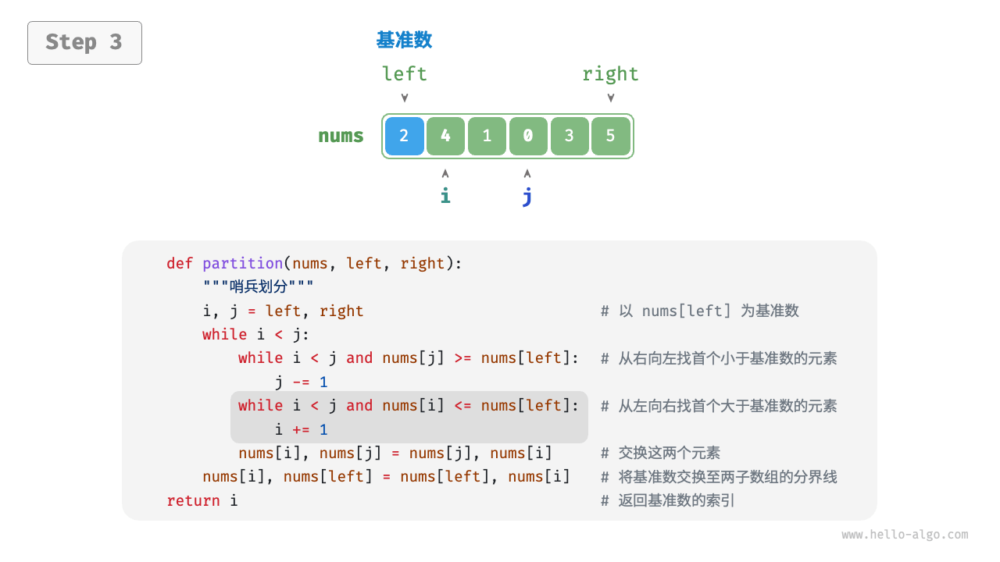
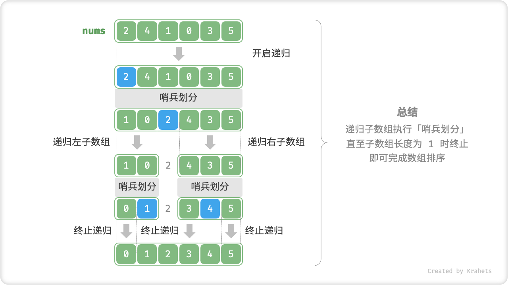

# 快速排序

「快速排序 Quick Sort」是一种基于 “分治思想” 的排序算法，速度很快、应用很广。

快速排序的核心操作为「哨兵划分」，其目标为：选取数组某个元素为 **基准数** ，将所有小于基准数的元素移动至其左边，大于基准数的元素移动至其右边。「哨兵划分」的实现流程为：

1. 以数组最左端元素作为基准数，初始化两个指针 `i` , `j` 指向数组两端；
2. 设置一个循环，每轮中使用 `i` / `j` 分别寻找首个比基准数大 / 小的元素，并交换此两元素；
3. 不断循环步骤 `2.` ，直至 `i` , `j` 相遇时跳出，最终把基准数交换至两个子数组的分界线；

「哨兵划分」执行完毕后，原数组被划分成两个部分，即 **左子数组** 和 **右子数组** ，且满足 **左子数组任意元素 < 基准数 < 右子数组任意元素**。因此，接下来我们只需要排序两个子数组即可。

=== "Step 1"
    
=== "Step 2"
    
=== "Step 3"
    
=== "Step 4"
    
=== "Step 5"
    
=== "Step 6"
    
=== "Step 7"
    
=== "Step 8"
    
=== "Step 9"
    

<p align="center"> Fig. 哨兵划分 </p>

=== "Java"

    ``` java title="quick_sort.java"
    /* 元素交换 */
    void swap(int[] nums, int i, int j) {
        int tmp = nums[i];
        nums[i] = nums[j];
        nums[j] = tmp;
    }
    
    /* 哨兵划分 */
    int partition(int[] nums, int left, int right) {
        // 以 nums[left] 作为基准数
        int i = left, j = right;
        while (i < j) {
            while (i < j && nums[j] >= nums[left])
                j--;          // 从右向左找首个小于基准数的元素
            while (i < j && nums[i] <= nums[left])
                i++;          // 从左向右找首个大于基准数的元素
            swap(nums, i, j); // 交换这两个元素
        }
        swap(nums, i, left);  // 将基准数交换至两子数组的分界线
        return i;             // 返回基准数的索引
    }
    ```

=== "C++"

    ```cpp title="quick_sort.cpp"
    /* 元素交换 */
    void swap(vector<int>& nums, int i, int j) {
        int tmp = nums[i];
        nums[i] = nums[j];
        nums[j] = tmp;
    }

    /* 哨兵划分 */
    int partition(vector<int>& nums, int left, int right) {
        // 以 nums[left] 作为基准数
        int i = left, j = right;
        while (i < j) {
            while (i < j && nums[j] >= nums[left])
                j--;          // 从右向左找首个小于基准数的元素
            while (i < j && nums[i] <= nums[left])
                i++;          // 从左向右找首个大于基准数的元素
            swap(nums, i, j); // 交换这两个元素
        }
        swap(nums, i, left);  // 将基准数交换至两子数组的分界线
        return i;             // 返回基准数的索引
    }
    ```

=== "Python"

    ```python title="quick_sort.py"
    """ 哨兵划分 """
    def partition(self, nums, left, right):
        # 以 nums[left] 作为基准数
        i, j = left, right
        while i < j:
            while i < j and nums[j] >= nums[left]:
                j -= 1  # 从右向左找首个小于基准数的元素
            while i < j and nums[i] <= nums[left]:
                i += 1  # 从左向右找首个大于基准数的元素
            # 元素交换
            nums[i], nums[j] = nums[j], nums[i]
        # 将基准数交换至两子数组的分界线
        nums[i], nums[left] = nums[left], nums[i]
        return i  # 返回基准数的索引
    ```

=== "Go"

    ```go title="quick_sort.go"
    /* 哨兵划分 */
    func partition(nums []int, left, right int) int {
        //以 nums[left] 作为基准数
        i, j := left, right
        for i < j {
            for i < j && nums[j] >= nums[left] {
                j-- //从右向左找首个小于基准数的元素
            }
            for i < j && nums[i] <= nums[left] {
                i++ //从左向右找首个大于基准数的元素
            }
            //元素交换
            nums[i], nums[j] = nums[j], nums[i]
        }
        //将基准数交换至两子数组的分界线
        nums[i], nums[left] = nums[left], nums[i]
        return i //返回基准数的索引
    }
    ```

=== "JavaScript"

    ``` js title="quick_sort.js"
    /* 元素交换 */
    function swap(nums, i, j) {
        let tmp = nums[i]
        nums[i] = nums[j]
        nums[j] = tmp
    }
    
    /* 哨兵划分 */
    function partition(nums, left, right){
        // 以 nums[left] 作为基准数
        let i = left, j = right
        while(i < j){
            while(i < j && nums[j] >= nums[left]){
                j -= 1  // 从右向左找首个小于基准数的元素
            }
            while(i < j && nums[i] <= nums[left]){
                i += 1  // 从左向右找首个大于基准数的元素
            }
            // 元素交换
            swap(nums, i, j) // 交换这两个元素
        }
        swap(nums, i, left)  // 将基准数交换至两子数组的分界线
        return i  // 返回基准数的索引
    }
    ```

=== "TypeScript"

    ```typescript title="quick_sort.ts"

    ```

=== "C"

    ```c title="quick_sort.c"

    ```

=== "C#"

    ```csharp title="quick_sort.cs"

    ```

!!! note "快速排序的分治思想"

    哨兵划分的实质是将 **一个长数组的排序问题** 简化为 **两个短数组的排序问题**。

## 算法流程

1. 首先，对数组执行一次「哨兵划分」，得到待排序的 **左子数组** 和 **右子数组** 。
2. 接下来，对 **左子数组** 和 **右子数组** 分别 **递归执行**「哨兵划分」……
3. 直至子数组长度为 1 时 **终止递归** ，即可完成对整个数组的排序。

观察发现，快速排序和「二分查找」的原理类似，都是以对数阶的时间复杂度来缩小处理区间。



<p align="center"> Fig. 快速排序流程 </p>

=== "Java"

    ```java title="quick_sort.java"
    /* 快速排序 */
    void quickSort(int[] nums, int left, int right) {
        // 子数组长度为 1 时终止递归
        if (left >= right)
            return;
        // 哨兵划分
        int pivot = partition(nums, left, right);
        // 递归左子数组、右子数组
        quickSort(nums, left, pivot - 1);
        quickSort(nums, pivot + 1, right);
    }
    ```

=== "C++"

    ```cpp title="quick_sort.cpp"
    /* 快速排序 */
    static void quickSort(vector<int>& nums, int left, int right) {
        // 子数组长度为 1 时终止递归
        if (left >= right)
            return;
        // 哨兵划分
        int pivot = partition(nums, left, right);
        // 递归左子数组、右子数组
        quickSort(nums, left, pivot - 1);
        quickSort(nums, pivot + 1, right);
    }
    ```

=== "Python"

    ```python title="quick_sort.py"
    """ 快速排序 """
    def quick_sort(self, nums, left, right):
        # 子数组长度为 1 时终止递归
        if left >= right:
            return
        # 哨兵划分
        pivot = self.partition(nums, left, right)
        # 递归左子数组、右子数组
        self.quick_sort(nums, left, pivot - 1)
        self.quick_sort(nums, pivot + 1, right)
    ```

=== "Go"

    ```go title="quick_sort.go"
    /* 快速排序 */
    func quickSort(nums []int, left, right int) {
        // 子数组长度为 1 时终止递归
        if left >= right {
            return
        }
        // 哨兵划分
        pivot := partition(nums, left, right)
        // 递归左子数组、右子数组
        quickSort(nums, left, pivot-1)
        quickSort(nums, pivot+1, right)
    }
    ```

=== "JavaScript"

    ```js title="quick_sort.js"
    /* 快速排序 */
    function quickSort(nums, left, right){
        // 子数组长度为 1 时终止递归
        if(left >= right) return
        // 哨兵划分
        const pivot = partition(nums, left, right)
        // 递归左子数组、右子数组
        quick_sort(nums, left, pivot - 1)
        quick_sort(nums, pivot + 1, right)
    }
    ```

=== "TypeScript"

    ```typescript title="quick_sort.ts"

    ```

=== "C"

    ```c title="quick_sort.c"

    ```

=== "C#"

    ```csharp title="quick_sort.cs"

    ```

## 算法特性

**平均时间复杂度 $O(n \log n)$ ：** 平均情况下，哨兵划分的递归层数为 $\log n$ ，每层中的总循环数为 $n$ ，总体使用 $O(n \log n)$ 时间。

**最差时间复杂度 $O(n^2)$ ：** 最差情况下，哨兵划分操作将长度为 $n$ 的数组划分为长度为 $0$ 和 $n - 1$ 的两个子数组，此时递归层数达到 $n$ 层，每层中的循环数为 $n$ ，总体使用 $O(n^2)$ 时间。

**空间复杂度 $O(n)$ ：** 输入数组完全倒序下，达到最差递归深度 $n$ 。

**原地排序：** 只在递归中使用 $O(\log n)$ 大小的栈帧空间。

**非稳定排序：** 哨兵划分操作可能改变相等元素的相对位置。

**自适应排序：** 最差情况下，时间复杂度劣化至 $O(n^2)$ 。

## 快排为什么快？

从命名能够看出，快速排序在效率方面一定 “有两把刷子” 。快速排序的平均时间复杂度虽然与「归并排序」和「堆排序」一致，但实际 **效率更高** ，这是因为：

- **出现最差情况的概率很低：** 虽然快速排序的最差时间复杂度为 $O(n^2)$ ，不如归并排序，但绝大部分情况下，快速排序可以达到 $O(n \log n)$ 的复杂度。
- **缓存使用效率高：** 哨兵划分操作时，将整个子数组加载入缓存中，访问元素效率很高。而诸如「堆排序」需要跳跃式访问元素，因此不具有此特性。
- **复杂度的常数系数低：** 在提及的三种算法中，快速排序的 **比较**、**赋值**、**交换** 三种操作的总体数量最少（类似于「插入排序」快于「冒泡排序」的原因）。

## 基准数优化

**普通快速排序在某些输入下的时间效率变差。** 举个极端例子，假设输入数组是完全倒序的，由于我们选取最左端元素为基准数，那么在哨兵划分完成后，基准数被交换至数组最右端，从而 **左子数组长度为 $n - 1$ 、右子数组长度为 $0$** 。这样进一步递归下去，**每轮哨兵划分后的右子数组长度都为 $0$** ，分治策略失效，快速排序退化为「冒泡排序」了。

为了尽量避免这种情况发生，我们可以优化一下基准数的选取策略。首先，在哨兵划分中，我们可以 **随机选取一个元素作为基准数** 。但如果运气很差，每次都选择到比较差的基准数，那么效率依然不好。

进一步地，我们可以在数组中选取 3 个候选元素（一般为数组的首、尾、中点元素），**并将三个候选元素的中位数作为基准数**，这样基准数 “既不大也不小” 的概率就大大提升了。当然，如果数组很长的话，我们也可以选取更多候选元素，来进一步提升算法的稳健性。采取该方法后，时间复杂度劣化至 $O(n^2)$ 的概率极低。

=== "Java"

    ```java title="quick_sort.java"
    /* 选取三个元素的中位数 */
    int medianThree(int[] nums, int left, int mid, int right) {
        // 使用了异或操作来简化代码
        // 异或规则为 0 ^ 0 = 1 ^ 1 = 0, 0 ^ 1 = 1 ^ 0 = 1
        if ((nums[left] > nums[mid]) ^ (nums[left] > nums[right]))
            return left;
        else if ((nums[mid] < nums[left]) ^ (nums[mid] < nums[right]))
            return mid;
        else
            return right;
    }
    
    /* 哨兵划分（三数取中值） */
    int partition(int[] nums, int left, int right) {
        // 选取三个候选元素的中位数
        int med = medianThree(nums, left, (left + right) / 2, right);
        // 将中位数交换至数组最左端
        swap(nums, left, med);
        // 以 nums[left] 作为基准数
        // 下同省略...
    }
    ```

=== "C++"

    ```cpp title="quick_sort.cpp"
    /* 选取三个元素的中位数 */
    int medianThree(vector<int>& nums, int left, int mid, int right) {
        // 使用了异或操作来简化代码
        // 异或规则为 0 ^ 0 = 1 ^ 1 = 0, 0 ^ 1 = 1 ^ 0 = 1
        if ((nums[left] > nums[mid]) ^ (nums[left] > nums[right]))
            return left;
        else if ((nums[mid] < nums[left]) ^ (nums[mid] < nums[right]))
            return mid;
        else
            return right;
    }

    /* 哨兵划分（三数取中值） */
    int partition(vector<int>& nums, int left, int right) {
        // 选取三个候选元素的中位数
        int med = medianThree(nums, left, (left + right) / 2, right);
        // 将中位数交换至数组最左端
        swap(nums, left, med);
        // 以 nums[left] 作为基准数
        // 下同省略...
    }
    ```

=== "Python"

    ```python title="quick_sort.py"
    """ 选取三个元素的中位数 """
    def median_three(self, nums, left, mid, right):
        # 使用了异或操作来简化代码
        # 异或规则为 0 ^ 0 = 1 ^ 1 = 0, 0 ^ 1 = 1 ^ 0 = 1
        if (nums[left] > nums[mid]) ^ (nums[left] > nums[right]):
            return left
        elif (nums[mid] < nums[left]) ^ (nums[mid] > nums[right]):
            return mid
        return right

    """ 哨兵划分（三数取中值） """
    def partition(self, nums, left, right):
        # 以 nums[left] 作为基准数
        med = self.median_three(nums, left, (left + right) // 2, right)
        # 将中位数交换至数组最左端
        nums[left], nums[med] = nums[med], nums[left]
        # 以 nums[left] 作为基准数
        # 下同省略...
    ```

=== "Go"

    ```go title="quick_sort.go"
    /* 选取三个元素的中位数 */
    func medianThree(nums []int, left, mid, right int) int {
        if (nums[left] > nums[mid]) != (nums[left] > nums[right]) {
            return left
        } else if (nums[mid] < nums[left]) != (nums[mid] > nums[right]) {
            return mid
        }
        return right
    }

    /* 哨兵划分（三数取中值）*/
    func partition(nums []int, left, right int) int {
        // 以 nums[left] 作为基准数
        med := medianThree(nums, left, (left+right)/2, right)
        // 将中位数交换至数组最左端
        nums[left], nums[med] = nums[med], nums[left]
        // 以 nums[left] 作为基准数
        // 下同省略...
    }
    ```

=== "JavaScript"

    ```js title="quick_sort.js"
    /* 选取三个元素的中位数 */
    function medianThree(nums, left, mid, right) {
        // 使用了异或操作来简化代码
        // 异或规则为 0 ^ 0 = 1 ^ 1 = 0, 0 ^ 1 = 1 ^ 0 = 1
        if ((nums[left] > nums[mid]) ^ (nums[left] > nums[right]))
            return left;
        else if ((nums[mid] < nums[left]) ^ (nums[mid] < nums[right]))
            return mid;
        else
            return right;
    }
    
    /* 哨兵划分（三数取中值） */
    function partition(nums, left, right) {
        // 选取三个候选元素的中位数
        let med = medianThree(nums, left, Math.floor((left + right) / 2), right);
        // 将中位数交换至数组最左端
        swap(nums, left, med);
        // 以 nums[left] 作为基准数
        // 下同省略...
    }
    ```

=== "TypeScript"

    ```typescript title="quick_sort.ts"

    ```

=== "C"

    ```c title="quick_sort.c"

    ```

=== "C#"

    ```csharp title="quick_sort.cs"

    ```

## 尾递归优化

**普通快速排序在某些输入下的空间效率变差。** 仍然以完全倒序的输入数组为例，由于每轮哨兵划分后右子数组长度为 0 ，那么将形成一个高度为 $n - 1$ 的递归树，此时使用的栈帧空间大小劣化至 $O(n)$ 。

为了避免栈帧空间的累积，我们可以在每轮哨兵排序完成后，判断两个子数组的长度大小，仅递归排序较短的子数组。由于较短的子数组长度不会超过 $\frac{n}{2}$ ，因此这样做能保证递归深度不超过 $\log n$ ，即最差空间复杂度被优化至 $O(\log n)$ 。

=== "Java"

    ```java title="quick_sort.java"
    /* 快速排序（尾递归优化） */
    void quickSort(int[] nums, int left, int right) {
        // 子数组长度为 1 时终止
        while (left < right) {
            // 哨兵划分操作
            int pivot = partition(nums, left, right);
            // 对两个子数组中较短的那个执行快排
            if (pivot - left < right - pivot) {
                quickSort(nums, left, pivot - 1);  // 递归排序左子数组
                left = pivot + 1;  // 剩余待排序区间为 [pivot + 1, right]
            } else {
                quickSort(nums, pivot + 1, right); // 递归排序右子数组
                right = pivot - 1; // 剩余待排序区间为 [left, pivot - 1]
            }
        }
    }
    ```

=== "C++"

    ```cpp title="quick_sort.cpp"
    /* 快速排序（尾递归优化） */
    static void quickSort(vector<int>& nums, int left, int right) {
        // 子数组长度为 1 时终止
        while (left < right) {
            // 哨兵划分操作
            int pivot = partition(nums, left, right);
            // 对两个子数组中较短的那个执行快排
            if (pivot - left < right - pivot) {
                quickSort(nums, left, pivot - 1);  // 递归排序左子数组
                left = pivot + 1;  // 剩余待排序区间为 [pivot + 1, right]
            } else {
                quickSort(nums, pivot + 1, right); // 递归排序右子数组
                right = pivot - 1; // 剩余待排序区间为 [left, pivot - 1]
            }
        }
    }
    ```

=== "Python"

    ```python title="quick_sort.py"
    """ 快速排序（尾递归优化） """
    def quick_sort(self, nums, left, right):
        # 子数组长度为 1 时终止
        while left < right:
            # 哨兵划分操作
            pivot = self.partition(nums, left, right)
            # 对两个子数组中较短的那个执行快排
            if pivot - left < right - pivot:
                self.quick_sort(nums, left, pivot - 1)  # 递归排序左子数组
                left = pivot + 1     # 剩余待排序区间为 [pivot + 1, right]
            else:
                self.quick_sort(nums, pivot + 1, right)  # 递归排序右子数组
                right = pivot - 1    # 剩余待排序区间为 [left, pivot - 1]
    ```

=== "Go"

    ```go title="quick_sort.go"
    /* 快速排序（尾递归优化）*/
    func quickSort(nums []int, left, right int) {
        // 子数组长度为 1 时终止
        for left < right {
            // 哨兵划分操作
            pivot := partition(nums, left, right)
            // 对两个子数组中较短的那个执行快排
            if pivot-left < right-pivot {
                quickSort(nums, left, pivot-1)   // 递归排序左子数组
                left = pivot + 1				 // 剩余待排序区间为 [pivot + 1, right]
            } else {
                quickSort(nums, pivot+1, right)  // 递归排序右子数组
                right = pivot - 1				 // 剩余待排序区间为 [left, pivot - 1]
            }
        }
    }
    ```

=== "JavaScript"

    ```js title="quick_sort.js"
    /* 快速排序（尾递归优化） */
    quickSort(nums, left, right) {
        // 子数组长度为 1 时终止
        while (left < right) {
            // 哨兵划分操作
            let pivot = partition(nums, left, right);
            // 对两个子数组中较短的那个执行快排
            if (pivot - left < right - pivot) {
                quickSort(nums, left, pivot - 1);  // 递归排序左子数组
                left = pivot + 1;  // 剩余待排序区间为 [pivot + 1, right]
            } else {
                quickSort(nums, pivot + 1, right); // 递归排序右子数组
                right = pivot - 1; // 剩余待排序区间为 [left, pivot - 1]
            }
        }
    }
    ```

=== "TypeScript"

    ```typescript title="quick_sort.ts"

    ```

=== "C"

    ```c title="quick_sort.c"

    ```

=== "C#"

    ```csharp title="quick_sort.cs"

    ```
