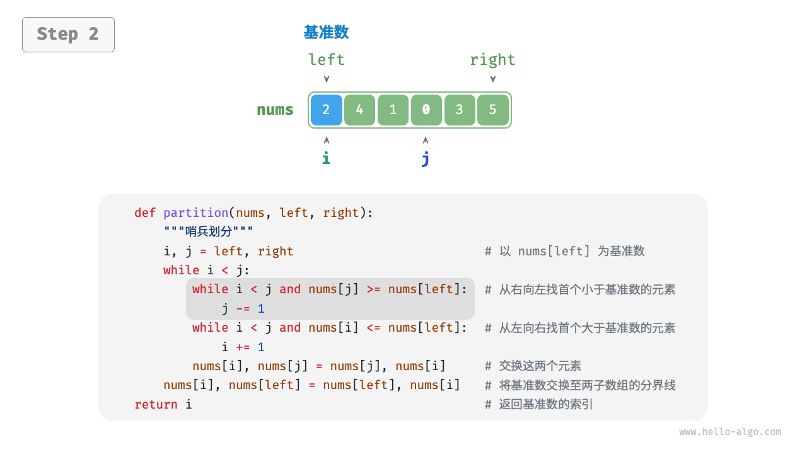

# 快速排序

「快速排序 Quick Sort」是一种基于“分治思想”的排序算法，速度很快、应用很广。

快速排序的核心操作为「哨兵划分」，其目标为：选取数组某个元素为 **基准数**，将所有小于基准数的元素移动至其左边，大于基准数的元素移动至其右边。「哨兵划分」的实现流程为：

1. 以数组最左端元素作为基准数，初始化两个指针 `i` , `j` 指向数组两端；
2. 设置一个循环，每轮中使用 `i` / `j` 分别寻找首个比基准数大 / 小的元素，并交换此两元素；
3. 不断循环步骤 `2.` ，直至 `i` , `j` 相遇时跳出，最终把基准数交换至两个子数组的分界线；

「哨兵划分」执行完毕后，原数组被划分成两个部分，即 **左子数组** 和 **右子数组**，且满足 **左子数组任意元素 < 基准数 < 右子数组任意元素**。因此，接下来我们只需要排序两个子数组即可。

=== "<1>"
    

=== "<2>"
    

=== "<3>"
    

=== "<4>"
    

=== "<5>"
    

=== "<6>"
    

=== "<7>"
    

=== "<8>"
    

=== "<9>"
    

<p align="center"> Fig. 哨兵划分 </p>

=== "Java"

    ```java title="quick_sort.java"
    [class]{QuickSort}-[func]{swap}

    [class]{QuickSort}-[func]{partition}
    ```

=== "C++"

    ```cpp title="quick_sort.cpp"
    [class]{QuickSort}-[func]{swap}

    [class]{QuickSort}-[func]{partition}
    ```

=== "Python"

    ```python title="quick_sort.py"
    [class]{QuickSort}-[func]{partition}
    ```

=== "Go"

    ```go title="quick_sort.go"
    [class]{quickSort}-[func]{partition}
    ```

=== "JavaScript"

    ```javascript title="quick_sort.js"
    [class]{QuickSort}-[func]{swap}

    [class]{QuickSort}-[func]{partition}
    ```

=== "TypeScript"

    ```typescript title="quick_sort.ts"
    [class]{QuickSort}-[func]{swap}

    [class]{QuickSort}-[func]{partition}
    ```

=== "C"

    ```c title="quick_sort.c"
    [class]{quickSort}-[func]{partition}
    ```

=== "C#"

    ```csharp title="quick_sort.cs"
    [class]{QuickSort}-[func]{swap}

    [class]{QuickSort}-[func]{partition}
    ```

=== "Swift"

    ```swift title="quick_sort.swift"
    [class]{}-[func]{swap}

    [class]{}-[func]{partition}
    ```

=== "Zig"

    ```zig title="quick_sort.zig"
    [class]{QuickSort}-[func]{swap}

    [class]{QuickSort}-[func]{partition}
    ```

!!! note "快速排序的分治思想"

    哨兵划分的实质是将 **一个长数组的排序问题** 简化为 **两个短数组的排序问题**。

## 算法流程

1. 首先，对数组执行一次「哨兵划分」，得到待排序的 **左子数组** 和 **右子数组**；
2. 接下来，对 **左子数组** 和 **右子数组** 分别 **递归执行**「哨兵划分」……
3. 直至子数组长度为 1 时 **终止递归**，即可完成对整个数组的排序；

观察发现，快速排序和「二分查找」的原理类似，都是以对数阶的时间复杂度来缩小处理区间。


<p align="center"> Fig. 快速排序流程 </p>

=== "Java"

    ```java title="quick_sort.java"
    [class]{QuickSort}-[func]{quickSort}
    ```

=== "C++"

    ```cpp title="quick_sort.cpp"
    [class]{QuickSort}-[func]{quickSort}
    ```

=== "Python"

    ```python title="quick_sort.py"
    [class]{QuickSort}-[func]{quick_sort}
    ```

=== "Go"

    ```go title="quick_sort.go"
    [class]{quickSort}-[func]{quickSort}
    ```

=== "JavaScript"

    ```javascript title="quick_sort.js"
    [class]{QuickSort}-[func]{quickSort}
    ```

=== "TypeScript"

    ```typescript title="quick_sort.ts"
    [class]{QuickSort}-[func]{quickSort}
    ```

=== "C"

    ```c title="quick_sort.c"
    [class]{quickSort}-[func]{quickSort}
    ```

=== "C#"

    ```csharp title="quick_sort.cs"
    [class]{QuickSort}-[func]{quickSort}
    ```

=== "Swift"

    ```swift title="quick_sort.swift"
    [class]{}-[func]{quickSort}
    ```

=== "Zig"

    ```zig title="quick_sort.zig"
    [class]{QuickSort}-[func]{quickSort}
    ```

## 算法特性

**平均时间复杂度 $O(n \log n)$** ：平均情况下，哨兵划分的递归层数为 $\log n$ ，每层中的总循环数为 $n$ ，总体使用 $O(n \log n)$ 时间。

**最差时间复杂度 $O(n^2)$** ：最差情况下，哨兵划分操作将长度为 $n$ 的数组划分为长度为 $0$ 和 $n - 1$ 的两个子数组，此时递归层数达到 $n$ 层，每层中的循环数为 $n$ ，总体使用 $O(n^2)$ 时间。

**空间复杂度 $O(n)$** ：输入数组完全倒序下，达到最差递归深度 $n$ 。

**原地排序**：只在递归中使用 $O(\log n)$ 大小的栈帧空间。

**非稳定排序**：哨兵划分操作可能改变相等元素的相对位置。

**自适应排序**：最差情况下，时间复杂度劣化至 $O(n^2)$ 。

## 快排为什么快？

从命名能够看出，快速排序在效率方面一定“有两把刷子”。快速排序的平均时间复杂度虽然与「归并排序」和「堆排序」一致，但实际 **效率更高**，这是因为：

- **出现最差情况的概率很低**：虽然快速排序的最差时间复杂度为 $O(n^2)$ ，不如归并排序，但绝大部分情况下，快速排序可以达到 $O(n \log n)$ 的复杂度。
- **缓存使用效率高**：哨兵划分操作时，将整个子数组加载入缓存中，访问元素效率很高。而诸如「堆排序」需要跳跃式访问元素，因此不具有此特性。
- **复杂度的常数系数低**：在提及的三种算法中，快速排序的 **比较**、**赋值**、**交换** 三种操作的总体数量最少（类似于「插入排序」快于「冒泡排序」的原因）。

## 基准数优化

**普通快速排序在某些输入下的时间效率变差**。举个极端例子，假设输入数组是完全倒序的，由于我们选取最左端元素为基准数，那么在哨兵划分完成后，基准数被交换至数组最右端，从而 **左子数组长度为 $n - 1$、右子数组长度为 $0$** 。这样进一步递归下去，**每轮哨兵划分后的右子数组长度都为 $0$** ，分治策略失效，快速排序退化为「冒泡排序」了。

为了尽量避免这种情况发生，我们可以优化一下基准数的选取策略。首先，在哨兵划分中，我们可以 **随机选取一个元素作为基准数**。但如果运气很差，每次都选择到比较差的基准数，那么效率依然不好。

进一步地，我们可以在数组中选取 3 个候选元素（一般为数组的首、尾、中点元素），**并将三个候选元素的中位数作为基准数**，这样基准数“既不大也不小”的概率就大大提升了。当然，如果数组很长的话，我们也可以选取更多候选元素，来进一步提升算法的稳健性。采取该方法后，时间复杂度劣化至 $O(n^2)$ 的概率极低。

=== "Java"

    ```java title="quick_sort.java"
    [class]{QuickSortMedian}-[func]{medianThree}

    [class]{QuickSortMedian}-[func]{partition}
    ```

=== "C++"

    ```cpp title="quick_sort.cpp"
    [class]{QuickSortMedian}-[func]{medianThree}

    [class]{QuickSortMedian}-[func]{partition}
    ```

=== "Python"

    ```python title="quick_sort.py"
    [class]{QuickSortMedian}-[func]{median_three}

    [class]{QuickSortMedian}-[func]{partition}
    ```

=== "Go"

    ```go title="quick_sort.go"
    [class]{quickSortMedian}-[func]{medianThree}

    [class]{quickSortMedian}-[func]{partition}
    ```

=== "JavaScript"

    ```javascript title="quick_sort.js"
    [class]{QuickSortMedian}-[func]{medianThree}

    [class]{QuickSortMedian}-[func]{partition}
    ```

=== "TypeScript"

    ```typescript title="quick_sort.ts"
    [class]{QuickSortMedian}-[func]{medianThree}

    [class]{QuickSortMedian}-[func]{partition}
    ```

=== "C"

    ```c title="quick_sort.c"
    [class]{quickSortMedian}-[func]{medianThree}

    [class]{quickSortMedian}-[func]{partition}
    ```

=== "C#"

    ```csharp title="quick_sort.cs"
    [class]{QuickSortMedian}-[func]{medianThree}

    [class]{QuickSortMedian}-[func]{partition}
    ```

=== "Swift"

    ```swift title="quick_sort.swift"
    [class]{}-[func]{medianThree}

    [class]{}-[func]{partitionMedian}
    ```

=== "Zig"

    ```zig title="quick_sort.zig"
    [class]{QuickSortMedian}-[func]{medianThree}

    [class]{QuickSortMedian}-[func]{partition}
    ```

## 尾递归优化

**普通快速排序在某些输入下的空间效率变差**。仍然以完全倒序的输入数组为例，由于每轮哨兵划分后右子数组长度为 0 ，那么将形成一个高度为 $n - 1$ 的递归树，此时使用的栈帧空间大小劣化至 $O(n)$ 。

为了避免栈帧空间的累积，我们可以在每轮哨兵排序完成后，判断两个子数组的长度大小，仅递归排序较短的子数组。由于较短的子数组长度不会超过 $\frac{n}{2}$ ，因此这样做能保证递归深度不超过 $\log n$ ，即最差空间复杂度被优化至 $O(\log n)$ 。

=== "Java"

    ```java title="quick_sort.java"
    [class]{QuickSortTailCall}-[func]{quickSort}
    ```

=== "C++"

    ```cpp title="quick_sort.cpp"
    [class]{QuickSortTailCall}-[func]{quickSort}
    ```

=== "Python"

    ```python title="quick_sort.py"
    [class]{QuickSortTailCall}-[func]{quick_sort}
    ```

=== "Go"

    ```go title="quick_sort.go"
    [class]{quickSortTailCall}-[func]{quickSort}
    ```

=== "JavaScript"

    ```javascript title="quick_sort.js"
    [class]{QuickSortTailCall}-[func]{quickSort}
    ```

=== "TypeScript"

    ```typescript title="quick_sort.ts"
    [class]{QuickSortTailCall}-[func]{quickSort}
    ```

=== "C"

    ```c title="quick_sort.c"
    [class]{quickSortTailCall}-[func]{quickSort}
    ```

=== "C#"

    ```csharp title="quick_sort.cs"
    [class]{QuickSortTailCall}-[func]{quickSort}
    ```

=== "Swift"

    ```swift title="quick_sort.swift"
    [class]{}-[func]{quickSortTailCall}
    ```

=== "Zig"

    ```zig title="quick_sort.zig"
    [class]{QuickSortTailCall}-[func]{quickSort}
    ```
