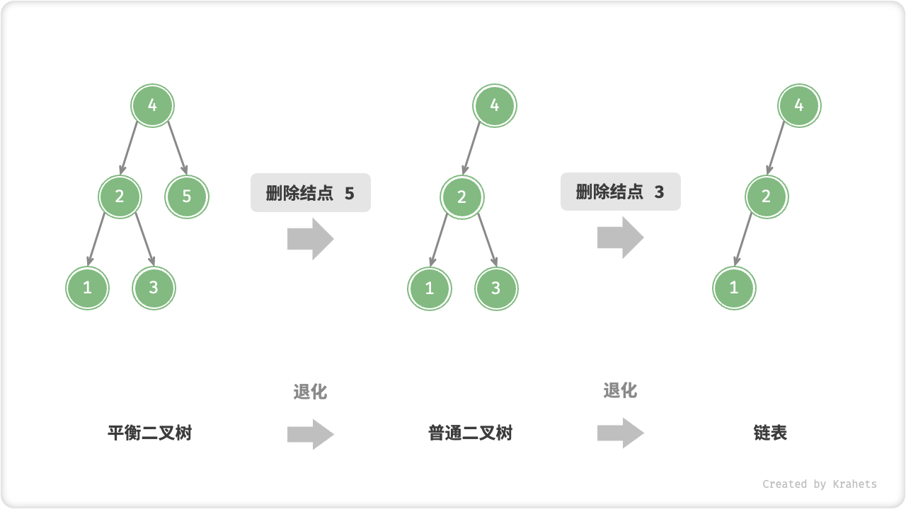
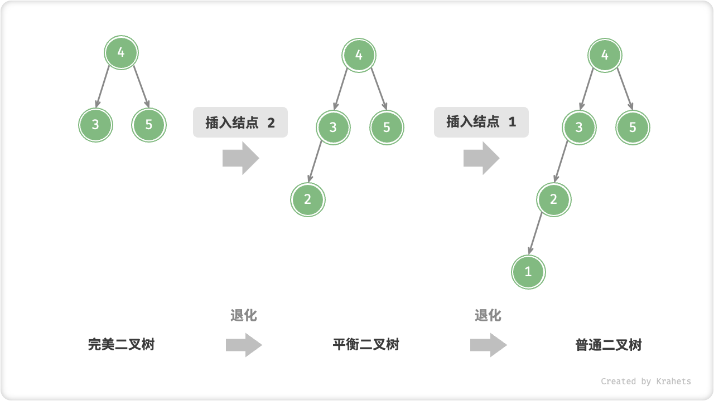
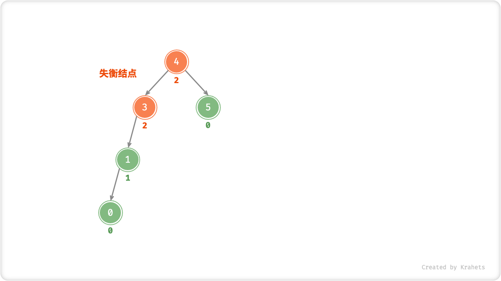
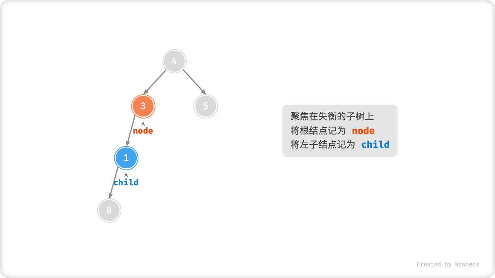
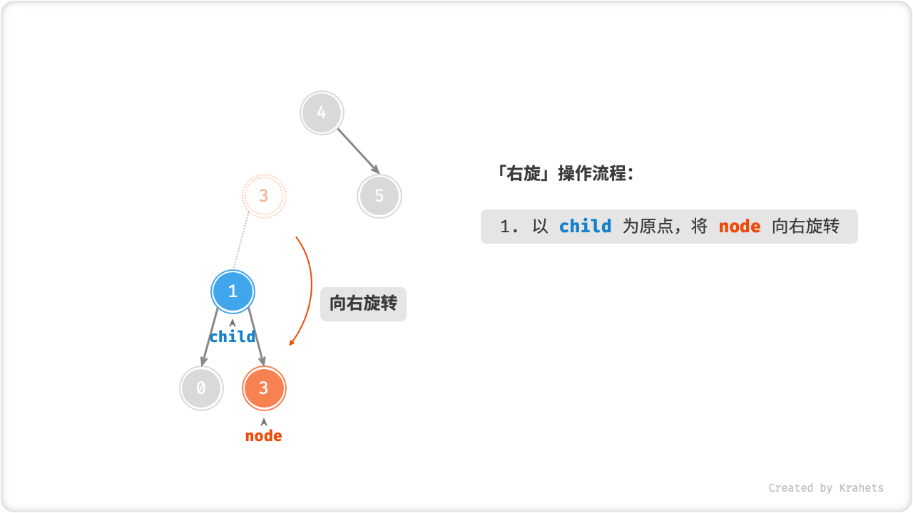
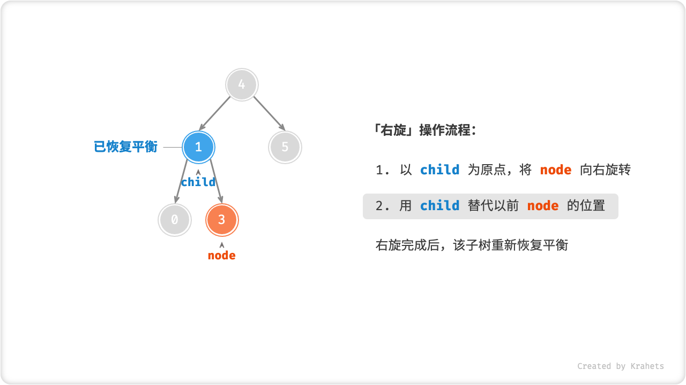
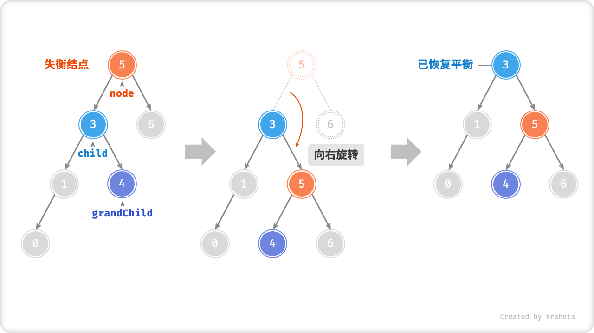
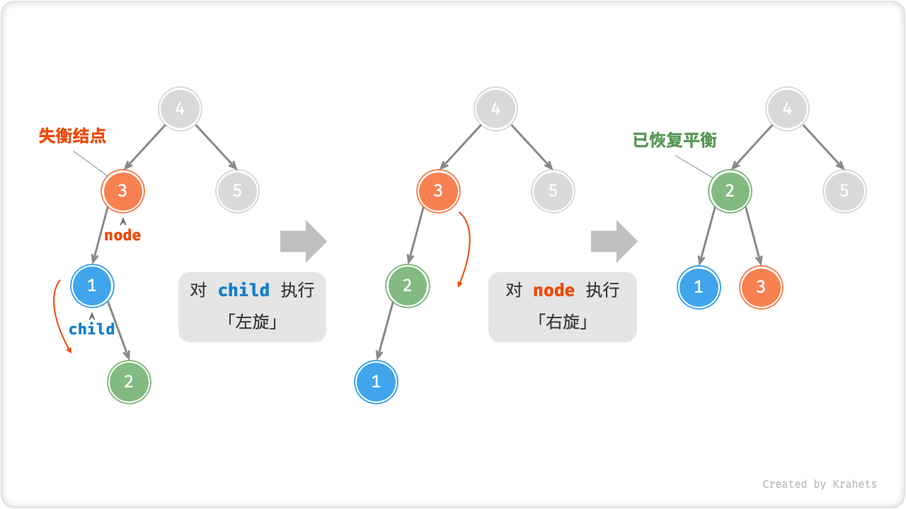
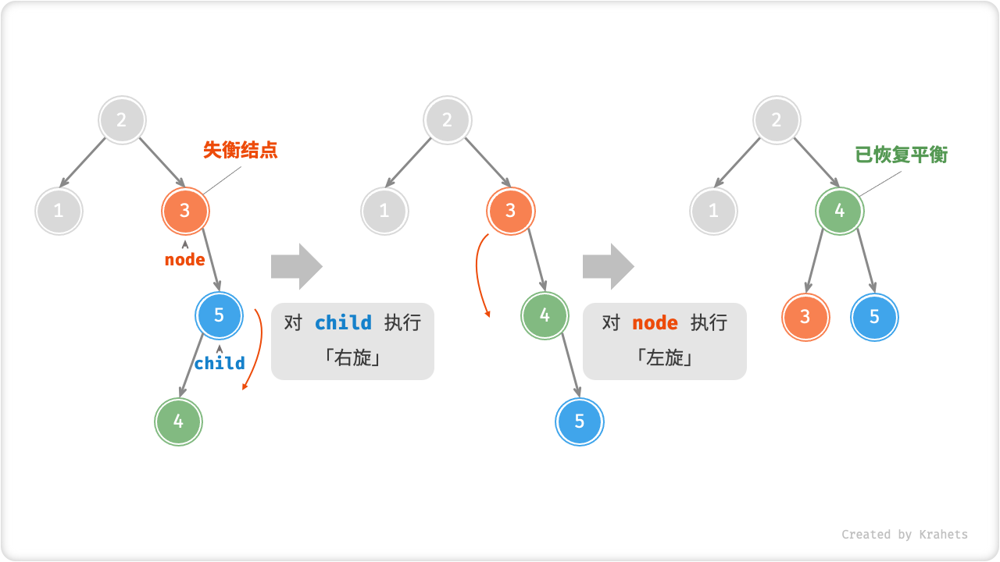
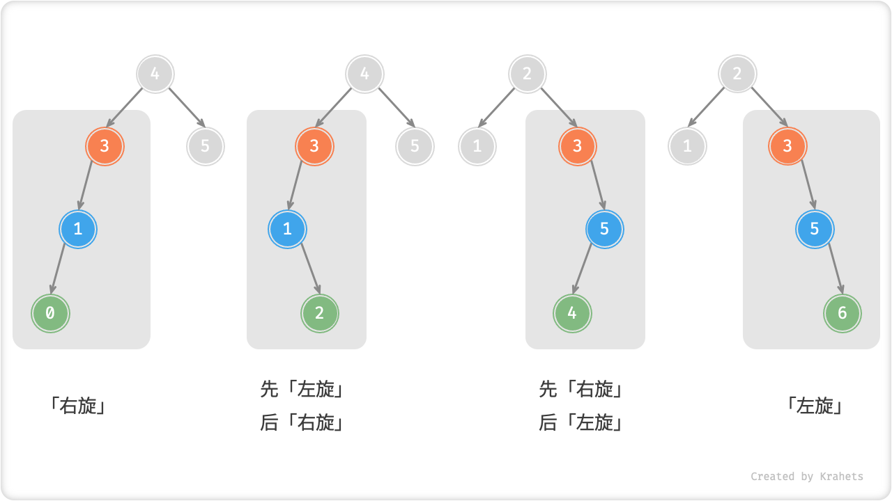

# AVL 树 *

在「二叉搜索树」章节中提到，在进行多次插入与删除操作后，二叉搜索树可能会退化为链表。此时所有操作的时间复杂度都会由 $O(\log n)$ 劣化至 $O(n)$ 。

如下图所示，执行两步删除结点后，该二叉搜索树就会退化为链表。



再比如，在以下完美二叉树中插入两个结点后，树严重向左偏斜，查找操作的时间复杂度也随之发生劣化。



G. M. Adelson-Velsky 和 E. M. Landis 在其 1962 年发表的论文 "An algorithm for the organization of information" 中提出了「AVL 树」。**论文中描述了一系列操作，使得在不断添加与删除结点后，AVL 树仍然不会发生退化**，进而使得各种操作的时间复杂度均能保持在 $O(\log n)$ 级别。

换言之，在频繁增删查改的使用场景中，AVL 树可始终保持很高的数据增删查改效率，具有很好的应用价值。

## AVL 树常见术语

「AVL 树」既是「二叉搜索树」又是「平衡二叉树」，同时满足这两种二叉树的所有性质，因此又被称为「平衡二叉搜索树」。

### 结点高度

在 AVL 树的操作中，需要获取结点「高度 Height」，所以给 AVL 树的结点类添加 `height` 变量。

=== "Java"

    ```java title="avl_tree.java"
    /* AVL 树结点类 */
    class TreeNode {
        public int val;         // 结点值
        public int height;      // 结点高度
        public TreeNode left;   // 左子结点
        public TreeNode right;  // 右子结点
        public TreeNode(int x) { val = x; }
    }
    ```

=== "C++"

    ```cpp title="avl_tree.cpp"
    
    ```

=== "Python"

    ```python title="avl_tree.py"
    
    ```

=== "Go"

    ```go title="avl_tree.go"
    
    ```

=== "JavaScript"

    ```js title="avl_tree.js"
    
    ```

=== "TypeScript"

    ```typescript title="avl_tree.ts"
    
    ```

=== "C"

    ```c title="avl_tree.c"
    
    ```

=== "C#"

    ```csharp title="avl_tree.cs"
    /* AVL 树结点类 */
    class TreeNode {
        public int val;         // 结点值
        public int height;      // 结点高度
        public TreeNode left;   // 左子结点
        public TreeNode right;  // 右子结点
        public TreeNode(int x) { val = x; }
    }
    ```

「结点高度」是最远叶结点到该结点的距离，即走过的「边」的数量。需要特别注意，**叶结点的高度为 0 ，空结点的高度为 -1** 。我们封装两个工具函数，分别用于获取与更新结点的高度。

=== "Java"

    ```java title="avl_tree.java"
    /* 获取结点高度 */ 
    int height(TreeNode node) {
        // 空结点高度为 -1 ，叶结点高度为 0
        return node == null ? -1 : node.height;
    }
    
    /* 更新结点高度 */
    void updateHeight(TreeNode node) {
        // 结点高度等于最高子树高度 + 1
        node.height = Math.max(height(node.left), height(node.right)) + 1;  
    }
    ```

=== "C++"

    ```cpp title="avl_tree.cpp"
    
    ```

=== "Python"

    ```python title="avl_tree.py"
    
    ```

=== "Go"

    ```go title="avl_tree.go"
    
    ```

=== "JavaScript"

    ```js title="avl_tree.js"
    
    ```

=== "TypeScript"

    ```typescript title="avl_tree.ts"
    
    ```

=== "C"

    ```c title="avl_tree.c"
    
    ```

=== "C#"

    ```csharp title="avl_tree.cs"
    /* 获取结点高度 */
    public int height(TreeNode? node)
    {
        // 空结点高度为 -1 ，叶结点高度为 0
        return node == null ? -1 : node.height;
    }

    /* 更新结点高度 */
    private void updateHeight(TreeNode node)
    {
        // 结点高度等于最高子树高度 + 1
        node.height = Math.Max(height(node.left), height(node.right)) + 1;
    }
    ```

### 结点平衡因子

结点的「平衡因子 Balance Factor」是 **结点的左子树高度减去右子树高度**，并定义空结点的平衡因子为 0 。同样地，我们将获取结点平衡因子封装成函数，以便后续使用。

=== "Java"

    ```java title="avl_tree.java"
    /* 获取结点平衡因子 */ 
    public int balanceFactor(TreeNode node) {
        // 空结点平衡因子为 0
        if (node == null) return 0;
        // 结点平衡因子 = 左子树高度 - 右子树高度
        return height(node.left) - height(node.right);
    }
    ```

=== "C++"

    ```cpp title="avl_tree.cpp"
    
    ```

=== "Python"

    ```python title="avl_tree.py"
    
    ```

=== "Go"

    ```go title="avl_tree.go"
    
    ```

=== "JavaScript"

    ```js title="avl_tree.js"
    
    ```

=== "TypeScript"

    ```typescript title="avl_tree.ts"
    
    ```

=== "C"

    ```c title="avl_tree.c"
    
    ```

=== "C#"

    ```csharp title="avl_tree.cs"
    /* 获取平衡因子 */
    public int balanceFactor(TreeNode? node)
    {
        // 空结点平衡因子为 0
        if (node == null) return 0;
        // 结点平衡因子 = 左子树高度 - 右子树高度
        return height(node.left) - height(node.right);
    }
    ```

!!! note

    设平衡因子为 $f$ ，则一棵 AVL 树的任意结点的平衡因子皆满足 $-1 \le f \le 1$ 。

## AVL 树旋转

AVL 树的独特之处在于「旋转 Rotation」的操作，其可 **在不影响二叉树中序遍历序列的前提下，使失衡结点重新恢复平衡。** 换言之，旋转操作既可以使树保持为「二叉搜索树」，也可以使树重新恢复为「平衡二叉树」。

我们将平衡因子的绝对值 $> 1$ 的结点称为「失衡结点」。根据结点的失衡情况，旋转操作分为 **右旋、左旋、先右旋后左旋、先左旋后右旋**，接下来我们来一起来看看它们是如何操作的。

### Case 1 - 右旋

如下图所示（结点下方为「平衡因子」），从底至顶看，二叉树中首个失衡结点是 **结点 3** 。我们聚焦在以该失衡结点为根结点的子树上，将该结点记为 `node` ，将其左子节点记为 `child` ，执行「右旋」操作。完成右旋后，该子树已经恢复平衡，并且仍然为二叉搜索树。

=== "Step 1"
    
=== "Step 2"
    
=== "Step 3"
    
=== "Step 4"
    

进而，如果结点 `child` 本身有右子结点（记为 `grandChild`），则需要在「右旋」中添加一步：将 `grandChild` 作为 `node` 的左子结点。



“向右旋转”是一种形象化的说法，实际需要通过修改结点指针实现，代码如下所示。

=== "Java"

    ```java title="avl_tree.java"
    /* 右旋操作 */ 
    TreeNode rightRotate(TreeNode node) {
        TreeNode child = node.left;
        TreeNode grandChild = child.right;
        // 以 child 为原点，将 node 向右旋转
        child.right = node;
        node.left = grandChild;
        // 更新结点高度
        updateHeight(node);
        updateHeight(child);
        // 返回旋转后子树的根节点
        return child;
    }
    ```

=== "C++"

    ```cpp title="avl_tree.cpp"
    
    ```

=== "Python"

    ```python title="avl_tree.py"
    
    ```

=== "Go"

    ```go title="avl_tree.go"
    
    ```

=== "JavaScript"

    ```js title="avl_tree.js"
    
    ```

=== "TypeScript"

    ```typescript title="avl_tree.ts"
    
    ```

=== "C"

    ```c title="avl_tree.c"
    
    ```

=== "C#"

    ```csharp title="avl_tree.cs"
    /* 右旋操作 */
    TreeNode? rightRotate(TreeNode? node)
    {
        if (node == null)
            return null;

        TreeNode? child = node.left;
        TreeNode? grandChild = child?.right;
        // 以 child 为原点，将 node 向右旋转
        child.right = node;
        node.left = grandChild;
        // 更新结点高度
        updateHeight(node);
        updateHeight(child);
        // 返回旋转后子树的根节点
        return child;
    }
    
    ```

### Case 2 - 左旋

类似地，如果将取上述失衡二叉树的“镜像”，那么则需要「左旋」操作。观察发现，**「左旋」和「右旋」操作是镜像对称的，两者对应解决的两种失衡情况也是对称的**。


根据对称性，我们可以很方便地从「右旋」推导出「左旋」。具体地，把所有的 `left` 替换为 `right` 、所有的 `right` 替换为 `left` 即可。

=== "Java"

    ```java title="avl_tree.java"
    /* 左旋操作 */ 
    private TreeNode leftRotate(TreeNode node) {
        TreeNode child = node.right;
        TreeNode grandChild = child.left;
        // 以 child 为原点，将 node 向左旋转
        child.left = node;
        node.right = grandChild;
        // 更新结点高度
        updateHeight(node);
        updateHeight(child);
        // 返回旋转后子树的根节点
        return child;
    }
    ```

=== "C++"

    ```cpp title="avl_tree.cpp"
    
    ```

=== "Python"

    ```python title="avl_tree.py"
    
    ```

=== "Go"

    ```go title="avl_tree.go"
    
    ```

=== "JavaScript"

    ```js title="avl_tree.js"
    
    ```

=== "TypeScript"

    ```typescript title="avl_tree.ts"
    
    ```

=== "C"

    ```c title="avl_tree.c"
    
    ```

=== "C#"

    ```csharp title="avl_tree.cs"
    /* 左旋操作 */
    TreeNode? leftRotate(TreeNode? node)
    {
        if (node == null)
            return null;

        TreeNode? child = node.right;
        TreeNode? grandChild = child?.left;
        // 以 child 为原点，将 node 向左旋转
        child.left = node;
        node.right = grandChild;
        // 更新结点高度
        updateHeight(node);
        updateHeight(child);
        // 返回旋转后子树的根节点
        return child;
    }
    ```

### Case 3 - 先左后右

对于下图的失衡结点 3 ，**单一使用左旋或右旋都无法使子树恢复平衡**，此时需要「先左旋后右旋」，即先对 `child` 执行「左旋」，再对 `node` 执行「右旋」。



### Case 4 - 先右后左

同理，取以上失衡二叉树的镜像，则需要「先右旋后左旋」，即先对 `child` 执行「右旋」，然后对 `node` 执行「左旋」。



### 旋转的选择

下图描述的四种失衡情况与上述 Cases 一一对应，分别采用右旋、左旋、先右后左、先左后右的旋转组合。



具体地，需要使用 **失衡结点的平衡因子、较高一侧子结点的平衡因子** 来确定失衡结点属于上图中的哪种情况。

<div class="center-table" markdown>

| 失衡结点的平衡因子 | 子结点的平衡因子 | 应采用的旋转方法 |
| ------------------ | ---------------- | ---------------- |
| $>0$ （即左偏树）  | $\geq 0$         | 右旋             |
| $>0$ （即左偏树）  | $<0$             | 先左旋后右旋     |
| $<0$ （即右偏树）  | $\leq 0$         | 左旋             |
| $<0$ （即右偏树）  | $>0$             | 先右旋后左旋     |

</div>

根据以上规则，我们将旋转操作封装成一个函数。至此，**我们可以使用此函数来旋转各种失衡情况，使失衡结点重新恢复平衡**。

=== "Java"

    ```java title="avl_tree.java"
    /* 执行旋转操作，使该子树重新恢复平衡 */
    TreeNode rotate(TreeNode node) {
        // 获取结点 node 的平衡因子
        int balanceFactor = balanceFactor(node);
        // 左偏树
        if (balanceFactor > 1) {
            if (balanceFactor(node.left) >= 0) {
                // 右旋
                return rightRotate(node);
            } else {
                // 先左旋后右旋
                node.left = leftRotate(node.left);
                return rightRotate(node);
            }
        }
        // 右偏树
        if (balanceFactor < -1) {
            if (balanceFactor(node.right) <= 0) {
                // 左旋
                return leftRotate(node);
            } else {
                // 先右旋后左旋
                node.right = rightRotate(node.right);
                return leftRotate(node);
            }
        }
        // 平衡树，无需旋转，直接返回
        return node;
    }
    ```

=== "C++"

    ```cpp title="avl_tree.cpp"
    
    ```

=== "Python"

    ```python title="avl_tree.py"
    
    ```

=== "Go"

    ```go title="avl_tree.go"
    
    ```

=== "JavaScript"

    ```js title="avl_tree.js"
    
    ```

=== "TypeScript"

    ```typescript title="avl_tree.ts"
    
    ```

=== "C"

    ```c title="avl_tree.c"
    
    ```

=== "C#"

    ```csharp title="avl_tree.cs"
    /* 执行旋转操作，使该子树重新恢复平衡 */
    TreeNode? rotate(TreeNode? node)
    {
        if (node == null)
            return node;

        // 获取结点 node 的平衡因子
        int balanceFactorInt = balanceFactor(node);
        // 左偏树
        if (balanceFactorInt > 1)
        {
            if (balanceFactor(node.left) >= 0)
            {
                // 右旋
                return rightRotate(node);
            }
            else
            {
                // 先左旋后右旋
                node.left = leftRotate(node?.left);
                return rightRotate(node);
            }
        }
        // 右偏树
        if (balanceFactorInt < -1)
        {
            if (balanceFactor(node.right) <= 0)
            {
                // 左旋
                return leftRotate(node);
            }
            else
            {
                // 先右旋后左旋
                node.right = rightRotate(node?.right);
                return leftRotate(node);
            }
        }
        // 平衡树，无需旋转，直接返回
        return node;
    }
    ```

## AVL 树常用操作

### 插入结点

「AVL 树」的结点插入操作与「二叉搜索树」主体类似。不同的是，在插入结点后，从该结点到根结点的路径上会出现一系列「失衡结点」。所以，**我们需要从该结点开始，从底至顶地执行旋转操作，使所有失衡结点恢复平衡**。

=== "Java"

    ```java title="avl_tree.java"
    /* 插入结点 */
    TreeNode insert(int val) {
        root = insertHelper(root, val);
        return root;
    }
    
    /* 递归插入结点（辅助函数） */
    TreeNode insertHelper(TreeNode node, int val) {
        if (node == null) return new TreeNode(val);
        /* 1. 查找插入位置，并插入结点 */
        if (val < node.val)
            node.left = insertHelper(node.left, val);
        else if (val > node.val)
            node.right = insertHelper(node.right, val);
        else
            return node;     // 重复结点不插入，直接返回
        updateHeight(node);  // 更新结点高度
        /* 2. 执行旋转操作，使该子树重新恢复平衡 */
        node = rotate(node);
        // 返回子树的根节点
        return node;
    }
    ```

=== "C++"

    ```cpp title="avl_tree.cpp"
    
    ```

=== "Python"

    ```python title="avl_tree.py"
    
    ```

=== "Go"

    ```go title="avl_tree.go"
    
    ```

=== "JavaScript"

    ```js title="avl_tree.js"
    
    ```

=== "TypeScript"

    ```typescript title="avl_tree.ts"
    
    ```

=== "C"

    ```c title="avl_tree.c"
    
    ```

=== "C#"

    ```csharp title="avl_tree.cs"
    /* 插入结点 */
    public TreeNode? insert(int val)
    {
        root = insertHelper(root, val);
        return root;
    }

    /* 递归插入结点（辅助函数） */
    private TreeNode? insertHelper(TreeNode? node, int val)
    {
        if (node == null) return new TreeNode(val);
        /* 1. 查找插入位置，并插入结点 */
        if (val < node.val)
            node.left = insertHelper(node.left, val);
        else if (val > node.val)
            node.right = insertHelper(node.right, val);
        else
            return node;     // 重复结点不插入，直接返回
        updateHeight(node);  // 更新结点高度
        /* 2. 执行旋转操作，使该子树重新恢复平衡 */
        node = rotate(node);
        // 返回子树的根节点
        return node;
    }
    ```

### 删除结点

「AVL 树」删除结点操作与「二叉搜索树」删除结点操作总体相同。类似地，**在删除结点后，也需要从底至顶地执行旋转操作，使所有失衡结点恢复平衡**。

=== "Java"

    ```java title="avl_tree.java"
    /* 删除结点 */
    TreeNode remove(int val) {
        root = removeHelper(root, val);
        return root;
    }
    
    /* 递归删除结点（辅助函数） */
    TreeNode removeHelper(TreeNode node, int val) {
        if (node == null) return null;
        /* 1. 查找结点，并删除之 */
        if (val < node.val)
            node.left = removeHelper(node.left, val);
        else if (val > node.val)
            node.right = removeHelper(node.right, val);
        else {
            if (node.left == null || node.right == null) {
                TreeNode child = node.left != null ? node.left : node.right;
                // 子结点数量 = 0 ，直接删除 node 并返回
                if (child == null)
                    return null;
                // 子结点数量 = 1 ，直接删除 node
                else
                    node = child;
            } else {
                // 子结点数量 = 2 ，则将中序遍历的下个结点删除，并用该结点替换当前结点
                TreeNode temp = minNode(node.right);
                node.right = removeHelper(node.right, temp.val);
                node.val = temp.val;
            }
        }
        updateHeight(node);  // 更新结点高度
        /* 2. 执行旋转操作，使该子树重新恢复平衡 */
        node = rotate(node);
        // 返回子树的根节点
        return node;
    }
    
    /* 获取最小结点 */
    TreeNode minNode(TreeNode node) {
        if (node == null) return node;
        // 循环访问左子结点，直到叶结点时为最小结点，跳出
        while (node.left != null) {
            node = node.left;
        }
        return node;
    }
    ```

=== "C++"

    ```cpp title="avl_tree.cpp"
    
    ```

=== "Python"

    ```python title="avl_tree.py"
    
    ```

=== "Go"

    ```go title="avl_tree.go"
    
    ```

=== "JavaScript"

    ```js title="avl_tree.js"
    
    ```

=== "TypeScript"

    ```typescript title="avl_tree.ts"
    
    ```

=== "C"

    ```c title="avl_tree.c"
    
    ```

=== "C#"

    ```csharp title="avl_tree.cs"
    /* 删除结点 */
    public TreeNode? remove(int val)
    {
        root = removeHelper(root, val);
        return root;
    }

    /* 递归删除结点（辅助函数） */
    private TreeNode? removeHelper(TreeNode? node, int val)
    {
        if (node == null) return null;
        /* 1. 查找结点，并删除之 */
        if (val < node.val)
            node.left = removeHelper(node.left, val);
        else if (val > node.val)
            node.right = removeHelper(node.right, val);
        else
        {
            if (node.left == null || node.right == null)
            {
                TreeNode? child = node.left != null ? node.left : node.right;
                // 子结点数量 = 0 ，直接删除 node 并返回
                if (child == null)
                    return null;
                // 子结点数量 = 1 ，直接删除 node
                else
                    node = child;
            }
            else
            {
                // 子结点数量 = 2 ，则将中序遍历的下个结点删除，并用该结点替换当前结点
                TreeNode? temp = minNode(node.right);
                node.right = removeHelper(node.right, temp.val);
                node.val = temp.val;
            }
        }
        updateHeight(node);  // 更新结点高度
        /* 2. 执行旋转操作，使该子树重新恢复平衡 */
        node = rotate(node);
        // 返回子树的根节点
        return node;
    }

    /* 获取最小结点 */
    private TreeNode? minNode(TreeNode? node)
    {
        if (node == null) return node;
        // 循环访问左子结点，直到叶结点时为最小结点，跳出
        while (node.left != null)
        {
            node = node.left;
        }
        return node;
    }
    ```

### 查找结点

「AVL 树」的结点查找操作与「二叉搜索树」一致，在此不再赘述。

## AVL 树典型应用

- 组织存储大型数据，适用于高频查找、低频增删场景；
- 用于建立数据库中的索引系统；

!!! question "为什么红黑树比 AVL 树更受欢迎？"
    红黑树的平衡条件相对宽松，因此在红黑树中插入与删除结点所需的旋转操作相对更少，结点增删操作相比 AVL 树的效率更高。
