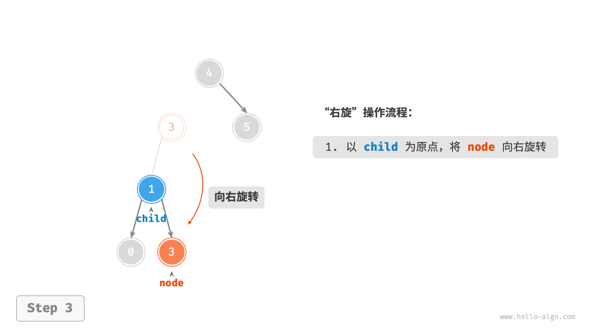
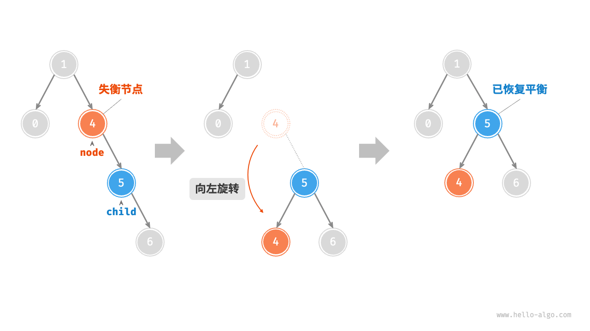
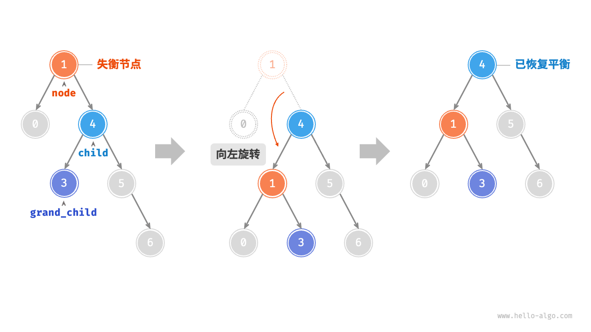
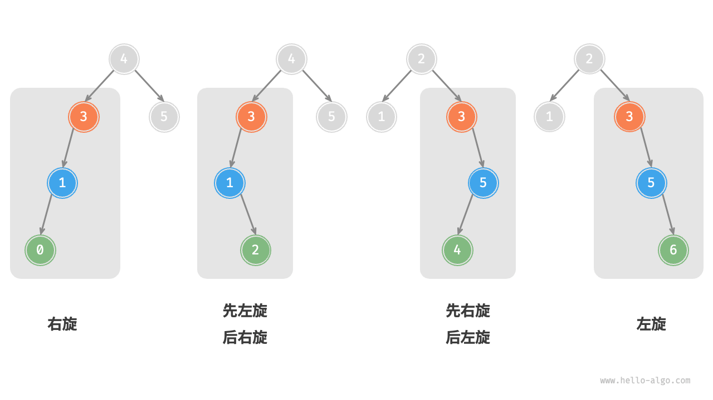

# AVL 树 *

在「二叉搜索树」章节中提到，在进行多次插入与删除操作后，二叉搜索树可能会退化为链表。此时所有操作的时间复杂度都会由 $O(\log n)$ 劣化至 $O(n)$ 。

如下图所示，执行两步删除结点后，该二叉搜索树就会退化为链表。


再比如，在以下完美二叉树中插入两个结点后，树严重向左偏斜，查找操作的时间复杂度也随之发生劣化。


G. M. Adelson-Velsky 和 E. M. Landis 在其 1962 年发表的论文 "An algorithm for the organization of information" 中提出了「AVL 树」。**论文中描述了一系列操作，使得在不断添加与删除结点后，AVL 树仍然不会发生退化**，进而使得各种操作的时间复杂度均能保持在 $O(\log n)$ 级别。

换言之，在频繁增删查改的使用场景中，AVL 树可始终保持很高的数据增删查改效率，具有很好的应用价值。

## AVL 树常见术语

「AVL 树」既是「二叉搜索树」又是「平衡二叉树」，同时满足这两种二叉树的所有性质，因此又被称为「平衡二叉搜索树」。

### 结点高度

在 AVL 树的操作中，需要获取结点「高度 Height」，所以给 AVL 树的结点类添加 `height` 变量。

=== "Java"

    ```java title=""
    /* AVL 树结点类 */
    class TreeNode {
        public int val; // 结点值
        public int height; // 结点高度
        public TreeNode left; // 左子结点
        public TreeNode right; // 右子结点
        public TreeNode(int x) { val = x; }
    }
    ```

=== "C++"

    ```cpp title=""
    /* AVL 树结点类 */
    struct TreeNode {
        int val{};              // 结点值
        int height = 0;         // 结点高度
        TreeNode *left{};       // 左子结点
        TreeNode *right{};      // 右子结点
        TreeNode() = default;
        explicit TreeNode(int x) : val(x){}
    };
    ```

=== "Python"

    ```python title=""
    """ AVL 树结点类 """
    class TreeNode:
        def __init__(self, val=None, left=None, right=None):
            self.val = val      # 结点值
            self.height = 0     # 结点高度
            self.left = left    # 左子结点引用
            self.right = right  # 右子结点引用
    ```

=== "Go"

    ```go title=""
    /* AVL 树结点类 */
    type TreeNode struct {
        Val    int       // 结点值
        Height int       // 结点高度
        Left   *TreeNode // 左子结点引用
        Right  *TreeNode // 右子结点引用
    }
    ```

=== "JavaScript"

    ```javascript title=""
    class TreeNode {
        val; // 结点值
        height; //结点高度
        left; // 左子结点指针
        right; // 右子结点指针
        constructor(val, left, right, height) {
            this.val = val === undefined ? 0 : val;
            this.height = height === undefined ? 0 : height;
            this.left = left === undefined ? null : left;
            this.right = right === undefined ? null : right;
        }
    }
    ```

=== "TypeScript"

    ```typescript title=""
    class TreeNode {
        val: number;            // 结点值
        height: number;         // 结点高度
        left: TreeNode | null;  // 左子结点指针
        right: TreeNode | null; // 右子结点指针
        constructor(val?: number, height?: number, left?: TreeNode | null, right?: TreeNode | null) {
            this.val = val === undefined ? 0 : val;
            this.height = height === undefined ? 0 : height; 
            this.left = left === undefined ? null : left; 
            this.right = right === undefined ? null : right; 
        }
    }
    ```

=== "C"

    ```c title=""

    ```

=== "C#"

    ```csharp title=""
    /* AVL 树结点类 */
    class TreeNode {
        public int val;          // 结点值
        public int height;       // 结点高度
        public TreeNode? left;   // 左子结点
        public TreeNode? right;  // 右子结点
        public TreeNode(int x) { val = x; }
    }
    ```

=== "Swift"

    ```swift title=""
    /* AVL 树结点类 */
    class TreeNode {
        var val: Int // 结点值
        var height: Int // 结点高度
        var left: TreeNode? // 左子结点
        var right: TreeNode? // 右子结点

        init(x: Int) {
            val = x
            height = 0
        }
    }
    ```

=== "Zig"

    ```zig title=""

    ```

「结点高度」是最远叶结点到该结点的距离，即走过的「边」的数量。需要特别注意，**叶结点的高度为 0 ，空结点的高度为 -1**。我们封装两个工具函数，分别用于获取与更新结点的高度。

=== "Java"

    ```java title="avl_tree.java"
    [class]{AVLTree}-[func]{height}

    [class]{AVLTree}-[func]{updateHeight}
    ```

=== "C++"

    ```cpp title="avl_tree.cpp"
    [class]{AVLTree}-[func]{height}

    [class]{AVLTree}-[func]{updateHeight}
    ```

=== "Python"

    ```python title="avl_tree.py"
    [class]{AVLTree}-[func]{height}

    [class]{AVLTree}-[func]{__update_height}
    ```

=== "Go"

    ```go title="avl_tree.go"
    [class]{aVLTree}-[func]{height}

    [class]{aVLTree}-[func]{updateHeight}
    ```

=== "JavaScript"

    ```javascript title="avl_tree.js"
    [class]{AVLTree}-[func]{height}

    [class]{AVLTree}-[func]{updateHeight}
    ```

=== "TypeScript"

    ```typescript title="avl_tree.ts"
    [class]{AVLTree}-[func]{height}

    [class]{AVLTree}-[func]{updateHeight}
    ```

=== "C"

    ```c title="avl_tree.c"
    [class]{aVLTree}-[func]{height}

    [class]{aVLTree}-[func]{updateHeight}
    ```

=== "C#"

    ```csharp title="avl_tree.cs"
    [class]{AVLTree}-[func]{height}

    [class]{AVLTree}-[func]{updateHeight}
    ```

=== "Swift"

    ```swift title="avl_tree.swift"
    [class]{AVLTree}-[func]{height}

    [class]{AVLTree}-[func]{updateHeight}
    ```

=== "Zig"

    ```zig title="avl_tree.zig"
    [class]{AVLTree}-[func]{height}

    [class]{AVLTree}-[func]{updateHeight}
    ```

### 结点平衡因子

结点的「平衡因子 Balance Factor」是 **结点的左子树高度减去右子树高度**，并定义空结点的平衡因子为 0 。同样地，我们将获取结点平衡因子封装成函数，以便后续使用。

=== "Java"

    ```java title="avl_tree.java"
    [class]{AVLTree}-[func]{balanceFactor}
    ```

=== "C++"

    ```cpp title="avl_tree.cpp"
    [class]{AVLTree}-[func]{balanceFactor}
    ```

=== "Python"

    ```python title="avl_tree.py"
    [class]{AVLTree}-[func]{balance_factor}
    ```

=== "Go"

    ```go title="avl_tree.go"
    [class]{aVLTree}-[func]{balanceFactor}
    ```

=== "JavaScript"

    ```javascript title="avl_tree.js"
    [class]{AVLTree}-[func]{balanceFactor}
    ```

=== "TypeScript"

    ```typescript title="avl_tree.ts"
    [class]{AVLTree}-[func]{balanceFactor}
    ```

=== "C"

    ```c title="avl_tree.c"
    [class]{aVLTree}-[func]{balanceFactor}
    ```

=== "C#"

    ```csharp title="avl_tree.cs"
    [class]{AVLTree}-[func]{balanceFactor}
    ```

=== "Swift"

    ```swift title="avl_tree.swift"
    [class]{AVLTree}-[func]{balanceFactor}
    ```

=== "Zig"

    ```zig title="avl_tree.zig"
    [class]{AVLTree}-[func]{balanceFactor}
    ```

!!! note

    设平衡因子为 $f$ ，则一棵 AVL 树的任意结点的平衡因子皆满足 $-1 \le f \le 1$ 。

## AVL 树旋转

AVL 树的独特之处在于「旋转 Rotation」的操作，其可 **在不影响二叉树中序遍历序列的前提下，使失衡结点重新恢复平衡**。换言之，旋转操作既可以使树保持为「二叉搜索树」，也可以使树重新恢复为「平衡二叉树」。

我们将平衡因子的绝对值 $> 1$ 的结点称为「失衡结点」。根据结点的失衡情况，旋转操作分为 **右旋、左旋、先右旋后左旋、先左旋后右旋**，接下来我们来一起来看看它们是如何操作的。

### Case 1 - 右旋

如下图所示（结点下方为「平衡因子」），从底至顶看，二叉树中首个失衡结点是 **结点 3**。我们聚焦在以该失衡结点为根结点的子树上，将该结点记为 `node` ，将其左子结点记为 `child` ，执行「右旋」操作。完成右旋后，该子树已经恢复平衡，并且仍然为二叉搜索树。

=== "<1>"
    

=== "<2>"
    

=== "<3>"
    

=== "<4>"
    

进而，如果结点 `child` 本身有右子结点（记为 `grandChild` ），则需要在「右旋」中添加一步：将 `grandChild` 作为 `node` 的左子结点。


“向右旋转”是一种形象化的说法，实际需要通过修改结点指针实现，代码如下所示。

=== "Java"

    ```java title="avl_tree.java"
    [class]{AVLTree}-[func]{rightRotate}
    ```

=== "C++"

    ```cpp title="avl_tree.cpp"
    [class]{AVLTree}-[func]{rightRotate}
    ```

=== "Python"

    ```python title="avl_tree.py"
    [class]{AVLTree}-[func]{__right_rotate}
    ```

=== "Go"

    ```go title="avl_tree.go"
    [class]{aVLTree}-[func]{rightRotate}
    ```

=== "JavaScript"

    ```javascript title="avl_tree.js"
    [class]{AVLTree}-[func]{rightRotate}
    ```

=== "TypeScript"

    ```typescript title="avl_tree.ts"
    [class]{AVLTree}-[func]{rightRotate}
    ```

=== "C"

    ```c title="avl_tree.c"
    [class]{aVLTree}-[func]{rightRotate}
    ```

=== "C#"

    ```csharp title="avl_tree.cs"
    [class]{AVLTree}-[func]{rightRotate}
    ```

=== "Swift"

    ```swift title="avl_tree.swift"
    [class]{AVLTree}-[func]{rightRotate}
    ```

=== "Zig"

    ```zig title="avl_tree.zig"
    [class]{AVLTree}-[func]{rightRotate}
    ```

### Case 2 - 左旋

类似地，如果将取上述失衡二叉树的“镜像”，那么则需要「左旋」操作。



同理，若结点 `child` 本身有左子结点（记为 `grandChild` ），则需要在「左旋」中添加一步：将 `grandChild` 作为 `node` 的右子结点。



观察发现，**「左旋」和「右旋」操作是镜像对称的，两者对应解决的两种失衡情况也是对称的**。根据对称性，我们可以很方便地从「右旋」推导出「左旋」。具体地，只需将「右旋」代码中的把所有的 `left` 替换为 `right` 、所有的 `right` 替换为 `left` ，即可得到「左旋」代码。

=== "Java"

    ```java title="avl_tree.java"
    [class]{AVLTree}-[func]{leftRotate}
    ```

=== "C++"

    ```cpp title="avl_tree.cpp"
    [class]{AVLTree}-[func]{leftRotate}
    ```

=== "Python"

    ```python title="avl_tree.py"
    [class]{AVLTree}-[func]{__left_rotate}
    ```

=== "Go"

    ```go title="avl_tree.go"
    [class]{aVLTree}-[func]{leftRotate}
    ```

=== "JavaScript"

    ```javascript title="avl_tree.js"
    [class]{AVLTree}-[func]{leftRotate}
    ```

=== "TypeScript"

    ```typescript title="avl_tree.ts"
    [class]{AVLTree}-[func]{leftRotate}
    ```

=== "C"

    ```c title="avl_tree.c"
    [class]{aVLTree}-[func]{leftRotate}
    ```

=== "C#"

    ```csharp title="avl_tree.cs"
    [class]{AVLTree}-[func]{leftRotate}
    ```

=== "Swift"

    ```swift title="avl_tree.swift"
    [class]{AVLTree}-[func]{leftRotate}
    ```

=== "Zig"

    ```zig title="avl_tree.zig"
    [class]{AVLTree}-[func]{leftRotate}
    ```

### Case 3 - 先左后右

对于下图的失衡结点 3 ，**单一使用左旋或右旋都无法使子树恢复平衡**，此时需要「先左旋后右旋」，即先对 `child` 执行「左旋」，再对 `node` 执行「右旋」。


### Case 4 - 先右后左

同理，取以上失衡二叉树的镜像，则需要「先右旋后左旋」，即先对 `child` 执行「右旋」，然后对 `node` 执行「左旋」。


### 旋转的选择

下图描述的四种失衡情况与上述 Cases 逐个对应，分别需采用 **右旋、左旋、先右后左、先左后右** 的旋转操作。



具体地，在代码中使用 **失衡结点的平衡因子、较高一侧子结点的平衡因子** 来确定失衡结点属于上图中的哪种情况。

<div class="center-table" markdown>

| 失衡结点的平衡因子 | 子结点的平衡因子 | 应采用的旋转方法 |
| ------------------ | ---------------- | ---------------- |
| $>0$ （即左偏树）  | $\geq 0$         | 右旋             |
| $>0$ （即左偏树）  | $<0$             | 先左旋后右旋     |
| $<0$ （即右偏树）  | $\leq 0$         | 左旋             |
| $<0$ （即右偏树）  | $>0$             | 先右旋后左旋     |

</div>

为方便使用，我们将旋转操作封装成一个函数。至此，**我们可以使用此函数来旋转各种失衡情况，使失衡结点重新恢复平衡**。

=== "Java"

    ```java title="avl_tree.java"
    [class]{AVLTree}-[func]{rotate}
    ```

=== "C++"

    ```cpp title="avl_tree.cpp"
    [class]{AVLTree}-[func]{rotate}
    ```

=== "Python"

    ```python title="avl_tree.py"
    [class]{AVLTree}-[func]{__rotate}
    ```

=== "Go"

    ```go title="avl_tree.go"
    [class]{aVLTree}-[func]{rotate}
    ```

=== "JavaScript"

    ```javascript title="avl_tree.js"
    [class]{AVLTree}-[func]{rotate}
    ```

=== "TypeScript"

    ```typescript title="avl_tree.ts"
    [class]{AVLTree}-[func]{rotate}
    ```

=== "C"

    ```c title="avl_tree.c"
    [class]{aVLTree}-[func]{rotate}
    ```

=== "C#"

    ```csharp title="avl_tree.cs"
    [class]{AVLTree}-[func]{rotate}
    ```

=== "Swift"

    ```swift title="avl_tree.swift"
    [class]{AVLTree}-[func]{rotate}
    ```

=== "Zig"

    ```zig title="avl_tree.zig"
    [class]{AVLTree}-[func]{rotate}
    ```

## AVL 树常用操作

### 插入结点

「AVL 树」的结点插入操作与「二叉搜索树」主体类似。不同的是，在插入结点后，从该结点到根结点的路径上会出现一系列「失衡结点」。所以，**我们需要从该结点开始，从底至顶地执行旋转操作，使所有失衡结点恢复平衡**。

=== "Java"

    ```java title="avl_tree.java"
    [class]{AVLTree}-[func]{insert}

    [class]{AVLTree}-[func]{insertHelper}
    ```

=== "C++"

    ```cpp title="avl_tree.cpp"
    [class]{AVLTree}-[func]{insert}

    [class]{AVLTree}-[func]{insertHelper}
    ```

=== "Python"

    ```python title="avl_tree.py"
    [class]{AVLTree}-[func]{insert}

    [class]{AVLTree}-[func]{__insert_helper}
    ```

=== "Go"

    ```go title="avl_tree.go"
    [class]{aVLTree}-[func]{insert}

    [class]{aVLTree}-[func]{insertHelper}
    ```

=== "JavaScript"

    ```javascript title="avl_tree.js"
    [class]{AVLTree}-[func]{insert}

    [class]{AVLTree}-[func]{insertHelper}
    ```

=== "TypeScript"

    ```typescript title="avl_tree.ts"
    [class]{AVLTree}-[func]{insert}

    [class]{AVLTree}-[func]{insertHelper}
    ```

=== "C"

    ```c title="avl_tree.c"
    [class]{aVLTree}-[func]{insert}

    [class]{aVLTree}-[func]{insertHelper}
    ```

=== "C#"

    ```csharp title="avl_tree.cs"
    [class]{AVLTree}-[func]{insert}

    [class]{AVLTree}-[func]{insertHelper}
    ```

=== "Swift"

    ```swift title="avl_tree.swift"
    [class]{AVLTree}-[func]{insert}

    [class]{AVLTree}-[func]{insertHelper}
    ```

=== "Zig"

    ```zig title="avl_tree.zig"
    [class]{AVLTree}-[func]{insert}

    [class]{AVLTree}-[func]{insertHelper}
    ```

### 删除结点

「AVL 树」删除结点操作与「二叉搜索树」删除结点操作总体相同。类似地，**在删除结点后，也需要从底至顶地执行旋转操作，使所有失衡结点恢复平衡**。

=== "Java"

    ```java title="avl_tree.java"
    [class]{AVLTree}-[func]{remove}

    [class]{AVLTree}-[func]{removeHelper}

    [class]{AVLTree}-[func]{getInOrderNext}
    ```

=== "C++"

    ```cpp title="avl_tree.cpp"
    [class]{AVLTree}-[func]{remove}

    [class]{AVLTree}-[func]{removeHelper}

    [class]{AVLTree}-[func]{getInOrderNext}
    ```

=== "Python"

    ```python title="avl_tree.py"
    [class]{AVLTree}-[func]{remove}

    [class]{AVLTree}-[func]{__remove_helper}

    [class]{AVLTree}-[func]{__get_inorder_next}
    ```

=== "Go"

    ```go title="avl_tree.go"
    [class]{aVLTree}-[func]{remove}

    [class]{aVLTree}-[func]{removeHelper}

    [class]{aVLTree}-[func]{getInOrderNext}
    ```

=== "JavaScript"

    ```javascript title="avl_tree.js"
    [class]{AVLTree}-[func]{remove}

    [class]{AVLTree}-[func]{removeHelper}

    [class]{AVLTree}-[func]{getInOrderNext}
    ```

=== "TypeScript"

    ```typescript title="avl_tree.ts"
    [class]{AVLTree}-[func]{remove}

    [class]{AVLTree}-[func]{removeHelper}

    [class]{AVLTree}-[func]{getInOrderNext}
    ```

=== "C"

    ```c title="avl_tree.c"
    [class]{aVLTree}-[func]{remove}

    [class]{aVLTree}-[func]{removeHelper}

    [class]{aVLTree}-[func]{getInOrderNext}
    ```

=== "C#"

    ```csharp title="avl_tree.cs"
    [class]{AVLTree}-[func]{remove}

    [class]{AVLTree}-[func]{removeHelper}

    [class]{AVLTree}-[func]{getInOrderNext}
    ```

=== "Swift"

    ```swift title="avl_tree.swift"
    [class]{AVLTree}-[func]{remove}

    [class]{AVLTree}-[func]{removeHelper}

    [class]{AVLTree}-[func]{getInOrderNext}
    ```

=== "Zig"

    ```zig title="avl_tree.zig"
    [class]{AVLTree}-[func]{remove}

    [class]{AVLTree}-[func]{removeHelper}

    [class]{AVLTree}-[func]{getInOrderNext}
    ```

### 查找结点

「AVL 树」的结点查找操作与「二叉搜索树」一致，在此不再赘述。

## AVL 树典型应用

- 组织存储大型数据，适用于高频查找、低频增删场景；
- 用于建立数据库中的索引系统；

!!! question "为什么红黑树比 AVL 树更受欢迎？"

    红黑树的平衡条件相对宽松，因此在红黑树中插入与删除结点所需的旋转操作相对更少，结点增删操作相比 AVL 树的效率更高。
