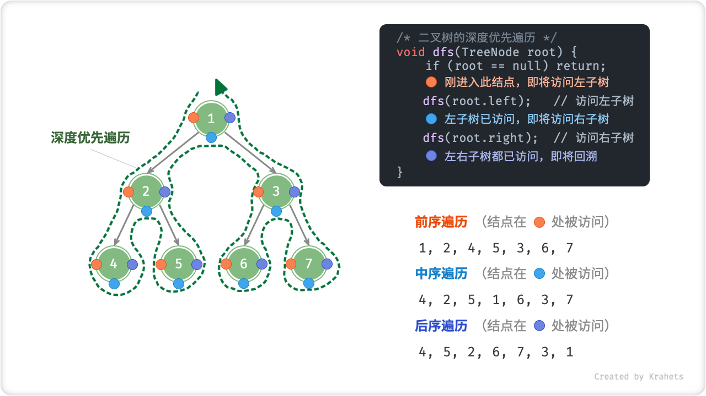

# 二叉树

「二叉树 Binary Tree」是一种非线性数据结构，代表着祖先与后代之间的派生关系，体现着 “一分为二” 的分治逻辑。类似于链表，二叉树也是以结点为单位存储的，结点包含「值」和两个「指针」。

=== "Java"

    ```java title=""
    /* 链表结点类 */
    class TreeNode {
        int val;         // 结点值
        TreeNode left;   // 左子结点指针
        TreeNode right;  // 右子结点指针
        TreeNode(int x) { val = x; }
    }
    ```

=== "C++"

    ```cpp title=""
    /* 链表结点结构体 */
    struct TreeNode {
        int val;          // 结点值
        TreeNode *left;   // 左子结点指针
        TreeNode *right;  // 右子结点指针
        TreeNode(int x) : val(x), left(nullptr), right(nullptr) {}
    };
    ```

=== "Python"

    ```python title=""
    """ 链表结点类 """
    class TreeNode:
        def __init__(self, val=0, left=None, right=None):
            self.val = val      # 结点值
            self.left = left    # 左子结点指针
            self.right = right  # 右子结点指针
    ```

=== "Go"

    ```go title=""

    ```

=== "JavaScript"

    ```js title=""

    ```

=== "TypeScript"

    ```typescript title=""

    ```

=== "C"

    ```c title=""

    ```

=== "C#"

    ```csharp title=""

    ```

结点的两个指针分别指向「左子结点 Left Child Node」和「右子结点 Right Child Node」，并且称该结点为两个子结点的「父结点 Parent Node」。给定二叉树某结点，将左子结点以下的树称为该结点的「左子树 Left Subtree」，右子树同理。


<p align="center"> Fig. 子结点与子树 </p>

需要注意，父结点、子结点、子树是可以向下递推的。例如，如果将上图的「结点 2」看作父结点，那么其左子结点和右子结点分别为「结点 4」和「结点 5」，左子树和右子树分别为「结点 4 以下的树」和「结点 5 以下的树」。

## 二叉树常见术语

「根结点 Root Node」：二叉树最顶层的结点，其没有父结点；

「叶结点 Leaf Node」：没有子结点的结点，其两个指针都指向 $\text{null}$ ；

结点「度 Degree」：结点的子结点数量，二叉树中度的范围是 0, 1, 2 ；

结点「深度 Depth」 ：根结点到该结点的层数；

结点「高度 Height」：最远叶结点到该结点的层数；

二叉树「高度」：二叉树中根结点到最远叶结点的层数；


<p align="center"> Fig. 二叉树的常见术语 </p>

## 二叉树最佳和最差结构

当二叉树的每层的结点都被填满时，达到「完美二叉树」；而当所有结点都偏向一边时，二叉树退化为「链表」。


<p align="center"> Fig. 二叉树的最佳和最差结构 </p>

在最佳和最差结构下，二叉树的结点数量和高度等性质达到最大（最小）值。

<div class="center-table" markdown>

|                               | 完美二叉树 | 链表         |
| ----------------------------- | ---------- | ---------- |
| 二叉树第 $i$ 层的结点数量     | $2^{i-1}$  | $1$           |
| 高度为 $h$ 的二叉树的结点总数 | $2^h - 1$  | $h$            |
| 结点总数为 $n$ 的二叉树的高度 | $\log_2 n + 1$ | $n$        |

</div>

## 二叉树基本操作

**初始化二叉树。** 与链表类似，先初始化结点，再构建引用指向（即指针）。

=== "Java"

    ```java title="binary_tree.java"
    // 初始化结点
    TreeNode n1 = new TreeNode(1);
    TreeNode n2 = new TreeNode(2);
    TreeNode n3 = new TreeNode(3);
    TreeNode n4 = new TreeNode(4);
    TreeNode n5 = new TreeNode(5);
    // 构建引用指向（即指针）
    n1.left = n2;
    n1.right = n3;
    n2.left = n4;
    n2.right = n5;
    ```

=== "C++"

    ```cpp title="binary_tree.cpp"
    /* 初始化二叉树 */
    // 初始化结点
    TreeNode* n1 = new TreeNode(1);
    TreeNode* n2 = new TreeNode(2);
    TreeNode* n3 = new TreeNode(3);
    TreeNode* n4 = new TreeNode(4);
    TreeNode* n5 = new TreeNode(5);
    // 构建引用指向（即指针）
    n1->left = n2;
    n1->right = n3;
    n2->left = n4;
    n2->right = n5;
    ```

=== "Python"

    ```python title="binary_tree.py"

    ```

=== "Go"

    ```go title="binary_tree.go"

    ```

=== "JavaScript"

    ```js title="binary_tree.js"

    ```

=== "TypeScript"

    ```typescript title="binary_tree.ts"

    ```

=== "C"

    ```c title="binary_tree.c"

    ```

=== "C#"

    ```csharp title="binary_tree.cs"

    ```

**插入与删除结点。** 与链表类似，插入与删除结点都可以通过修改指针实现。


<p align="center"> Fig. 在二叉树中插入与删除结点 </p>

=== "Java"

    ```java title="binary_tree.java"
    TreeNode P = new TreeNode(0);
    // 在 n1 -> n2 中间插入结点 P
    n1.left = P;
    P.left = n2;
    // 删除结点 P
    n1.left = n2;
    ```

=== "C++"

    ```cpp title="binary_tree.cpp"
    /* 插入与删除结点 */
    TreeNode* P = new TreeNode(0);
    // 在 n1 -> n2 中间插入结点 P
    n1->left = P;
    P->left = n2;
    // 删除结点 P
    n1->left = n2;
    ```

=== "Python"

    ```python title="binary_tree.py"

    ```

=== "Go"

    ```go title="binary_tree.go"

    ```

=== "JavaScript"

    ```js title="binary_tree.js"

    ```

=== "TypeScript"

    ```typescript title="binary_tree.ts"

    ```

=== "C"

    ```c title="binary_tree.c"

    ```

=== "C#"

    ```csharp title="binary_tree.cs"

    ```

!!! note

    插入结点会改变二叉树的原有逻辑结构，删除结点往往意味着删除了该结点的所有子树。因此，二叉树中的插入与删除一般都是由一套操作配合完成的，这样才能实现有意义的操作。

## 二叉树遍历

非线性数据结构的遍历操作比线性数据结构更加复杂，往往需要使用搜索算法来实现。常见的二叉树遍历方式有层序遍历、前序遍历、中序遍历、后序遍历。

### 层序遍历

「层序遍历 Hierarchical-Order Traversal」从顶至底、一层一层地遍历二叉树，并在每层中按照从左到右的顺序访问结点。

层序遍历本质上是「广度优先搜索 Breadth-First Traversal」，其体现着一种 “一圈一圈向外” 的层进遍历方式。


<p align="center"> Fig. 二叉树的层序遍历 </p>

广度优先遍历一般借助「队列」来实现。队列的规则是 “先进先出” ，广度优先遍历的规则是 ”一层层平推“ ，两者背后的思想是一致的。

=== "Java"

    ```java title="binary_tree_bfs.java"
    /* 层序遍历 */
    List<Integer> hierOrder(TreeNode root) {
        // 初始化队列，加入根结点
        Queue<TreeNode> queue = new LinkedList<>() {{ add(root); }};
        // 初始化一个列表，用于保存遍历序列
        List<Integer> list = new ArrayList<>();
        while (!queue.isEmpty()) {
            TreeNode node = queue.poll();  // 队列出队
            list.add(node.val);            // 保存结点值
            if (node.left != null)
                queue.offer(node.left);    // 左子结点入队
            if (node.right != null)
                queue.offer(node.right);   // 右子结点入队
        }
        return list;
    }
    ```

=== "C++"

    ```cpp title="binary_tree_bfs.cpp"
    /* 层序遍历 */
    vector<int> hierOrder(TreeNode* root) {
        // 初始化队列，加入根结点
        queue<TreeNode*> queue;
        queue.push(root);
        // 初始化一个列表，用于保存遍历序列
        vector<int> vec;
        while (!queue.empty()) {
            TreeNode* node = queue.front();
            queue.pop();  // 队列出队
            vec.push_back(node->val);            // 保存结点
            if (node->left != nullptr)
                queue.push(node->left);    // 左子结点入队
            if (node->right != nullptr)
                queue.push(node->right);   // 右子结点入队
        }
        return vec;
    }
    ```

=== "Python"

    ```python title="binary_tree_bfs.py"

    ```

=== "Go"

    ```go title="binary_tree_bfs.go"

    ```

=== "JavaScript"

    ```js title="binary_tree_bfs.js"

    ```

=== "TypeScript"

    ```typescript title="binary_tree_bfs.ts"

    ```

=== "C"

    ```c title="binary_tree_bfs.c"

    ```

=== "C#"

    ```csharp title="binary_tree_bfs.cs"

    ```

### 前序、中序、后序遍历

相对地，前、中、后序遍历皆属于「深度优先遍历 Depth-First Traversal」，其体现着一种 “先走到尽头，再回头继续” 的回溯遍历方式。

如下图所示，左侧是深度优先遍历的的示意图，右上方是对应的递归实现代码。深度优先遍历就像是绕着整个二叉树的外围 “走” 一圈，走的过程中，在每个结点都会遇到三个位置，分别对应前序遍历、中序遍历、后序遍历。



<p align="center"> Fig. 二叉树的前 / 中 / 后序遍历 </p>

<div class="center-table" markdown>

| 位置       | 含义                                 | 此处访问结点时对应            |
| ---------- | ------------------------------------ | ----------------------------- |
| 橙色圆圈处 | 刚进入此结点，即将访问该结点的左子树 | 前序遍历 Pre-Order Traversal  |
| 蓝色圆圈处 | 已访问完左子树，即将访问右子树       | 中序遍历 In-Order Traversal   |
| 紫色圆圈处 | 已访问完左子树和右子树，即将返回     | 后序遍历 Post-Order Traversal |

</div>

=== "Java"

    ```java title="binary_tree_dfs.java"
    /* 前序遍历 */
    void preOrder(TreeNode root) {
        if (root == null) return;
        // 访问优先级：根结点 -> 左子树 -> 右子树
        list.add(root.val);
        preOrder(root.left);
        preOrder(root.right);
    }
    
    /* 中序遍历 */
    void inOrder(TreeNode root) {
        if (root == null) return;
        // 访问优先级：左子树 -> 根结点 -> 右子树
        inOrder(root.left);
        list.add(root.val);
        inOrder(root.right);
    }
    
    /* 后序遍历 */
    void postOrder(TreeNode root) {
        if (root == null) return;
        // 访问优先级：左子树 -> 右子树 -> 根结点
        postOrder(root.left);
        postOrder(root.right);
        list.add(root.val);
    }
    ```

=== "C++"

    ```cpp title="binary_tree_dfs.cpp"
    /* 前序遍历 */
    void preOrder(TreeNode* root) {
        if (root == nullptr) return;
        // 访问优先级：根结点 -> 左子树 -> 右子树
        vec.push_back(root->val);
        preOrder(root->left);
        preOrder(root->right);
    }

    /* 中序遍历 */
    void inOrder(TreeNode* root) {
        if (root == nullptr) return;
        // 访问优先级：左子树 -> 根结点 -> 右子树
        inOrder(root->left);
        vec.push_back(root->val);
        inOrder(root->right);
    }

    /* 后序遍历 */
    void postOrder(TreeNode* root) {
        if (root == nullptr) return;
        // 访问优先级：左子树 -> 右子树 -> 根结点
        postOrder(root->left);
        postOrder(root->right);
        vec.push_back(root->val);
    }
    ```

=== "Python"

    ```python title="binary_tree_dfs.py"

    ```

=== "Go"

    ```go title="binary_tree_dfs.go"

    ```

=== "JavaScript"

    ```js title="binary_tree_dfs.js"

    ```

=== "TypeScript"

    ```typescript title="binary_tree_dfs.ts"

    ```

=== "C"

    ```c title="binary_tree_dfs.c"

    ```

=== "C#"

    ```csharp title="binary_tree_dfs.cs"

    ```

!!! note

    使用循环一样可以实现前、中、后序遍历，但代码相对繁琐，有兴趣的同学可以自行实现。
